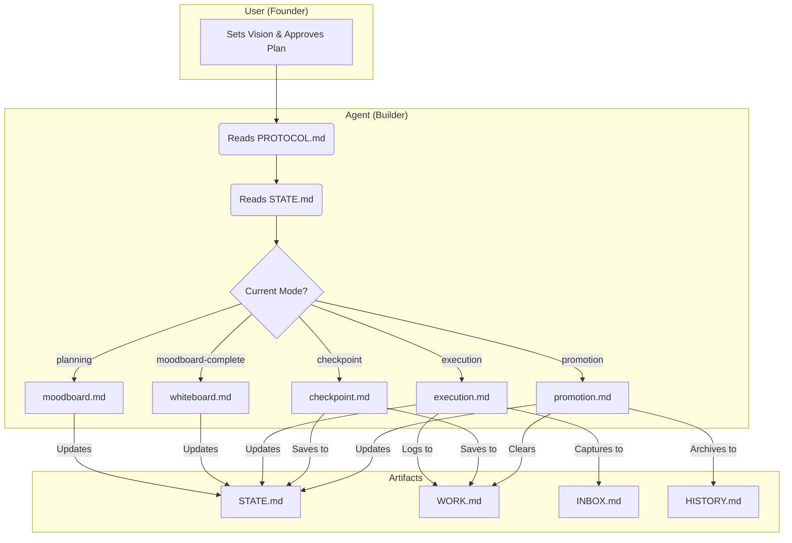

# ⚡ GSD-Lite

**(lite) Get Sh*t Done with AI Agents.**

A minimal, file-based protocol to keep your AI sessions focused, context-aware, and productive.

[](https://pypi.org/project/gsd-lite/)

[Inspired by gsd](https://github.com/glittercowboy/get-shit-done) 

## 🚀 Quick Start

No installation required. Run directly with `uv` (recommended):

```bash
# Initialize a new project
uvx gsd-lite

# Or update an existing one
uvx gsd-lite --update
```

## 🧐 What is this?

**GSD-Lite** is a set of markdown templates that structure your interaction with coding agents (Claude, ChatGPT, Cursor, Windsurf).

Instead of treating the chat as ephemeral, GSD-Lite forces the agent to maintain **persistent state** in your file system. This drastically reduces hallucinations and "context amnesia" during long coding sessions. The protocol is decomposed into a series of workflows, with a main `PROTOCOL.md` file acting as a router.

### The Artifacts

| File | Purpose |
|------|---------|
| **`PROTOCOL.md`** | The rulebook and router. The agent reads this to know how to behave and which workflow to load. |
| **`STATE.md`** | The high-level map. Tracks Phase, Current Task, and Decisions. |
| **`WORK.md`** | The execution log. Tracks every action, file change, and command. |
| **`INBOX.md`** | The parking lot. Captures scope creep, ideas, and bugs for later. |
| **`HISTORY.md`** | The ledger. A permanent record of completed phases. |
| **`workflows/`** | A directory of markdown files, each defining a specific workflow (e.g., `moodboard.md`, `execution.md`). |
| **`workflows/promotion.md`** | A special workflow for promoting results and cleaning up logs at the end of a phase. |

## 🛠️ Usage

1. **Scaffold**: Run `uvx gsd-lite` in your project root.
2. **Prompt**: Start your AI session with:
   > "Hi! Please read `gsd-lite/template/PROTOCOL.md` to start the session."
3. **Flow**: The agent will read `PROTOCOL.md` and then `STATE.md` to determine the `Current Mode`. It will then load the appropriate workflow from the `workflows/` directory. The agent will guide you through:
   - **Planning Mode:** Creating a Moodboard and defining scope (`moodboard.md`).
   - **Execution Mode:** Logging work and updating state (`execution.md`).
   - **Checkpoint Mode:** Saving session state for later continuation (`checkpoint.md`).
   - **Promotion Mode:** Promoting results and cleaning up logs (`promotion.md`).

## ✨ Synergy between the artifacts



## 🔄 Context Lifecycle: Checkpoint -> Clear -> Resume

GSD-Lite uses a `checkpoint -> clear -> resume` cycle to manage context across sessions.

*   **Checkpoint**: At the end of a session, the agent will save the current state to the artifacts. `WORK.md` is preserved.
*   **Clear**: You can safely clear your chat history.
*   **Resume**: At the start of a new session, the agent will read the artifacts to reconstruct the context, rather than relying on chat history.

This allows for long-running projects without context loss. The `checkpoint` action is distinct from `promotion`. `WORK.md` is only trimmed after a successful promotion, ensuring no loss of work.

## 🧠 The Philosophy: Founder vs. Builder

GSD-Lite isn't just a set of templates; it's a power dynamic. We explicitly divide responsibilities to keep momentum high and confusion low:

*   **You are the Founder (Visionary):** You own the "What" and "Why". You set the direction, approve the roadmap, and define the boundaries of success. You are the final authority on scope and UX.
*   **The Agent is the Builder (Executor):** The agent owns the "How". It handles the technical heavy lifting, manages the logs, and maintains the state. It auto-fixes bugs and technical debt, but pauses for architectural decisions.

This **Founder/Builder** split ensures you stay in control while the agent stays productive.

## 📄 License

MIT