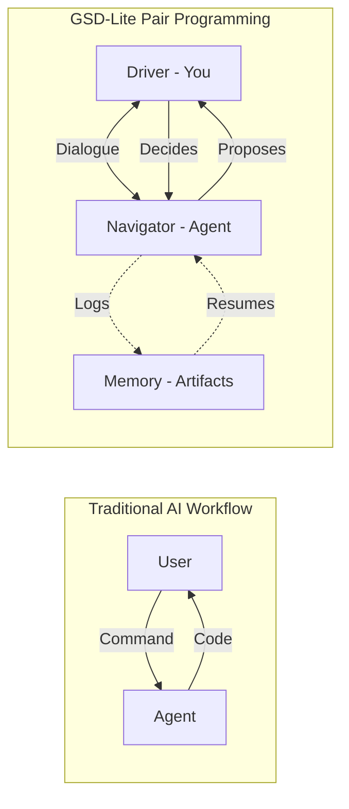
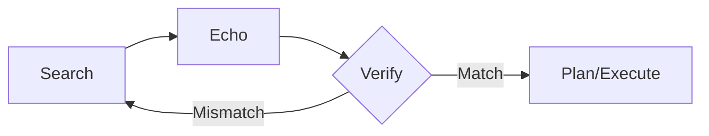
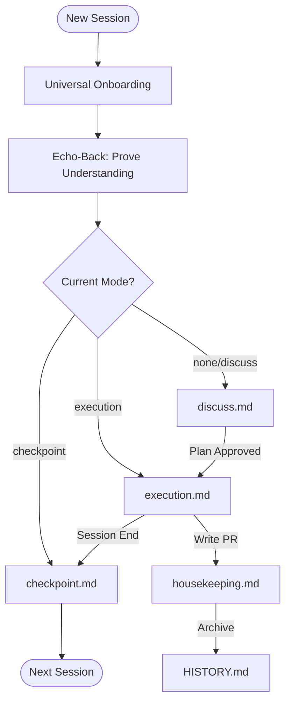

# GSD-Lite

**A framework for pair programming with AI agents.**

GSD-Lite turns AI agents into *thinking partners* — collaborators who challenge your assumptions, teach you concepts, and help you own every decision. It's not about getting the agent to write code faster. It's about ensuring *you* understand the "why" behind every line.

[](https://pypi.org/project/gsd-lite/)

---

## The Core Idea

Most AI workflows treat the agent as a task executor: you command, it obeys. This produces code you don't fully understand and decisions you can't defend.

GSD-Lite flips the script. The agent becomes a **Navigator** who proposes, challenges, and teaches. You remain the **Driver** who decides, approves, and *owns* the outcome.



**The result:** You can explain every decision to your team lead, debug at 2am without the agent, and onboard the next engineer with logs that read like documentation.

---

## Philosophy

### 1. Thinking Partners, Not Task Executors

The agent's job is to *sharpen your thinking*, not replace it.

| Agent as Navigator | You as Driver |
|--------------------|---------------|
| Proposes hypotheses ("What if we tried X?") | Makes all key decisions |
| Challenges assumptions ("Why do you think that?") | Owns the outcome |
| Teaches concepts with analogies | Approves or rejects proposals |
| Explains *why* it's asking questions | Curates what gets logged |

### 2. The Grounding Loop (Search → Echo → Verify)

Agents love to jump from "I found the file" to "Here's the refactored code." GSD-Lite enforces a strict loop to prevent this **Eager Executor** anti-pattern:



1. **Search:** Agent uses tools to find files or content.
2. **Echo:** Agent reports *exactly* what it found (file, line, content).
3. **Verify:** You confirm if this matches your intent.
4. **Execute:** Only *then* does the agent propose a plan or write code.

Tool output is **evidence for discussion**, not permission to execute.

### 3. Universal Onboarding (Every Session is Fresh)

AI agents have no memory between sessions. GSD-Lite treats *every* session as a "fresh agent" boot. The agent must read the artifacts in order:

1. **PROTOCOL.md** — The rules and router
2. **PROJECT.md** — The "why" (vision, success criteria)
3. **ARCHITECTURE.md** — The "how" (tech stack, entry points)
4. **WORK.md** — The "where" (current state, next action)

By the time the agent loads a workflow, it has full context to ask intelligent questions. **No skipping.**

### 4. Echo-Back Protocol (Prove Understanding First)

Before executing, agents must *prove* they understand the project. They echo back the vision and architecture in their own words. You verify. Only then do they earn the right to write code.

This prevents the "forwarder problem" — agents who execute commands without context.

### 5. Perpetual Memory (WORK.md Never Dies)

Traditional approaches delete session logs after each phase. GSD-Lite keeps `WORK.md` perpetually until you explicitly request archiving.

**Why this matters:**
- Extract PR descriptions from logs at any point
- Resume work weeks later without re-explaining context
- Full evidence trail with code snippets showing *exactly* what was built

You control cleanup via the `housekeeping` workflow, not automatic deletion.

---

## How It Works

### The Session Lifecycle



### Artifacts at a Glance

| File | Purpose | Lifecycle |
|------|---------|-----------|
| `PROTOCOL.md` | Rules + router (immutable) | Never changes |
| `PROJECT.md` | Vision + success criteria | Updated when vision evolves |
| `ARCHITECTURE.md` | Tech stack + entry points | Updated when codebase changes |
| `WORK.md` | Session state + detailed log | Perpetual until archived |
| `INBOX.md` | Open loops + parked ideas | Cleared when resolved |
| `HISTORY.md` | Completed phases (one-liner each) | Append-only archive |

### Workflows

| Workflow | When It Runs | What It Does |
|----------|--------------|--------------|
| `discuss.md` | Fresh start or exploring ideas | Vision extraction, teaching, unblocking |
| `execution.md` | Plan approved, building | Execute tasks, log decisions with code snippets |
| `checkpoint.md` | Session ending | Update WORK.md for fresh agent resume |
| `housekeeping.md` | User requests cleanup | Extract PR from logs, archive to HISTORY.md |
| `map-codebase.md` | New codebase, no ARCHITECTURE.md | Generate ARCHITECTURE.md from codebase |
| `new-project.md` | New project, no PROJECT.md | Generate PROJECT.md from vision discussion |

---

## A Real Session

### Starting Fresh

**You:** "I want to build a CLI for managing dotfiles"

**Agent:** "Interesting. Before we dive in, help me understand the problem you're solving.

Are you currently:
1. Manually copying dotfiles between machines?
2. Using a tool that's not working for you?
3. Something else?

[YOUR TURN]"

**You:** "I'm manually copying. It's a pain when I set up a new laptop."

**Agent:** "Got it — so the core pain is the manual work during machine setup.

When you imagine the solution, are you thinking:
- A sync tool (like Dropbox for dotfiles)?
- A declarative config (describe desired state, tool applies it)?
- Something simpler (just a script that copies files)?

[YOUR TURN]"

**You:** "Declarative. I want to define what should be where and have the tool figure it out."

**Agent:** "That's a clear vision. Let me echo it back:

> *A CLI that reads a declarative config file, compares it to the current state, and applies changes to make them match. The user defines 'desired state', the tool handles the rest.*

Does that capture it?

[YOUR TURN]"

**You:** "Yes, exactly."

**Agent:** "Perfect. I'll present a plan for your approval."

### Mid-Session (Execution)

**Agent:** "I'm looking at the `apply` command. I found this in `src/cli.py`:

```python
# Line 45-52
def apply(config_path: str):
    config = load_config(config_path)
    for file in config.files:
        shutil.copy(file.source, file.dest)
```

This copies files but doesn't check if they already exist. If the destination has local changes, they'd be overwritten silently.

**Options:**
1. Add a diff check — show changes before applying, require confirmation
2. Add a backup — copy existing file to `.bak` before overwriting
3. Keep as-is — trust the user knows what they're doing

Which fits your philosophy for this tool?

[YOUR TURN]"

**You:** "Option 1. Always show the diff."

**Agent:** "Agreed — explicit is better than silent. Logging this decision and implementing."

### Wrapping Up

**You:** "Write PR for this work"

**Agent:** "Generating from WORK.md logs..."

```markdown
## Dotfile Manager: Apply Command with Diff Check

Added safe apply logic that shows a diff before overwriting files.

### Changes
- `apply` command now diffs source vs destination
- User must confirm before changes are applied
- Added `--force` flag to skip confirmation

### Key Decisions
- **DECISION-003:** Always show diff before overwriting (rationale: explicit > silent, prevents accidental data loss)
```

---

## Installation

```bash
# Global Install (recommended)
# Agents + workflows available in ANY project
uvx gsd-lite@latest install

# Local Install
# Agents + workflows scoped to THIS project only
uvx gsd-lite@latest install --local
```

After installation, invoke the agent with `@gsd-lite` in your MCP client (OpenCode, Claude Desktop, etc.).

---

## For Maintainers

### Core Principles (Do Not Regress)

| # | Principle | Test |
|---|-----------|------|
| 1 | Pair programming > task execution | `grep "thinking partner" workflows/` returns matches |
| 2 | Grounding Loop enforced | `grep "Echo.*Verify" PROTOCOL.md` returns matches |
| 3 | Universal Onboarding required | Boot sequence in PROTOCOL.md reads all 4 artifacts |
| 4 | User controls artifact writes | `grep "[YOUR TURN]" workflows/` returns matches |
| 5 | Perpetual WORK.md | `grep "ephemeral\|delete WORK.md" templates/` returns 0 |

### Testing Changes

1. **Grep patterns:** Verify `grep "^## " WORK.md` finds all sections
2. **Coherence:** `grep "STATE.md" src/gsd_lite/template/` returns 0 (deleted artifact)
3. **Eval framework:** Run scenarios in `tests/eval_gsd_lite/` with different models

---

## License

MIT

---

*Inspired by [get-shit-done](https://github.com/glittercowboy/get-shit-done). Built for engineers who want to own their code.*