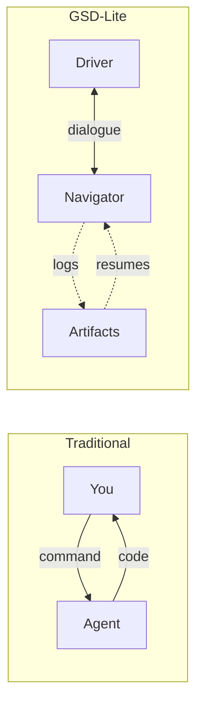
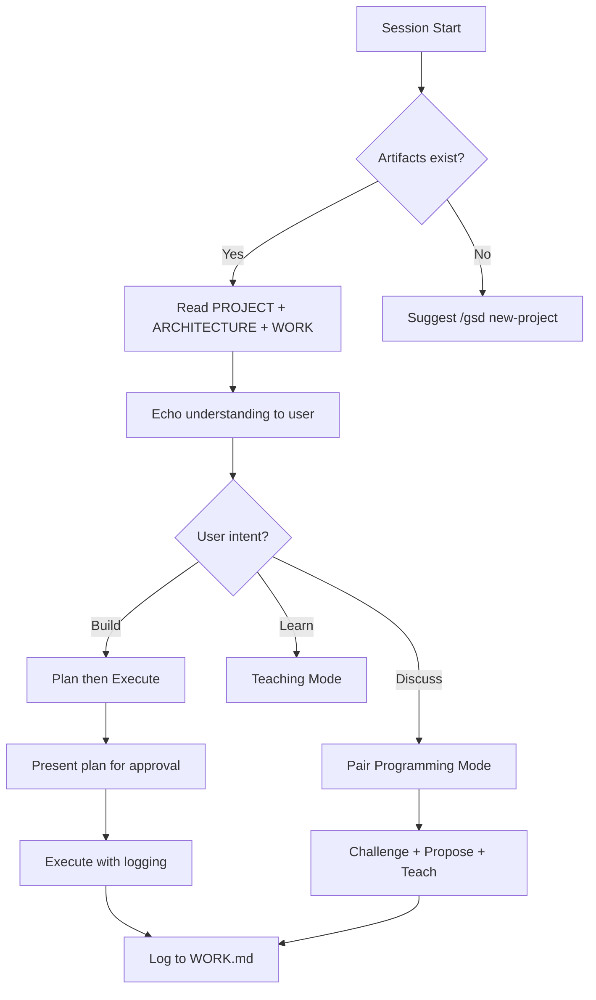
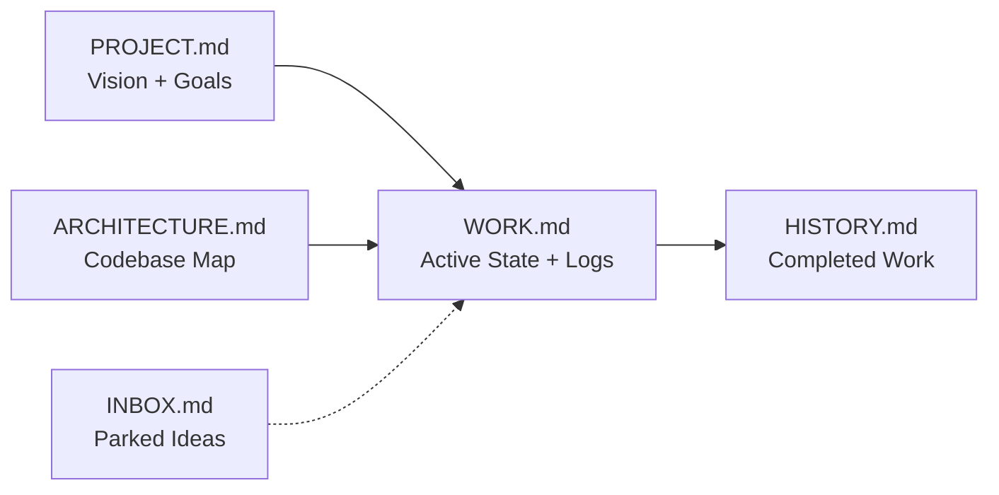
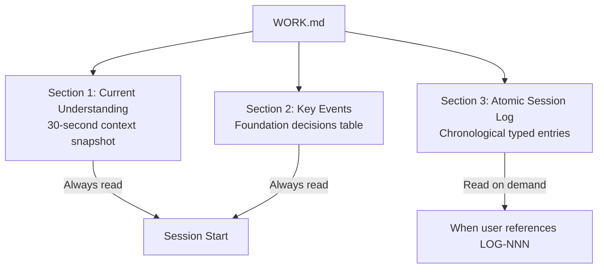
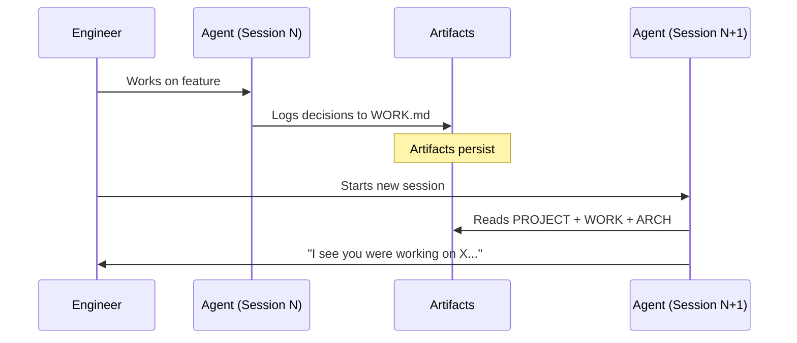

# GSD-Lite

**A pair programming protocol for AI agents.** Turn Claude into a thinking partner who challenges your assumptions, teaches you concepts, and helps you own every decision.

[](https://www.npmjs.com/package/gsd-lite)
[](https://opensource.org/licenses/MIT)

---

## Quickstart

```bash
# In your project directory:
npx gsd-lite

# Start Claude Code:
claude
```

That's it. GSD-Lite activates automatically as your default agent.

### What just happened?

```
your-project/
  .claude/
    agents/gsd-lite.md      # The protocol (auto-activated)
    commands/gsd/            # Slash commands
    settings.json            # Points Claude to gsd-lite agent
  gsd-lite/
    PROJECT.md               # Your project vision
    ARCHITECTURE.md           # Codebase structure
    WORK.md                  # Session log + decisions
    INBOX.md                 # Parked ideas
    HISTORY.md               # Completed work archive
```

### First session

When you start Claude, the GSD-Lite agent reads your artifacts and asks what you want to work on. Try these:

| What you want | What to do |
|---|---|
| Understand GSD-Lite | Type `/gsd learn` |
| Define your project | Type `/gsd new-project` |
| Document your codebase | Type `/gsd map-codebase` |
| Check progress | Type `/gsd progress` |
| Just start working | Describe your task naturally |

---

## The Core Idea

Most AI workflows treat the agent as a task executor: you command, it obeys. This produces code you don't fully understand and decisions you can't defend.

GSD-Lite flips the script. The agent becomes a **Navigator** who proposes, challenges, and teaches. You remain the **Driver** who decides, approves, and *owns* the outcome.


```mermaid
graph LR
    subgraph Traditional
        U1[You] -->|command| A1[Agent]
        A1 -->|code| U1
    end
    subgraph GSD-Lite
        U2[Driver] <-->|dialogue| A2[Navigator]
        A2 -.->|logs| M[Artifacts]
        M -.->|resumes| A2
    end
```

**The result:** You can explain every decision to your team, debug at 2am without the agent, and onboard the next engineer with logs that read like documentation.

---

## How It Works

### The Protocol Flow


```mermaid
graph TD
    A[Session Start] --> B{Artifacts exist?}
    B -->|Yes| C[Read PROJECT + ARCHITECTURE + WORK]
    B -->|No| D[Suggest /gsd new-project]
    C --> E[Echo understanding to user]
    E --> F{User intent?}
    F -->|Discuss| G[Pair Programming Mode]
    F -->|Build| H[Plan then Execute]
    F -->|Learn| I[Teaching Mode]
    G --> J[Challenge + Propose + Teach]
    H --> K[Present plan for approval]
    K --> L[Execute with logging]
    L --> M[Log to WORK.md]
    J --> M
```

### Artifacts = Memory

Every session starts by reading artifacts, not chat history. This means:
- **Any engineer** can pick up where you left off
- **Any future session** has full context
- **Decisions are documented** with rationale and rejected alternatives


```mermaid
graph LR
    P[PROJECT.md<br/>Vision + Goals] --> W[WORK.md<br/>Active State + Logs]
    A[ARCHITECTURE.md<br/>Codebase Map] --> W
    W --> H[HISTORY.md<br/>Completed Work]
    I[INBOX.md<br/>Parked Ideas] -.-> W
```

### The Driver/Navigator Model

| You (Driver) | Agent (Navigator) |
|---|---|
| Bring context and domain knowledge | Challenge assumptions |
| Make all key decisions | Teach concepts with analogies |
| Own the reasoning | Propose options with tradeoffs |
| Approve all artifact writes | Present plans before acting |
| Curate what gets logged | Over-communicate in responses |

---

## Key Concepts

### 1. Why Before How

The agent always asks *why* before jumping to implementation.

> You: "Add dark mode"
> Agent: "Why dark mode? Accessibility? Battery savings? User preference? The answer changes the approach."

### 2. Echo Before Execute

Before acting, the agent echoes what it understood and waits for confirmation.

> "I understood you want X because Y. I'll do Z. Does this match your mental model?"

### 3. Artifacts Over Chat

Important decisions get logged to WORK.md, not lost in chat. Every log entry follows a journalism standard:
- **Narrative arc** -- what question was live, what happened
- **Raw evidence** -- code snippets, error messages, exact citations
- **Decision record** -- chosen path AND why alternatives were rejected
- **Stateless handoff** -- a future agent can continue from any log

### 4. Scope Discipline

When new ideas pop up mid-work, the agent suggests parking them:

> "That sounds like a new capability. Want me to capture it to INBOX.md for later? Let's focus on [current task] for now."

---

## Slash Commands

| Command | What it does |
|---|---|
| `/gsd learn` | Interactive tutorial -- explains GSD-Lite in context of your project |
| `/gsd new-project` | Guided project definition -- creates PROJECT.md through dialogue |
| `/gsd map-codebase` | Codebase discovery -- creates ARCHITECTURE.md by exploring your code |
| `/gsd progress` | Progress report -- summarizes current state, tasks, and next actions |

---

## File Reference

| File | Purpose | Created by |
|---|---|---|
| `gsd-lite/PROJECT.md` | Project vision, core value, success criteria | `/gsd new-project` |
| `gsd-lite/ARCHITECTURE.md` | Codebase structure, tech stack, data flow | `/gsd map-codebase` |
| `gsd-lite/WORK.md` | Session state, decisions, execution log | Agent during work |
| `gsd-lite/INBOX.md` | Parked ideas and questions | Agent when scope creeps |
| `gsd-lite/HISTORY.md` | Archive of completed phases | Agent at milestones |
| `.claude/agents/gsd-lite.md` | The protocol itself | `npx gsd-lite` |
| `.claude/settings.json` | Points Claude to gsd-lite agent | `npx gsd-lite` |

---

## WORK.md Structure

The work log has three sections:


```mermaid
graph TD
    W[WORK.md] --> S1[Section 1: Current Understanding<br/>30-second context snapshot]
    W --> S2[Section 2: Key Events<br/>Foundation decisions table]
    W --> S3[Section 3: Atomic Session Log<br/>Chronological typed entries]
    S1 --> |Always read| Boot[Session Start]
    S2 --> |Always read| Boot
    S3 --> |Read on demand| Ref[When user references LOG-NNN]
```

**Section 1** -- Current mode, active task, vision, blockers, next action
**Section 2** -- Key events table (date, event, impact)
**Section 3** -- Typed log entries: [VISION], [DECISION], [DISCOVERY], [PLAN], [EXEC], [BLOCKER], [BUG], [PIVOT], [BREAKTHROUGH], [RESEARCH]

---

## Updating

Run the installer again to update the protocol and commands while preserving your artifacts:

```bash
npx gsd-lite@latest
```

Your `WORK.md`, `PROJECT.md`, and other artifacts are never overwritten (unless you pass `--force`).

---

## Philosophy

### The Grounding Loop

Every interaction follows: **Search -> Echo -> Verify**

1. **Search** -- Agent reads artifacts and code to build understanding
2. **Echo** -- Agent states what it understood back to you
3. **Verify** -- You confirm, correct, or redirect

This prevents the agent from running off with wrong assumptions.

### Session Continuity

GSD-Lite solves the "new session, lost context" problem:


```mermaid
sequenceDiagram
    participant E as Engineer
    participant A as Agent (Session N)
    participant F as Artifacts
    participant B as Agent (Session N+1)
    E->>A: Works on feature
    A->>F: Logs decisions to WORK.md
    Note over F: Artifacts persist
    E->>B: Starts new session
    B->>F: Reads PROJECT + WORK + ARCH
    B->>E: "I see you were working on X..."
```

---

## License

MIT
