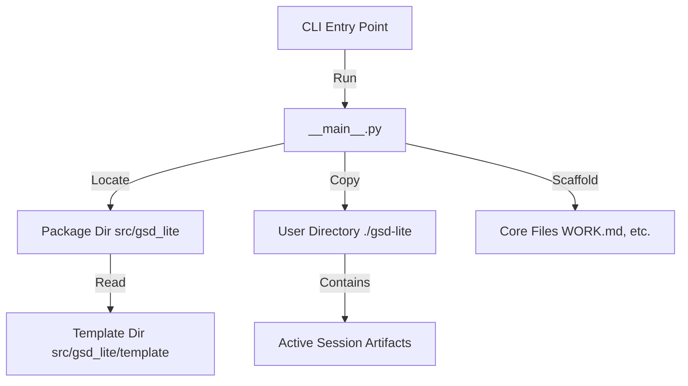

# Architecture

*Mapped: 2026-02-03*

## Project Structure Overview

| Directory                | Description                                                                               |
| ------------------------ | ----------------------------------------------------------------------------------------- |
| `src/gsd_lite/`          | **Core Logic**: Python source code for the CLI application                                |
| `src/gsd_lite/template/` | **Payload**: The GSD artifact templates (PROTOCOL, WORK.md, etc.) distributed to users    |
| `.planning/`             | **Context**: Upstream project planning and definition (Data Engineering Copilot Patterns) |
| `.claude/`               | **Reference**: Original GSD reference implementation                                      |
| `gsd-lite/`              | **Bootstrap**: The "dogfooding" instance of GSD-Lite used to build this project           |

## Tech Stack

| Technology      | Role          | Reason                                                       |
| --------------- | ------------- | ------------------------------------------------------------ |
| **Python 3.9+** | Runtime       | Universal availability, strong text processing               |
| **Typer**       | CLI Framework | Type-safe, declarative CLI building with minimal boilerplate |
| **Rich**        | UI Library    | Beautiful terminal formatting for better user experience     |
| **Hatchling**   | Build Backend | Modern Python packaging standard (PEP 621)                   |

## Data Flow

The application functions as a static asset generator/scaffolder.

## Entry Points

- `src/gsd_lite/__main__.py` - **CLI Entry Point**: Main application logic, handles args parsing and file operations.
- `pyproject.toml` - **Project Config**: Defines dependencies, scripts, and build targets.
- `.planning/PROJECT.md` - **Vision**: Defines the "Why" and scope of the GSD-Lite project.