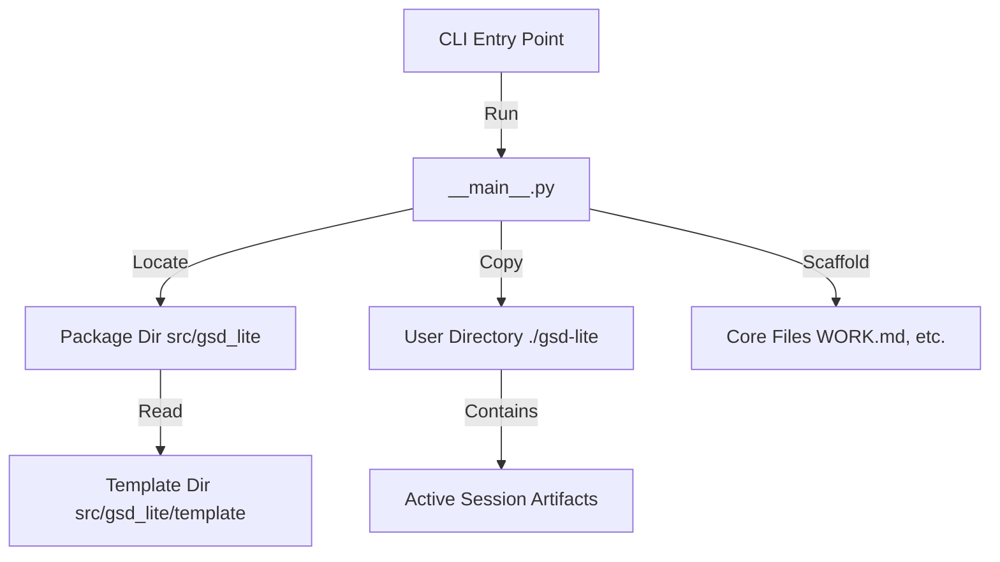
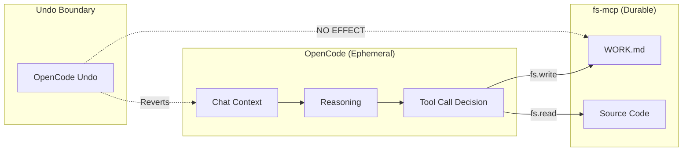

# Architecture

*Mapped: 2026-02-03*

## Project Structure Overview

| Directory                | Description                                                                               |
| ------------------------ | ----------------------------------------------------------------------------------------- |
| `src/gsd_lite/`          | **Core Logic**: Python source code for the CLI application                                |
| `src/gsd_lite/template/` | **Payload**: The GSD artifact templates (PROTOCOL, WORK.md, etc.) distributed to users    |
| `.planning/`             | **Context**: Upstream project planning and definition (Data Engineering Copilot Patterns) |
| `.claude/`               | **Reference**: Original GSD reference implementation                                      |
| `gsd-lite/`              | **Bootstrap**: The "dogfooding" instance of GSD-Lite used to build this project           |

## Tech Stack

| Technology      | Role          | Reason                                                       |
| --------------- | ------------- | ------------------------------------------------------------ |
| **Python 3.9+** | Runtime       | Universal availability, strong text processing               |
| **Typer**       | CLI Framework | Type-safe, declarative CLI building with minimal boilerplate |
| **Rich**        | UI Library    | Beautiful terminal formatting for better user experience     |
| **Hatchling**   | Build Backend | Modern Python packaging standard (PEP 621)                   |

## Data Flow

The application functions as a static asset generator/scaffolder.

## Entry Points

- `src/gsd_lite/__main__.py` - **CLI Entry Point**: Main application logic, handles args parsing and file operations.
- `pyproject.toml` - **Project Config**: Defines dependencies, scripts, and build targets.
- `.planning/PROJECT.md` - **Vision**: Defines the "Why" and scope of the GSD-Lite project.

## The Two-Brain System

### Session vs. Filesystem Persistence

GSD-Lite operates on a fundamental architectural principle: **ephemeral reasoning, durable artifacts**.

| Component | Role | Persistence | Undo Behavior |
|-----------|------|-------------|---------------|
| **OpenCode Session** | Reasoning Engine | Ephemeral | Fork/Undo reverts context |
| **fs-mcp Server** | Execution Engine | Durable | Fork/Undo has no effect |

### The Persistence Bridge

Agents MUST treat the filesystem as an **External API**, not as session state.

### Why OpenCode Runs from Home

The user spawns OpenCode from `~/` (Home Directory), not from project roots. This is intentional:

1. **Single Entry Point:** One OpenCode instance manages multiple projects via different fs-mcp connections.
2. **Global Session Pool:** All sessions land in `~/.local/share/opencode/storage/session/global/`.
3. **Project Isolation via Fingerprinting:** We identify which project a session touched by parsing absolute paths from fs-mcp tool outputs (see LOG-033, LOG-034).

### Consequences for Evaluation

Because `projectID` is always "global", the evaluation parser must:
1. Scan tool call outputs for absolute paths
2. Extract project root from path prefixes
3. Group sessions by detected project

This is documented in LOG-033 (Fingerprinting) and LOG-034 (Schema).