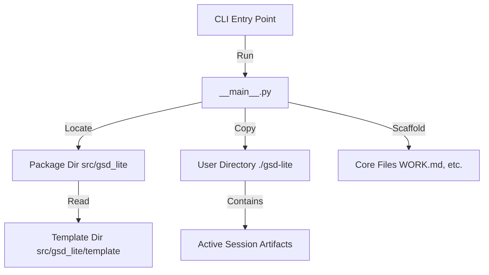
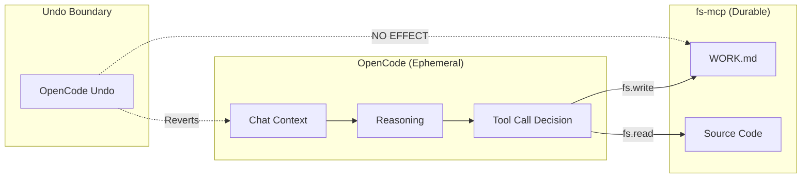
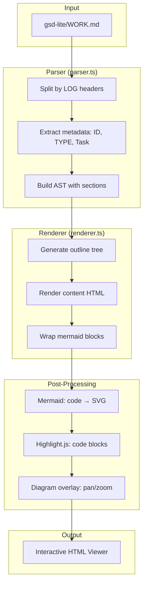
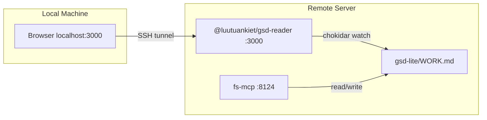

# Architecture

*Mapped: 2026-02-03*

## Project Structure Overview

| Directory                | Description                                                                               |
| ------------------------ | ----------------------------------------------------------------------------------------- |
| `src/gsd_lite/`          | **Core Logic**: Python source code for the CLI application                                |
| `src/gsd_lite/template/` | **Payload**: The GSD artifact templates (PROTOCOL, WORK.md, etc.) distributed to users    |
| `plugins/reader-vite/`   | **Reader Plugin**: TypeScript/Vite worklog viewer with live reload (see [Plugins](#plugins) section) |
| `.planning/`             | **Context**: Upstream project planning and definition (Data Engineering Copilot Patterns) |
| `.claude/`               | **Reference**: Original GSD reference implementation                                      |
| `gsd-lite/`              | **Bootstrap**: The "dogfooding" instance of GSD-Lite used to build this project           |

## Tech Stack

| Technology      | Role          | Reason                                                       |
| --------------- | ------------- | ------------------------------------------------------------ |
| **Python 3.9+** | Runtime       | Universal availability, strong text processing               |
| **Typer**       | CLI Framework | Type-safe, declarative CLI building with minimal boilerplate |
| **Rich**        | UI Library    | Beautiful terminal formatting for better user experience     |
| **Hatchling**   | Build Backend | Modern Python packaging standard (PEP 621)                   |

## Data Flow

The application functions as a static asset generator/scaffolder.



## Entry Points

- `src/gsd_lite/__main__.py` - **CLI Entry Point**: Main application logic, handles args parsing and file operations.
- `pyproject.toml` - **Project Config**: Defines dependencies, scripts, and build targets.
- `.planning/PROJECT.md` - **Vision**: Defines the "Why" and scope of the GSD-Lite project.

---

## Token Budget Architecture

*Established: 2026-02-17 (LOG-073)*

GSD-Lite is optimized for **minimal fixed cost, maximum work budget**.

### The Token Budget Model

```
┌─────────────────────────────────────────────────────────────┐
│  100k context window                                         │
├─────────────────────────────────────────────────────────────┤
│  Fixed Cost (~2.4k)    │ Agent instruction (gsd-lite.md)    │
├────────────────────────┼────────────────────────────────────┤
│  JIT Context (~10-20k) │ Curated work logs (grep → read)    │
├────────────────────────┼────────────────────────────────────┤
│  Work Budget (~80k)    │ Actual pair programming            │
└─────────────────────────────────────────────────────────────┘
```

### Template Token Costs

| Component | Tokens | Loaded When |
|-----------|--------|-------------|
| `gsd-lite.md` | 2,414 | Always (agent instruction) |
| `gsd-housekeeping.md` | 6,549 | Only when housekeeping |
| `new-project.md` | 2,578 | Only when starting project |
| `map-codebase.md` | 1,903 | Only when mapping codebase |
| Templates (5 files) | 242 | Never loaded as instructions |

**Design principle:** Templates are **structure only** — no examples. Examples bloat token cost and agents skip them during grep-first onboarding anyway.

### The Lean Architecture (LOG-073)

Consolidated from 36,982 tokens → ~2,400 token fixed cost:

| Before | After |
|--------|-------|
| PROTOCOL.md (monolith) | `gsd-lite.md` (single agent file) |
| 5 workflow files | 2 on-demand workflows |
| CONSTITUTION.md | Deleted (practice over measurement) |
| questioning.md reference | Embedded in agent file |
| Templates with examples | Structure-only templates |

## The Two-Brain System

### Session vs. Filesystem Persistence

GSD-Lite operates on a fundamental architectural principle: **ephemeral reasoning, durable artifacts**.

| Component | Role | Persistence | Undo Behavior |
|-----------|------|-------------|---------------|
| **OpenCode Session** | Reasoning Engine | Ephemeral | Fork/Undo reverts context |
| **fs-mcp Server** | Execution Engine | Durable | Fork/Undo has no effect |

### The Persistence Bridge

Agents MUST treat the filesystem as an **External API**, not as session state.



### Why OpenCode Runs from Home

The user spawns OpenCode from `~/` (Home Directory), not from project roots. This is intentional:

1. **Single Entry Point:** One OpenCode instance manages multiple projects via different fs-mcp connections.
2. **Global Session Pool:** All sessions land in `~/.local/share/opencode/storage/session/global/`.
3. **Project Isolation via Fingerprinting:** We identify which project a session touched by parsing absolute paths from fs-mcp tool outputs (see LOG-033, LOG-034).

### Consequences for Evaluation

Because `projectID` is always "global", the evaluation parser must:
1. Scan tool call outputs for absolute paths
2. Extract project root from path prefixes
3. Group sessions by detected project

This is documented in LOG-033 (Fingerprinting) and LOG-034 (Schema).

---

## Protocol Craft Laboratory

*Reframed: 2026-02-17 (LOG-072)*

GSD-Lite quality cannot be measured deterministically — the human is a confounding variable. Instead, we practice **Protocol Craft**: deliberate refinement through the Craft Cycle.

### The Craft Cycle

```
DESIGN → APPLY → NOTICE → REFINE → (repeat)
```

| Phase | Action | Example |
|-------|--------|--------|
| **Design** | Make a change to protocol/workflow | Cut 30% of discuss.md |
| **Apply** | Use it for real sessions | 5 sessions over a week |
| **Notice** | Observe what feels different | Did agents miss context? |
| **Refine** | Adjust based on feel | Restore or cut more |

### What We Measure (Proxies, Not Quality)

| Measurable | What It Tells You |
|------------|-------------------|
| Token count | Is instruction bloated? |
| Time to onboard | Can fresh agent get productive? |
| Decision density | How many decisions per session? |
| 48-hour cold read | Can YOU understand old logs? |

### The Evaluation Laboratory (Historical)

The `tests/evals/` directory contains synthetic fixtures for controlled testing:

```
tests/evals/
├── templates/        # Synthetic API client app
├── scenarios/        # Test scripts (for reference)
└── workspaces/       # Sandbox clones
```

**Note:** Deterministic evaluation was deprioritized (LOG-072). The laboratory remains useful for **prototyping new workflows** in isolation, not for proving GSD-Lite "works."

---

## Plugins

### Worklog Reader (`plugins/reader-vite/`)

A TypeScript/Vite application that renders `WORK.md` as an interactive, mobile-friendly HTML viewer with live reload.

#### Purpose

GSD-Lite worklogs grow to 9,000+ lines. Standard markdown viewers (GitHub, VS Code mobile) lack:
- Outline navigation for `### [LOG-NNN]` entries
- "Jump to latest" functionality
- Sticky breadcrumbs showing current position
- Live reload when WORK.md changes

The Reader solves this with a purpose-built worklog browser. See LOG-047 for the full vision.

#### Tech Stack

| Technology | Role | Reason |
|------------|------|--------|
| **TypeScript** | Source language | Type safety for parser/renderer |
| **Vite** | Dev server & bundler | Fast HMR during development |
| **Mermaid** | Diagram rendering | Renders `mermaid` code blocks as SVG |
| **Highlight.js** | Syntax highlighting | Code block formatting |
| **chokidar** | File watching (prod) | Native OS file events |
| **ws** | WebSocket (prod) | Live reload notifications |

#### Directory Structure

```
plugins/reader-vite/
├── package.json           # npm package config (@luutuankiet/gsd-reader)
├── cli.cjs                # Production entry point (npx @gsd-lite/reader)
├── vite.config.ts         # Vite configuration (dev only)
├── dist/                  # Built static assets (shipped with npm package)
│   ├── index.html
│   └── assets/
└── src/
    ├── main.ts            # App entry point
    ├── parser.ts          # WORK.md → AST parser
    ├── renderer.ts        # AST → HTML renderer
    ├── diagram-overlay.ts # Mermaid pan/zoom overlay
    ├── syntax-highlight.ts# Code block highlighting
    ├── types.ts           # TypeScript interfaces
    └── vite-plugin-worklog.ts  # Vite plugin for HMR (dev only)
```

#### Two Modes of Operation

| Mode | Command | Use Case |
|------|---------|----------|
| **Development** | `cd plugins/reader-vite && pnpm dev` | Developing the reader itself |
| **Production** | `npx @luutuankiet/gsd-reader [path]` | Using reader on any gsd-lite project |

**Development mode** uses Vite's HMR for instant updates. **Production mode** uses a lightweight Node HTTP server with chokidar file watching and WebSocket live reload.

#### Data Flow



#### Remote Server Deployment

The reader is designed to run **on the same machine as WORK.md** (typically a remote server). This enables native file watching via chokidar.



**Workflow:**
```bash
# On remote server
npx @luutuankiet/gsd-reader ./gsd-lite/WORK.md --port 3000

# On local machine (add to SSH tunnel)
ssh -L 3000:localhost:3000 remote-server

# Open browser
open http://localhost:3000
```

#### Key Design Decisions

| Decision | Rationale | Log Reference |
|----------|-----------|---------------|
| Custom parser (not unified markdown lib) | GSD-Lite has specific header format (`### [LOG-NNN] - [TYPE] - Title`) | LOG-047 §3.2 |
| Light theme only | "False" syntax highlighting is worse than none; semantic colors need contrast | LOG-051 |
| WebSocket for prod live reload | Avoids shipping Vite as runtime dep (~50MB → ~2MB) | LOG-056 §3 |
| Reader runs on remote | Chokidar requires local filesystem access | LOG-056 §2 |
| `trimEnd()` not `trim()` on content | Preserves leading empty lines for correct anchor line numbers | LOG-064 |

#### Critical Implementation Details (For Future Agents)

**Line Number Alignment (parser ↔ renderer)**

The reader uses line numbers for deep linking (`#line-7551`). This requires strict alignment:

1. **Parser (`parser.ts`)**: Records `lineNumber` as absolute file line (1-indexed) for each log and child section.
2. **Renderer (`renderer.ts`)**: Calls `renderMarkdown(content, startLine)` where `startLine = log.lineNumber + 1`.
3. **Content capture**: Uses `.trimEnd()` NOT `.trim()` — trimming leading lines breaks line number alignment.

```
# If LOG-043 header is at line 7534:
# - Content starts at line 7535 (log.lineNumber + 1)
# - H4 at file line 7551 must render with id="line-7551"
# - Parser child has lineNumber: 7551, outline href="#line-7551"
# - If content was .trim()'d, rendered ID would be off by N leading empty lines
```

**Mobile Bottom Sheet Architecture**

| Component | File | Purpose |
|-----------|------|---------|
| Sheet HTML | `renderer.ts` → `renderBottomSheet()` | Generates `.outline-sheet` with drag handle |
| Snap states | `index.html` CSS | `.snap-collapsed`, `.snap-half`, `.snap-full` |
| Gesture handling | `renderer.ts` | Touch start/move/end on drag handle |
| State machine | `setSheetState()` | Manages transitions, overlay visibility |

**Scroll Sync System**

The outline highlights the current section as you scroll the main content:

1. `updateCurrentSection()`: Finds the last `[data-section-title]` element above the "reading line" (96px offset).
2. Updates breadcrumb with **parent log title** (not sub-section — provides stable context).
3. Marks `.active` on matching outline links in **both** sidebar and sheet.
4. Auto-scrolls outline to show active item (smooth during scroll, instant on open).

**Dual Outline Containers**

Desktop and mobile have separate outline containers with identical content:
- Desktop: `#outline` (sidebar, scrollable via `overflow-y: auto`)
- Mobile: `#outlineSheet .sheet-content` (bottom sheet, scrollable)

Both share the same `renderOutlineItem()` output but different CSS and interaction handlers.