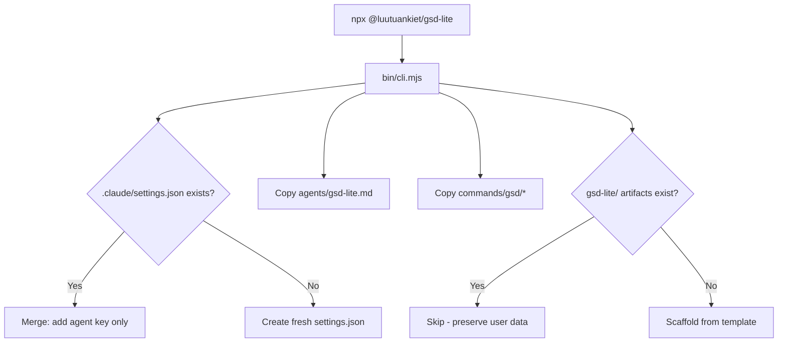

# Architecture

*Mapped: 2026-03-24*

## Project Structure Overview

| Directory | Purpose |
|---|---|
| `bin/` | CLI entry point — zero-dep Node.js installer |
| `template/` | Files copied into user projects on install |
| `template/.claude/agents/` | The GSD-Lite protocol agent (gsd-lite.md) |
| `template/.claude/commands/gsd/` | Slash commands (learn, new-project, map-codebase, progress) |
| `template/.claude/settings.json` | Default settings (used only for fresh installs) |
| `template/gsd-lite/` | Artifact templates (WORK.md, PROJECT.md, etc.) |
| `test/` | Install safety tests (node:test, zero deps) |
| `.github/workflows/` | npm OIDC trusted publishing |

## Tech Stack

- **Runtime:** Node.js 22 (ES modules)
- **Language:** JavaScript (zero TypeScript — keeps it simple)
- **Dependencies:** None (uses only `fs`, `path`, `url` builtins)
- **Test framework:** `node:test` (built-in, zero deps)
- **Package manager:** npm
- **CI/CD:** GitHub Actions with OIDC provenance

## Data Flow

```mermaid
graph TD
    A[npx @luutuankiet/gsd-lite] --> B[bin/cli.mjs]
    B --> C{.claude/settings.json exists?}
    C -->|Yes| D[Merge: add agent key only]
    C -->|No| E[Create fresh settings.json]
    B --> F[Copy agents/gsd-lite.md]
    B --> G[Copy commands/gsd/*]
    B --> H{gsd-lite/ artifacts exist?}
    H -->|Yes| I[Skip - preserve user data]
    H -->|No| J[Scaffold from template]
```

## Entry Points

- `bin/cli.mjs` — CLI entry point, handles install/help/force flags
- `template/.claude/agents/gsd-lite.md` — The protocol itself (loaded by Claude Code as system prompt)
- `template/.claude/commands/gsd/learn.md` — Interactive onboarding command
- `test/install.test.mjs` — 14 safety tests covering all install scenarios
