# GSD-Lite Inbox

<!--
LOOP CAPTURE - ideas, questions, concerns parked here.
All loops get systematic ID: LOOP-NNN (globally unique).

Loops come from TWO sources:
1. User: Non-linear thinker, asks questions mid-task
2. Agent: Discovers dependencies, future work, concerns

ENTRY FORMAT:
### [LOOP-NNN] - {{one line summary}} - Status: {{Open|Clarifying|Resolved}}
**Created:** YYYY-MM-DD | **Source:** {{task/context where discovered}} | **Origin:** User|Agent
**Context:** [The situation - why this loop exists, what triggered it]
**Details:** [Specific question/concern with code references where applicable]
**Resolution:** [How resolved, if applicable]

WHY THIS FORMAT:
- Agents grep headers (`^### \[LOOP-`) to scan open loops without reading full content
- Summary in header enables quick triage from grep output alone
- Context section preserves the "why" - future agents/humans understand the situation
- Code references anchor abstract concerns to concrete codebase locations
- Journalism-style narrative tells the story, not just the fact

GREP PATTERNS:
- All loops with summaries: grep "^### \[LOOP-" INBOX.md
- Open loops only: grep "Status: Open" INBOX.md
- Loop by ID: grep "\[LOOP-007\]" INBOX.md
- User loops: grep "Origin: User" INBOX.md
- Agent loops: grep "Origin: Agent" INBOX.md
-->

## How to Use

- Capture immediately when loop discovered
- Assign next LOOP-NNN ID (increment from last ID in this file)
- Write context-rich entry (not just a title - tell the story)
- Don't interrupt current task to address loop
- Review at phase end for next phase planning
- User can reference by ID: "discuss LOOP-007"

---

## Active Loops

<!--
Active loops awaiting attention. Each entry is self-contained with full context.
IMPORTANT: Below are EXAMPLE entries showing format. Real entries use [LOOP-NNN], not [EXAMPLE-LOOP-NNN].
-->

### [EXAMPLE-LOOP-001] - Client update workflow needs pull mechanism - Status: Open
**Created:** 2026-01-23 | **Source:** During PHASE-001 planning | **Origin:** User

**Context:**
While discussing the initial architecture for the sync service, user raised a concern about how clients would receive updates. The current design only handles push from server, but user's mental model includes scenarios where clients might be offline and need to catch up.

**Details:**
The `SyncService` class in `src/services/sync.ts:45-78` currently implements `pushUpdate()` but has no corresponding pull mechanism. User specifically mentioned:
> "What happens when a client reconnects after being offline for 2 hours? They'd miss all the updates."

This affects the `ClientConnection` interface at `src/types/client.ts:12` which assumes always-connected clients. Need to decide:
1. Do we add a `pullUpdates(since: timestamp)` method?
2. Or implement message queuing per-client?
3. What's the retention window for missed updates?

**Resolution:** _(pending)_

---

### [EXAMPLE-LOOP-002] - Token expiry strategy unclear for long-running sessions - Status: Clarifying
**Created:** 2026-01-23 | **Source:** During TASK-AUTH-001 implementation | **Origin:** Agent

**Context:**
While implementing JWT generation in `src/auth/token.ts`, agent discovered an ambiguity in the requirements. The spec says "tokens should expire" but doesn't specify duration or refresh strategy. This matters because the dashboard is designed for long work sessions (4-8 hours).

**Details:**
Current implementation at `src/auth/token.ts:23-31`:
```typescript
export function generateToken(userId: string): string {
  return jwt.sign(
    { sub: userId, iat: Date.now() },
    process.env.JWT_SECRET,
    { expiresIn: '???' }  // <-- What should this be?
  );
}
```

Options discovered during research:
- Short-lived (15min) + refresh token: More secure, but adds complexity
- Long-lived (24h): Simpler, but security concern if token leaked
- Sliding window: Token refreshes on activity, expires on idle

User preference needed. This blocks finalizing the auth implementation.

**Resolution:** _(awaiting user input)_

---

### [EXAMPLE-LOOP-003] - Database migration strategy for production - Status: Open
**Created:** 2026-01-24 | **Source:** During TASK-DB-002 schema design | **Origin:** Agent

**Context:**
Agent completed the initial schema design in `prisma/schema.prisma`, but realized there's no migration strategy defined for when we deploy to production. The current approach uses `prisma db push` which is fine for development but destructive in production.

**Details:**
The schema includes relationships that require careful migration ordering:
```prisma
// prisma/schema.prisma:34-45
model User {
  id        String   @id @default(uuid())
  posts     Post[]   // Has-many relationship
  profile   Profile? // Optional one-to-one
}

model Post {
  authorId  String
  author    User @relation(fields: [authorId], references: [id])
}
```

If we add a NOT NULL column to `User` later, existing rows will fail. Need to establish:
1. Migration file naming convention
2. Rollback strategy
3. CI/CD pipeline integration for migrations
4. Data backfill approach for schema changes

This isn't blocking current work but will become critical before first production deploy.

**Resolution:** _(to be addressed in PHASE-003)_

---

### [LOOP-001] - Philosophical CI: "Intern Test" for GSD-Lite iterations - Status: Open
**Created:** 2026-02-07 | **Source:** Reviewing gsd-housekeeping.md spec (LOG-019) | **Origin:** User

**Context:**
While reviewing the Context Gardener spec, we discussed whether tagged blocks have enough narrative context. This surfaced a deeper problem: GSD-Lite is meta, text-based, and philosophical. There's no programmatic way to test if a new iteration regresses against our core principles (engineer ownership, journalism-quality logs, fork-and-resume workflow, etc.).

Traditional CI tests code behavior. GSD-Lite needs to test *agent behavior against philosophy*.

**Details:**
The user proposed an "Intern Test" concept:

1. **Test Scenarios:** Define a testset of situations across workflows:
   - Fresh agent onboarding (does it read PROJECT.md first?)
   - Discussion mode (does it ask WHY before HOW?)
   - Execution mode (does it echo before execute?)
   - Checkpoint (does it update Current Understanding correctly?)
   - Housekeeping (does the Context Gardener respect three-tier hierarchy?)

2. **Fresh Agent Injection:** Send a SOTA model (Gemini Pro 3 / Claude Opus 4.5) into each scenario with the updated GSD-Lite templates.

3. **Behavior Collection:** Capture what the agent actually does:
   - Did it follow the protocol?
   - Did it ask permission before writing?
   - Did it use the Challenge Tone Protocol appropriately?

4. **Reconciliation:** Compare behavior against core principles (codified from PROJECT.md, PROTOCOL.md). Declaratively determine: does this change break our philosophy?

**Why this matters:**
- Currently, philosophical drift is only caught by human review (expensive, inconsistent)
- A "philosophical CI" would give confidence that template changes don't regress
- It embraces the genAI/natural-language ground of the project — use LLMs to test LLM behavior

**Open Questions:**
- How to codify "core principles" in a way that's machine-checkable?
- What's the minimum viable testset that covers the critical workflows?
- Should the reconciliation be automated (LLM-as-judge) or human-reviewed?
- How to handle non-determinism in agent responses?

**Resolution:** _(pending — requires design exploration)_

---

### [LOOP-002] - Few-Shot Examples May Be Invisible to Header-Only Grep Patterns - Status: Open
**Created:** 2026-02-07 | **Source:** Reviewing gsd-housekeeping.md spec and template structure | **Origin:** User

**Context:**
While discussing whether the Context Gardener spec conforms to our vision, we discovered a potential structural tension in GSD-Lite's design: **templates contain rich few-shot examples, but agents are instructed to grep only headers — which structurally skips those examples.**

This matters because few-shot examples are a primary way to teach agents "how to write" in our journalism style. If agents never see them, they may produce outputs that don't match the format we designed.

**The Architecture of Examples in GSD-Lite:**

```mermaid
flowchart TD
    subgraph TEMPLATES["📁 Template Files"]
        WORK["WORK.md<br/>17 EXAMPLE entries<br/>(lines 184-390)"]
        INBOX["INBOX.md<br/>5 EXAMPLE-LOOP entries<br/>(lines 51-180)"]
        HIST["HISTORY.md<br/>1 Example Entry<br/>(line 27)"]
    end
    
    subgraph PROTOCOL["📜 Protocol Instructions"]
        GREP1["grep '^### \\[LOG-'<br/>Find log entries"]
        GREP2["grep '^### \\[LOOP-'<br/>Find loops"]
        GREP3["grep '^## '<br/>Find sections"]
    end
    
    subgraph PROBLEM["⚠️ The Gap"]
        MISS["Examples use EXAMPLE-NNN format<br/>Grep patterns match LOG-NNN / LOOP-NNN<br/>→ Examples structurally invisible"]
    end
    
    WORK --> |"Agent greps"| GREP1
    INBOX --> |"Agent greps"| GREP2
    GREP1 --> MISS
    GREP2 --> MISS
    
    style PROBLEM fill:#fff3cd,stroke:#856404
    style MISS fill:#f8d7da,stroke:#721c24
```



**Details — Evidence from Template Scan:**

| File | Example Count | Format | Grep Pattern Used | Result |
|------|---------------|--------|-------------------|--------|
| `src/gsd_lite/template/WORK.md` | 17 entries | `[EXAMPLE-001]` through `[EXAMPLE-017]` | `grep "^### \[LOG-"` | **MISS** — pattern requires `LOG-`, not `EXAMPLE-` |
| `src/gsd_lite/template/INBOX.md` | 5 entries | `[EXAMPLE-LOOP-001]` through `[EXAMPLE-LOOP-005]` | `grep "^### \[LOOP-"` | **MISS** — pattern requires `LOOP-`, not `EXAMPLE-LOOP-` |
| `src/gsd_lite/template/HISTORY.md` | 1 entry | `### Example Entry` | `grep "^### \[LOG-"` | **MISS** — no ID format |

**Citations — Where Grep-First Instructions Live:**

**Resolution:** _(pending — related to LOOP-003)_

---

### [LOOP-003] - Structural Regression Prevention: CI for Documentation Drift - Status: Open
**Created:** 2026-02-07 | **Source:** Post-mortem on LOG-020/LOG-021 (Invisible Documentation Problem) | **Origin:** User

**Context:**
We just completed TASK-PROTOCOL-DOCS-001, migrating HTML comments from templates to the `gsd-lite.md` agent instruction. The root cause was discovered only through deep inspection: HTML comments were invisible to grep-first agents, creating a gap between "what we documented" and "what agents actually read."

**The concern:** How do we prevent future changes from regressing into this same anti-pattern? Without a structural safeguard, someone could:
1. Add new documentation as HTML comments in templates (invisible to agents)
2. Add a new section to PROTOCOL.md (which no longer exists) instead of gsd-lite.md
3. Create drift between template examples and agent instruction definitions

**What We Need to Prevent:**

| Regression Type | Example | Why It's Bad |
|-----------------|---------|--------------|
| **Invisible Docs** | New HTML comment in WORK.md explaining a feature | Agent never sees it via grep-first |
| **Orphaned Templates** | Re-creating PROTOCOL.md or similar file | Two sources of truth, drift inevitable |
| **Structural Drift** | Template defines 4 log types, agent instruction says 6 | Agent follows instruction, template examples are misleading |
| **Token Bloat** | Agent instruction grows past 10k without notice | First-turn context overflow |

**Proposed CI Framework (Discussion Needed):**

1. **Deterministic Checks (fast, cheap):**
   - Token budget: `gsd-lite.md` ≤ 10k tokens
   - No HTML comments in templates (or only one-liner pointers)
   - No orphaned files (PROTOCOL.md should not exist)
   - Section parity: Agent instruction sections match template structure

2. **Structural Consistency Checks:**
   - Log types in agent instruction match example types in templates
   - Grep patterns in instruction actually match template content
   - ID formats (LOG-NNN, LOOP-NNN) consistent across all files

3. **Behavioral Checks (slow, expensive):** — See LOOP-001
   - Intern Test scenarios verify agent actually follows structure

**Open Questions:**
- What's the minimal set of deterministic checks that catches 80% of regressions?
- Should we lint templates for HTML comments? Or allow them with explicit "human-only" markers?
- How do we test "grep patterns actually work" without running an agent?

**Relationship to Other Loops:**
- **LOOP-001** (Philosophical CI): This is the deterministic complement — LOOP-001 tests behavior, LOOP-003 tests structure
- **LOOP-002** (Few-Shot Visibility): Same root cause — structure that agents can't see

**Resolution:** _(pending — requires design discussion)_

---

### [LOOP-004] - Document the Manual Reconciliation Pattern for Regression Discovery - Status: Open
**Created:** 2026-02-07 | **Source:** Post-mortem on LOG-020 through LOG-023 | **Origin:** User

**Context:**
We just went through a multi-step manual process to discover and fix the "invisible documentation" regression (HTML comments not embedded in agent instruction). The process worked, but it was ad-hoc. We should document this pattern so future reconciliation efforts follow the same rigor.

**The Pattern We Used (Reconstructed):**


**Details — What We Did This Session:**

| Phase | What We Did | Log Reference |
|-------|-------------|---------------|
| **Discovery** | Asked "what does agent actually read?" Traced grep-first path. Found HTML comments invisible. | LOG-020 Part 1 |
| **Decision** | Analyzed token budget (4,913 + 1,250 = 6,163 < 10k). Decided to consolidate to gsd-lite.md. | LOG-020 Part 2-3, DECISION-020a |
| **Execution** | Deleted PROTOCOL.md. Added structure sections to gsd-lite.md. Removed HTML comments from templates. | LOG-021 |
| **Validation (partial)** | Agent wrote LOOP-003, user audited compliance → discovered missing executable templates. | LOG-022, LOG-023 |

**What's Still Fuzzy:**

1. **No formal audit checklist** — We manually compared agent output to spec
2. **No automated validation** — CI doesn't catch structural drift yet (see LOOP-003)
3. **Pattern not codified** — Next time we hit a regression, we'll reinvent this process

**Why Document This:**

The pattern we used is valuable:
- **Trigger → Trace → Compare → Evidence** is a reusable debugging approach
- **Token budget analysis** should be standard for any doc consolidation
- **Executable templates** emerged as a solution — should be default practice

**Proposed Next Steps:**

1. Codify this pattern in a workflow or reference doc
2. Create an "Agent Visibility Audit" checklist
3. Build CI checks (LOOP-003) to automate Phase 4

**Relationship to Other Loops:**
- **LOOP-001** (Intern Test): Behavioral validation — does agent follow philosophy?
- **LOOP-002** (Few-Shot Visibility): Same root cause — structural invisibility
- **LOOP-003** (CI for Regression): Automated prevention — Phase 4 automation

**Resolution:** _(pending — collect more data points before formalizing)_

---

1. **PROTOCOL.md, Line 101:**
   > `**Grep-first behavior:** Always grep to discover structure before reading large artifacts. Use `grep "^## " WORK.md` to find section boundaries, then surgical read of relevant sections.`

2. **PROTOCOL.md, Line 135:**
   > `- All logs with summaries: `grep "^### \[LOG-"` — scan project evolution from headers`

3. **WORK.md, Line 21:**
   > `- All logs with summaries: grep "^### \[LOG-" WORK.md — scan project evolution from headers`

4. **gsd-lite.md (agent spec), Line 155:**
   > `- All logs with summaries: `grep "^### \[LOG-"` — scan project evolution from headers`

**The Design Intent (Why This Might Be Deliberate):**

The template WORK.md contains a clear warning (line 181):
> `IMPORTANT: Below are EXAMPLE entries showing format. Real entries should use [LOG-NNN] not [EXAMPLE-NNN].`

This suggests the `EXAMPLE-NNN` format was **intentionally designed** to be invisible to production grep patterns. The examples exist as:
- **Human documentation** — showing users the expected format
- **Initialization scaffolding** — cleared when real work begins

But this creates tension with the few-shot learning value.

**The Trade-Off We Need to Decide:**

| Approach | Pro | Con |
|----------|-----|-----|
| **Keep examples invisible** (current) | Context optimization: agents don't load 2000+ tokens of examples every session | Agents may not learn journalism style; outputs may drift from format |
| **Make examples visible** (change grep pattern) | Agents learn format through few-shot examples | Context pollution: every session loads examples; might confuse agent ("is this real or example?") |
| **Selective visibility** (new mechanism) | Best of both: load examples only during onboarding or when agent requests | Adds complexity; needs explicit "read examples" instruction in workflows |

**Synthesized Example — The Failure Mode:**

Imagine a fresh agent is told to write a DISCOVERY log. It greps for existing logs, sees only headers like:
```
### [LOG-005] - [DECISION] - Use card layout - Task: MODEL-A
### [LOG-012] - [EXEC] - Installed jose library - Task: AUTH-IMPL
```

It has **no few-shot example** of what a DISCOVERY log body should look like. It might write:
```markdown
### [LOG-020] - [DISCOVERY] - Found rate limit issue - Task: API-OPT
Found a rate limit issue in the API. It affects performance.
```

Compare to the template example (`src/gsd_lite/template/WORK.md`, lines 228-240):
```markdown
### [EXAMPLE-005] - [DISCOVERY] - Found engagement pattern in Linear reference app - Task: MODEL-A
**Timestamp:** 2026-01-22 15:00
**Details:**
- Observation: Linear shows engagement inline, not in dropdown/modal
- Evidence from inspection:
\`\`\`html
<div class="engagement-bar">
  <span class="metric">👍 12</span>
  <span class="metric">💬 5</span>
  <span class="metric">🔄 3</span>
</div>
\`\`\`
- Impact: Informs SUBTASK-002 design (inline engagement, emoji + count)
```

The few-shot example includes **Timestamp**, **Details** with bullet structure, **code evidence**, and **Impact** — all missing from the naive agent output.

**Open Questions:**
1. Should we add explicit "read examples" instruction to onboarding workflows?
2. Should we create a separate `EXAMPLES.md` file that's loaded once during `gsd-lite install`?
3. Should we rely on the agent spec (gsd-lite.md) to embed few-shot examples directly, bypassing templates?
4. How does this interact with LOOP-001 (Philosophical CI)? Could the "intern test" detect format drift?

**Backlink:** Related to LOOP-001 (Philosophical CI) — if agents don't see examples, the "intern test" might catch format regression, making this a detectable failure mode.

**Resolution:** _(pending — revisit during next template refactor)_

---

## Resolved Loops

<!--
Resolved loops with full resolution context. Kept for historical reference.
-->

### [EXAMPLE-LOOP-004] - Password reset flow scope unclear - Status: Resolved
**Created:** 2026-01-22 | **Source:** During TASK-002 user discussion | **Origin:** User

**Context:**
User mentioned "we should add password reset" during a planning session for the auth module. It was unclear whether this was a Phase 1 requirement or a future nice-to-have. User's exact words: "Add password reset flow... actually, maybe later?"

**Details:**
Password reset would require:
- New API endpoint: `POST /auth/reset-request`
- Email service integration (not currently in scope)
- Reset token table in database
- Frontend reset flow (2 new pages minimum)

This represented significant scope creep if included in Phase 1.

**Resolution:**
Discussed with user on 2026-01-23. Decision: Password reset is PHASE-002 scope. Created TASK-PWD-001 in phase 2 planning. User confirmed: "Yes, let's ship basic auth first, reset flow can wait."

Logged as `[LOG-025] - [DECISION]` in WORK.md.

---

### [EXAMPLE-LOOP-005] - Profile page data model needs user input - Status: Resolved
**Created:** 2026-01-22 | **Source:** During TASK-003 component design | **Origin:** Agent

**Context:**
While designing the `ProfileCard` component, agent needed to know what user data to display. The `User` model had basic fields but it was unclear if profile should show activity history, badges, or social links.

**Details:**
Original `User` model at `src/models/user.ts:5-12`:
```typescript
interface User {
  id: string;
  email: string;
  name: string;
  createdAt: Date;
  // What else goes here for profile display?
}
```

Agent prepared three options:
1. Minimal: Just name + avatar + join date
2. Social: Add bio, social links, website
3. Gamified: Add badges, activity streak, contribution count

**Resolution:**
User chose Option 2 (Social) on 2026-01-23. Extended interface to include `bio`, `avatarUrl`, `socialLinks`. Implementation completed in TASK-003.

---

*Review active loops before each phase promotion. Resolve or carry forward intentionally.*
