# GSD-Lite Work Log

<!--
PERPETUAL SESSION WORK LOG - captures all work during project execution.
Tracks vision, planning, execution, decisions, and blockers across multiple tasks.

LIFECYCLE:
- Created: When project starts
- Updated: Throughout project execution
- Housekeeping: User-controlled archiving of completed tasks to HISTORY.md
- Perpetual: Logs persist until user requests archiving

PURPOSE:
- Session continuity: Fresh agents resume by reading Current Understanding (30-second context)
- Detailed history: Atomic log provides HOW we got here with full evidence
- Non-linear access: Grep patterns enable quick discovery (headers, log IDs, types, tasks)
- PR extraction: Filter by task to generate PR descriptions from execution logs

GREP PATTERNS FOR DISCOVERY:
- Headers: grep "^## " WORK.md — discover 3-part structure
- All logs with summaries: grep "^### \[LOG-" WORK.md — scan project evolution from headers
- Log by ID: grep "\[LOG-015\]" WORK.md — find specific entry
- Log by type: grep "\[DECISION\]" WORK.md — find all decisions
- Log by task: grep "Task: MODEL-A" WORK.md — filter by task

FILE READING STRATEGY:
1. Discover structure: grep "^## " to find section boundaries
2. Surgical read: Read from start_line using read_to_next_pattern or calculate end_line
3. See PROTOCOL.md "File Reading Strategy" section for detailed patterns
-->

---

## 1. Current Understanding (Read First)

<!--
HANDOFF SECTION - Read this first when resuming work.
Updated at checkpoint time or when significant state changes.
Target: Fresh agent can understand current state in 30 seconds.

Structure:
- current_mode: What workflow are we in? (moodboard, execution, checkpoint, etc.)
- active_task: What task is being worked on NOW
- parked_tasks: What tasks are on hold (waiting for decisions, dependencies, etc.)
- vision: What user wants - the intent, feel, references, success criteria
- decisions: Key decisions with rationale - not just WHAT but WHY
- blockers: Open questions, stuck items, waiting on user, ambiguities
- next_action: Specific first action when resuming this session

Use concrete facts, not jargon. Avoid "as discussed" or "per original vision" - fresh agent has zero context.

IMPORTANT: Below are EXAMPLE entries showing format - replace with your actual session content.
-->

<current_mode>
none
</current_mode>

<active_task>
Task: DIST-002 - Implement Unified Installer
Status: COMPLETED - `install` command implemented with Global/Local support.
</active_task>

<parked_tasks>
None
</parked_tasks>

<vision>
GSD-Lite is a pair programming protocol where:
- Engineer (Driver): Owns decisions, curates what gets logged, stakes reputation on outcome
- Agent (Navigator): Proposes solutions, executes tasks, narrates reasoning
- Artifacts (Memory): Persist beyond sessions, become institutional knowledge

Core insight: Agents are brilliant but ephemeral. Engineers are permanent and must own/comprehend every decision.
Fork & resume workflow: Pair program → log rich findings → kill session when tokens rise → resume with fresh agent pointing at curated logs.

Distribution Goal: Unified "Hotel Model" — `gsd-lite install` (global) or `install --local` creates identical structure at different roots.
</vision>

<decisions>
DECISION-004: Universal Onboarding in PROTOCOL.md
- Rationale: Fresh agents using direct workflow entry (e.g., discuss.md) lacked high-level context (PROJECT.md). Onboarding must be a universal boot sequence, not workflow-dependent.

DECISION-005: Decomission Sticky Note Protocol
- Rationale: Artifacts are now mature enough to be the source of truth. Repeating status in every turn adds noise/tokens without value.

DECISION-013: Unified Installation Model (LOG-013)
- Rationale: Single command structure for both global and local. Same output (opencode config + gsd-lite artifacts), different root. Smart check: skip user artifacts if exist, always overwrite templates. Simplifies mental model vs fragmented install/update/local/force flags.
</decisions>

<blockers>
None - Plan is clear.
</blockers>

<next_action>
none
</next_action>

---

## 2. Key Events Index (Query Accelerator)

<!--
GREP ACCELERATOR - One-line summaries of major log entries.
Updated for "major" entries: VISION, DECISION, BLOCKER, DISCOVERY with code.
Skip EXEC/PLAN entries unless they're phase-changing.

Purpose: Quick scan without reading full atomic log.
Agent greps for type/task, reads index for context, then reads full log entry if needed.

Format: 10 words max per summary.

IMPORTANT: Below are EXAMPLE entries showing format - replace with your actual index content.
-->

| Log ID | Type | Task | Summary |
|--------|------|------|---------|
| LOG-012 | DISCOVERY | DIST-002 | Reverse-engineered get-shit-done-cc installer patterns |
| LOG-013 | DECISION | DIST-002 | Unified install model: same output, different location |

---

## 3. Atomic Session Log (Chronological)

<!--
TYPE-TAGGED ATOMIC ENTRIES - All session work captured here.
Each entry is self-contained with code snippets where applicable.

Entry types (6 types):
- [VISION] - User vision/preferences, vision evolution, reference points
- [DECISION] - Decision made (tech, scope, approach) with rationale
- [DISCOVERY] - Evidence, findings, data (ALWAYS with code snippets)
- [PLAN] - Planning work: task breakdown, risk identification, approach
- [BLOCKER] - Open questions, stuck items, waiting states
- [EXEC] - Execution work: files modified, commands run (ALWAYS with code snippets)

Entry format:
### [LOG-NNN] - [TYPE] - {{one line summary}} - Task: TASK-ID
**Timestamp:** [YYYY-MM-DD HH:MM]
**Details:** [Full context with code snippets for EXEC/DISCOVERY]

WHY THIS FORMAT:
- Agents grep headers (`^### \[LOG-`) to scan project evolution without reading full content
- Summary in header line enables quick onboarding from grep output alone
- "###" level headers render nicely in IDE outlines for human navigation
- Timestamp moved under header keeps the grep-scanned line focused on WHAT happened

Use action timestamp (when decision made or action taken), not entry-write time.
Code snippets REQUIRED for EXEC and DISCOVERY entries (enables PR extraction).

IMPORTANT: Below are EXAMPLE entries showing format. Real entries should use [LOG-NNN] not [EXAMPLE-NNN].
-->

### [EXAMPLE-001] - [VISION] - User wants Linear-like feel + Bloomberg density for power users - Task: MODEL-A
**Timestamp:** 2026-01-22 14:00
**Details:**
- Context: Discussed UI patterns during moodboard session
- Reference: Clean layout (Linear) but with information density (Bloomberg terminal)
- Implication: Interface should not patronize advanced users with excessive whitespace

---

### [EXAMPLE-002] - [PLAN] - Broke card layout into 3 sub-tasks - Task: MODEL-A
**Timestamp:** 2026-01-22 14:10
**Details:**
- SUBTASK-001: Base card component with props interface
- SUBTASK-002: Engagement metrics display (likes, comments, shares)
- SUBTASK-003: Layout grid with responsive breakpoints
- Risk: Responsive behavior may need user verification on mobile

### [EXAMPLE-003] - [DECISION] - Use card-based layout, not timeline view - Task: MODEL-A
**Timestamp:** 2026-01-22 14:15
**Details:**
- Rationale: Cards support varying content length (post + engagement + metadata); timeline more rigid
- Alternative considered: Timeline view (simpler implementation, less flexible for content types)
- Impact: Unblocks component design; affects SUBTASK-001 (card props interface)

### [EXAMPLE-004] - [EXEC] - Created base card component with TypeScript interface - Task: MODEL-A
**Timestamp:** 2026-01-22 14:30
**Details:**
Files created: `src/components/Card.tsx`

```typescript
// src/components/Card.tsx
interface CardProps {
  id: string;
  title: string;
  content: string;
  author: {
    name: string;
    avatar?: string;
  };
  engagement: {
    likes: number;
    comments: number;
    shares: number;
  };
  createdAt: Date;
}

export function Card({ title, content, author, engagement, createdAt }: CardProps) {
  // Implementation follows Linear's clean aesthetic with Bloomberg-level density
  return (
    <article className="card">
      {/* Component implementation */}
    </article>
  );
}
```

### [EXAMPLE-005] - [DISCOVERY] - Found engagement pattern in Linear reference app - Task: MODEL-A
**Timestamp:** 2026-01-22 15:00
**Details:**
Evidence from reference analysis:

```plaintext
Linear uses a "reactions bar" pattern:
- Fixed position at bottom of card
- Icons only (no counts) in collapsed state
- Hover reveals counts + "Add reaction" option
- Max 5 reactions visible, "+N more" overflow
```

Implication: Our engagement metrics should support collapsed/expanded states.

### [EXAMPLE-006] - [EXEC] - Implemented engagement metrics component - Task: MODEL-A
**Timestamp:** 2026-01-22 15:15
**Details:**
Files modified: `src/components/EngagementBar.tsx`

```typescript
// src/components/EngagementBar.tsx
interface EngagementBarProps {
  likes: number;
  comments: number;
  shares: number;
  collapsed?: boolean;
}

export function EngagementBar({ likes, comments, shares, collapsed = true }: EngagementBarProps) {
  const [isExpanded, setIsExpanded] = useState(!collapsed);
  
  return (
    <div 
      className="engagement-bar"
      onMouseEnter={() => setIsExpanded(true)}
      onMouseLeave={() => setIsExpanded(collapsed)}
    >
      {isExpanded ? (
        <ExpandedMetrics likes={likes} comments={comments} shares={shares} />
      ) : (
        <CollapsedIcons />
      )}
    </div>
  );
}
```

### [EXAMPLE-007] - [BLOCKER] - Mobile breakpoint unclear - 768px or 640px? - Task: MODEL-A
**Timestamp:** 2026-01-22 15:30
**Details:**
- Context: Implementing responsive grid, need to know tablet/mobile split point
- Options: 768px (iPad portrait), 640px (larger phones)
- Waiting on: User preference for mobile-first vs tablet-first
- Impact: Blocks SUBTASK-003 (responsive grid)

### [EXAMPLE-008] - [DECISION] - Use 768px breakpoint, standard tablet/mobile split - Task: MODEL-A
**Timestamp:** 2026-01-22 16:00
**Details:**
- Decision: Use 768px as primary breakpoint (standard tablet width)
- Rationale: Matches Tailwind defaults, most design systems use this convention
- Secondary breakpoint: 1024px for desktop
- Resolves: BLOCKER from LOG-007

### [EXAMPLE-009] - [EXEC] - Implemented responsive grid with 768px breakpoint - Task: MODEL-A
**Timestamp:** 2026-01-22 16:15
**Details:**
Files modified: `src/styles/grid.css`

```css
/* src/styles/grid.css */
.card-grid {
  display: grid;
  gap: 1rem;
  
  /* Mobile: single column */
  grid-template-columns: 1fr;
}

@media (min-width: 768px) {
  .card-grid {
    /* Tablet: 2 columns */
    grid-template-columns: repeat(2, 1fr);
  }
}

@media (min-width: 1024px) {
  .card-grid {
    /* Desktop: 3 columns with Bloomberg-level density */
    grid-template-columns: repeat(3, 1fr);
    gap: 0.75rem;
  }
}
```

### [EXAMPLE-010] - [VISION] - Authentication must support refresh token rotation - Task: AUTH-IMPL
**Timestamp:** 2026-01-23 09:00
**Details:**
- Context: Security requirements for enterprise deployment
- Requirement: Refresh tokens must rotate on each use (prevents replay attacks)
- Implication: Token storage needs to track issued/revoked states

### [EXAMPLE-011] - [PLAN] - JWT auth broken into 3 tasks - Task: AUTH-IMPL
**Timestamp:** 2026-01-23 09:15
**Details:**
- TASK-001: Token generation (JWT + refresh token)
- TASK-002: Login endpoint with bcrypt hashing
- TASK-003: Middleware for protected routes
- Dependency: TASK-003 requires TASK-001 complete

### [EXAMPLE-012] - [EXEC] - Installed jose library and created token generation - Task: AUTH-IMPL
**Timestamp:** 2026-01-23 10:00
**Details:**
Command run: `npm install jose`

```typescript
// src/lib/auth/tokens.ts
import { SignJWT, jwtVerify } from 'jose';

const JWT_SECRET = new TextEncoder().encode(process.env.JWT_SECRET);

export async function generateAccessToken(userId: string): Promise<string> {
  return new SignJWT({ sub: userId })
    .setProtectedHeader({ alg: 'HS256' })
    .setExpirationTime('15m')
    .sign(JWT_SECRET);
}

export async function generateRefreshToken(userId: string): Promise<string> {
  return new SignJWT({ sub: userId, type: 'refresh' })
    .setProtectedHeader({ alg: 'HS256' })
    .setExpirationTime('7d')
    .sign(JWT_SECRET);
}
```

### [EXAMPLE-013] - [DISCOVERY] - bcrypt cost factor 12 optimal for performance - Task: AUTH-IMPL
**Timestamp:** 2026-01-23 10:30
**Details:**
Evidence from benchmarking:

```plaintext
bcrypt cost factor benchmarks (Node.js 18, M1 Mac):
- Cost 10: ~65ms per hash
- Cost 11: ~130ms per hash
- Cost 12: ~260ms per hash (sweet spot)
- Cost 13: ~520ms per hash (too slow for login)

OWASP recommendation: minimum cost 10, prefer 12 for new systems.
Source: https://cheatsheetseries.owasp.org/cheatsheets/Password_Storage_Cheat_Sheet.html
```

Decision: Use cost factor 12 as default.

### [EXAMPLE-014] - [EXEC] - Created login endpoint with bcrypt hashing - Task: AUTH-IMPL
**Timestamp:** 2026-01-23 11:00
**Details:**
Files created: `src/app/api/auth/login/route.ts`

```typescript
// src/app/api/auth/login/route.ts
import bcrypt from 'bcrypt';
import { generateAccessToken, generateRefreshToken } from '@/lib/auth/tokens';

const BCRYPT_COST = 12;

export async function POST(request: Request) {
  const { email, password } = await request.json();
  
  const user = await getUserByEmail(email);
  if (!user || !await bcrypt.compare(password, user.passwordHash)) {
    return Response.json({ error: 'Invalid credentials' }, { status: 401 });
  }
  
  const accessToken = await generateAccessToken(user.id);
  const refreshToken = await generateRefreshToken(user.id);
  
  return Response.json({ accessToken, refreshToken });
}
```

### [EXAMPLE-015] - [BLOCKER] - Password reset flow unclear - same JWT or separate token? - Task: AUTH-IMPL
**Timestamp:** 2026-01-23 11:30
**Details:**
- Question: Should password reset use main JWT or a separate short-lived token?
- Security concern: Main JWT has 15min expiry; reset links typically need 1-24 hours
- Options: (A) Same JWT with longer expiry, (B) Separate reset token
- Waiting on: Security review / user preference

### [EXAMPLE-016] - [DECISION] - Use separate reset token, not main JWT - Task: AUTH-IMPL
**Timestamp:** 2026-01-23 14:00
**Details:**
- Decision: Separate reset token with 1-hour expiry
- Rationale: 
  - Isolates reset flow from main auth (different security boundary)
  - Short expiry reduces window for link interception
  - Can revoke reset tokens independently of user sessions
- Resolves: BLOCKER from LOG-015

### [EXAMPLE-017] - [EXEC] - Added password reset token generation - Task: AUTH-IMPL
**Timestamp:** 2026-01-23 14:30
**Details:**
Files modified: `src/lib/auth/tokens.ts`

```typescript
// Added to src/lib/auth/tokens.ts
export async function generateResetToken(userId: string): Promise<string> {
  return new SignJWT({ sub: userId, type: 'reset' })
    .setProtectedHeader({ alg: 'HS256' })
    .setExpirationTime('1h')  // Short expiry per DECISION-016
    .sign(JWT_SECRET);
}

export async function verifyResetToken(token: string): Promise<{ userId: string } | null> {
  try {
    const { payload } = await jwtVerify(token, JWT_SECRET);
    if (payload.type !== 'reset') return null;
    return { userId: payload.sub as string };
  } catch {
    return null;
  }
}
```

---
<!-- END OF EXAMPLE ENTRIES -->

<!-- ACTUAL SESSION LOGS START BELOW - Replace examples above as you use the template -->

---

### [LOG-001] - [DISCOVERY] - Vision Archaeology: Unearthing GSD-Lite's True Purpose from Artifacts and PRs - Task: BOOTSTRAP-001
**Timestamp:** 2026-02-03 14:30
**Details:**
This session performed "vision archaeology" — reconstructing the true purpose of GSD-Lite by examining its evolution through planning artifacts, merged PRs, and a production deployment. What emerged was not a "session handoff framework" but something deeper: a **pair programming protocol** that ensures engineers own and comprehend every decision, even when agents do the heavy lifting.

**The Investigation: Three Sources of Truth**

We examined three artifact layers to understand what GSD-Lite had become:

1. **Original PROJECT.md** (`.planning/PROJECT.md`)
   - Started as "Data Engineering Copilot Patterns" — a documentation project
   - Core value: "Maintain ownership of the reasoning process"
   - This was the seed, but the plant had grown beyond it

2. **Merged PRs** (7 PRs from GitHub)
   - PR #10: Echo-back onboarding — agents must prove understanding before executing
   - PR #8: Summary in headers — logs are grep-scannable
   - PR #4: Workflow decomposition — 929-line monolith → 5 focused files
   - PR #2: INIT_PROMPT — 120 lines vs 300+ docs for activation
   - Pattern: Every PR optimized for **agent comprehension** and **token efficiency**

3. **Production Deployment** (Meltano pipeline, `/workspaces/.../estrid-meltano-el`)
   - 26 rich log entries demonstrating the pattern in action
   - LOG-017 "Time Traveler Bug" — journalism narrative with analogy
   - LOG-025 "Blank String Philosophy" — decision with "Silent Nod" metaphor
   - PR_DATA_339.md — PR description generated from WORK.md logs

**The Revelation: Fork & Resume as Core Mechanic**

The production deployment revealed a workflow not explicitly documented:

```
SESSION 1 (tokens: 0 → 60k)
├── Pair program with agent
├── Hit finding → "Log this with journalism narrative"
├── Agent writes rich log entry
├── Tokens rising toward 80k
└── FORK: Kill session, keep artifacts

SESSION 2 (tokens: 0 → fresh)
├── "Read LOG-017, continue from there"
├── Agent onboards from curated artifact
├── Continue pair programming
└── FORK again when needed
```


#### Decision Record

| Attribute | Value |
|-----------|-------|
| **Decision ID** | DECISION-014 |
| **Title** | Stateless-First Architecture |
| **Status** | APPROVED |
| **Supersedes** | None (new capability) |
| **Rationale** | Embrace micro-forking as core philosophy. Every turn generates handoff. User owns context management. |
| **Trade-offs** | 10-12 lines per turn overhead, but sessions are only 5-8 turns anyway. |
| **Next Action** | Implement PROTOCOL-STATELESS-001 through 003 |
- [DECISION] - Decision made (tech, scope, approach) with rationale
- [DISCOVERY] - Evidence, findings, data (ALWAYS with code snippets)
- [PLAN] - Planning work: task breakdown, risk identification, approach
- [BLOCKER] - Open questions, stuck items, waiting states
- [EXEC] - Execution work: files modified, commands run (ALWAYS with code snippets)

Entry format:
### [LOG-NNN] - [TYPE] - {{one line summary}} - Task: TASK-ID
**Timestamp:** [YYYY-MM-DD HH:MM]
**Details:** [Full context with code snippets for EXEC/DISCOVERY]

WHY THIS FORMAT:
- Agents grep headers (`^### \[LOG-`) to scan project evolution without reading full content
- Summary in header line enables quick onboarding from grep output alone
- "###" level headers render nicely in IDE outlines for human navigation
- Timestamp moved under header keeps the grep-scanned line focused on WHAT happened

Use action timestamp (when decision made or action taken), not entry-write time.
Code snippets REQUIRED for EXEC and DISCOVERY entries (enables PR extraction).

IMPORTANT: Below are EXAMPLE entries showing format. Real entries should use [LOG-NNN] not [EXAMPLE-NNN].
-->

### [EXAMPLE-001] - [VISION] - User wants Linear-like feel + Bloomberg density for power users - Task: MODEL-A
**Timestamp:** 2026-01-22 14:00
**Details:**
- Context: Discussed UI patterns during moodboard session
- Reference: Clean layout (Linear) but with information density (Bloomberg terminal)
- Implication: Interface should not patronize advanced users with excessive whitespace

### [EXAMPLE-002] - [PLAN] - Broke card layout into 3 sub-tasks - Task: MODEL-A
**Timestamp:** 2026-01-22 14:10
**Details:**
- SUBTASK-001: Base card component with props interface
- SUBTASK-002: Engagement metrics display (likes, comments, shares)
- SUBTASK-003: Layout grid with responsive breakpoints
- Risk: Responsive behavior may need user verification on mobile

### [EXAMPLE-003] - [DECISION] - Use card-based layout, not timeline view - Task: MODEL-A
**Timestamp:** 2026-01-22 14:15
**Details:**
- Rationale: Cards support varying content length (post + engagement + metadata); timeline more rigid
- Alternative considered: Timeline view (simpler implementation, less flexible for content types)
- Impact: Unblocks component design; affects SUBTASK-001 (card props interface)

### [EXAMPLE-004] - [EXEC] - Created base card component with TypeScript interface - Task: MODEL-A
**Timestamp:** 2026-01-22 14:30
**Details:**
- Files modified: src/components/Card.tsx (created), src/types/post.ts (created)
- Code snippet:
```typescript
interface PostCardProps {
  post: {
    id: string;
    content: string;
    author: string;
    timestamp: Date;
    engagement: {
      likes: number;
      comments: number;
      shares: number;
    };
  };
}
```
- Status: SUBTASK-001 complete, proceeding to SUBTASK-002

### [EXAMPLE-005] - [DISCOVERY] - Found engagement pattern in Linear reference app - Task: MODEL-A
**Timestamp:** 2026-01-22 15:00
**Details:**
- Observation: Linear shows engagement inline, not in dropdown/modal
- Evidence from inspection:
```html
<div class="engagement-bar">
  <span class="metric">👍 12</span>
  <span class="metric">💬 5</span>
  <span class="metric">🔄 3</span>
</div>
```
- Impact: Informs SUBTASK-002 design (inline engagement, emoji + count)

### [EXAMPLE-006] - [EXEC] - Implemented engagement metrics component - Task: MODEL-A
**Timestamp:** 2026-01-22 15:30
**Details:**
- Files modified: src/components/EngagementBar.tsx (created)
- Code snippet:
```typescript
export function EngagementBar({ likes, comments, shares }: EngagementProps) {
  return (
    <div className="engagement-bar">
      <Metric icon="👍" count={likes} />
      <Metric icon="💬" count={comments} />
      <Metric icon="🔄" count={shares} />
    </div>
  );
}
```
- Status: SUBTASK-002 complete, proceeding to SUBTASK-003

### [EXAMPLE-007] - [BLOCKER] - Mobile breakpoint unclear - 768px or 640px? - Task: MODEL-A
**Timestamp:** 2026-01-22 16:00
**Details:**
- Issue: User hasn't specified mobile breakpoint preference
- Context: Linear uses 768px, Bloomberg uses custom breakpoints
- Waiting on: User decision on responsive strategy
- Impact: Blocks SUBTASK-003 (layout grid) until clarified

### [EXAMPLE-008] - [DECISION] - Use 768px breakpoint, standard tablet/mobile split - Task: MODEL-A
**Timestamp:** 2026-01-22 16:15
**Details:**
- Rationale: 768px is industry standard, matches Linear reference
- User preference: "Keep it simple, use standard breakpoints"
- Impact: Unblocks SUBTASK-003

### [EXAMPLE-009] - [EXEC] - Implemented responsive grid with 768px breakpoint - Task: MODEL-A
**Timestamp:** 2026-01-22 16:45
**Details:**
- Files modified: src/components/CardGrid.tsx (created), src/styles/grid.css (created)
- Code snippet:
```css
.card-grid {
  display: grid;
  grid-template-columns: repeat(auto-fill, minmax(300px, 1fr));
  gap: 1rem;
}

@media (max-width: 768px) {
  .card-grid {
    grid-template-columns: 1fr;
  }
}
```
- Status: SUBTASK-003 complete, Task: MODEL-A ready for verification

### [EXAMPLE-010] - [VISION] - Authentication must support refresh token rotation - Task: AUTH-IMPL
**Timestamp:** 2026-01-23 10:00
**Details:**
- Security requirement from user: "Don't want long-lived tokens floating around"
- Reference: OAuth 2.0 refresh token rotation best practice
- Success criteria: Access token 15min, refresh token rotates on use

### [EXAMPLE-011] - [PLAN] - JWT auth broken into 3 tasks - Task: AUTH-IMPL
**Timestamp:** 2026-01-23 10:20
**Details:**
- TASK-001: Library setup (jose v0.5.0) + token generation
- TASK-002: Login endpoint with bcrypt password hashing
- TASK-003: Token validation middleware + refresh rotation
- Risk: Token expiry strategy may need user decision

### [EXAMPLE-012] - [EXEC] - Installed jose library and created token generation - Task: AUTH-IMPL
**Timestamp:** 2026-01-23 10:30
**Details:**
- Files modified: src/auth/token.ts (created), package.json (jose added)
- Code snippet:
```typescript
export async function generateAccessToken(userId: string): Promise<string> {
  const secret = new TextEncoder().encode(process.env.JWT_SECRET);
  return await new SignJWT({ userId })
    .setProtectedHeader({ alg: 'HS256' })
    .setExpirationTime('15m')
    .sign(secret);
}
```
- Status: TASK-001 complete

### [EXAMPLE-013] - [DISCOVERY] - bcrypt cost factor 12 optimal for performance - Task: AUTH-IMPL
**Timestamp:** 2026-01-23 11:00
**Details:**
- Benchmark: Cost 10 = 50ms, Cost 12 = 150ms, Cost 14 = 600ms
- Code used for testing:
```typescript
import bcrypt from 'bcrypt';
for (const cost of [10, 12, 14]) {
  const start = Date.now();
  await bcrypt.hash('password', cost);
  console.log(`Cost ${cost}: ${Date.now() - start}ms`);
}
```
- Decision: Use cost 12 (150ms acceptable for login latency)

### [EXAMPLE-014] - [EXEC] - Created login endpoint with bcrypt hashing - Task: AUTH-IMPL
**Timestamp:** 2026-01-23 11:30
**Details:**
- Files modified: src/api/auth/login.ts (created)
- Code snippet:
```typescript
export async function loginHandler(req: Request, res: Response) {
  const { email, password } = req.body;
  const user = await db.findUserByEmail(email);
  const valid = await bcrypt.compare(password, user.passwordHash);
  if (!valid) throw new AuthError('Invalid credentials');
  const accessToken = await generateAccessToken(user.id);
  res.json({ accessToken });
}
```
- Status: TASK-002 complete, proceeding to TASK-003

### [EXAMPLE-015] - [BLOCKER] - Password reset flow unclear - same JWT or separate token? - Task: AUTH-IMPL
**Timestamp:** 2026-01-23 12:00
**Details:**
- Issue: Security model for password reset not specified
- Question: Reuse main JWT or generate separate reset token?
- Waiting on: User decision on security approach
- Impact: Blocks finalization of auth module architecture

### [EXAMPLE-016] - [DECISION] - Use separate reset token, not main JWT - Task: AUTH-IMPL
**Timestamp:** 2026-01-23 12:15
**Details:**
- Rationale: Separate token provides better security isolation
- User preference: "Don't reuse auth token for password reset - keep them separate"
- Expiry: 1 hour for reset token (short-lived for security)
- Impact: Need to add generateResetToken() to auth module

### [EXAMPLE-017] - [EXEC] - Added password reset token generation - Task: AUTH-IMPL
**Timestamp:** 2026-01-23 12:45
**Details:**
- Files modified: src/auth/token.ts (updated), src/api/auth/reset.ts (created)
- Code snippet:
```typescript
export async function generateResetToken(userId: string): Promise<string> {
  const secret = new TextEncoder().encode(process.env.JWT_SECRET);
  return await new SignJWT({ userId, type: 'reset' })
    .setProtectedHeader({ alg: 'HS256' })
    .setExpirationTime('1h')
    .sign(secret);
}
```
- Status: Password reset complete, Task: AUTH-IMPL ready for verification

---


### [LOG-001] - [DISCOVERY] - Vision Archaeology: Unearthing GSD-Lite's True Purpose from Artifacts and PRs - Task: BOOTSTRAP-001
**Timestamp:** 2026-02-03 14:30
**Details:**
This session performed "vision archaeology" — reconstructing the true purpose of GSD-Lite by examining its evolution through planning artifacts, merged PRs, and a production deployment. What emerged was not a "session handoff framework" but something deeper: a **pair programming protocol** that ensures engineers own and comprehend every decision, even when agents do the heavy lifting.

**The Investigation: Three Sources of Truth**

We examined three artifact layers to understand what GSD-Lite had become:

1. **Original PROJECT.md** (`.planning/PROJECT.md`)
   - Started as "Data Engineering Copilot Patterns" — a documentation project
   - Core value: "Maintain ownership of the reasoning process"
   - This was the seed, but the plant had grown beyond it

2. **Merged PRs** (7 PRs from GitHub)
   - PR #10: Echo-back onboarding — agents must prove understanding before executing
   - PR #8: Summary in headers — logs are grep-scannable
   - PR #4: Workflow decomposition — 929-line monolith → 5 focused files
   - PR #2: INIT_PROMPT — 120 lines vs 300+ docs for activation
   - Pattern: Every PR optimized for **agent comprehension** and **token efficiency**

3. **Production Deployment** (Meltano pipeline, `/workspaces/.../estrid-meltano-el`)
   - 26 rich log entries demonstrating the pattern in action
   - LOG-017 "Time Traveler Bug" — journalism narrative with analogy
   - LOG-025 "Blank String Philosophy" — decision with "Silent Nod" metaphor
   - PR_DATA_339.md — PR description generated from WORK.md logs

**The Revelation: Fork & Resume as Core Mechanic**

The production deployment revealed a workflow not explicitly documented:

```
SESSION 1 (tokens: 0 → 60k)
├── Pair program with agent
├── Hit finding → "Log this with journalism narrative"
├── Agent writes rich log entry
├── Tokens rising toward 80k
└── FORK: Kill session, keep artifacts

SESSION 2 (tokens: 0 → fresh)
├── "Read LOG-017, continue from there"
├── Agent onboards from curated artifact
├── Continue pair programming
└── FORK again when needed
```

**The Insight User Emphasized:**
> *"Agents are ephemeral however brilliant. It is the engineers that has the final stake and should hone their skill learning from the best."*

This reframed everything. GSD-Lite isn't about making agents more effective — it's about making **engineers** more effective by:
1. Capturing agent brilliance in permanent artifacts
2. Forcing engineers to curate what's worth preserving
3. Creating onboarding docs that teach reasoning, not just outcomes

**The "Silent Nod" Analogy (from LOG-025):**

To explain why this matters, consider this analogy from the production logs:

Imagine you ask a colleague, "Do you want coffee?"
- **NULL Response:** They stare blankly. You don't know if they heard you. (Unknown)
- **Empty String Response:** They give a **Silent Nod**. No words, but the message is clear.

In GSD-Lite terms:
- **Chat history** is like the colleague's spoken words — ephemeral, expensive to replay
- **WORK.md logs** are like written meeting notes — permanent, searchable, teachable

An engineer reading LOG-025 doesn't just learn that empty strings mean "local currency" — they learn the *reasoning pattern* for how to think about data semantics. They can apply that pattern to the next ambiguous field they encounter.

**The Logging Standard (Captured in PROJECT.md):**

User provided the explicit prompt pattern for rich logging:

> *"Please include specific code snippet, reasoning, extended context in a journalism narrative style so that whoever with 0 context can onboard and pick up this key record of decision without ambiguity or friction. Add a cherry on top to include exact/synthesized example to explain the concepts/findings mentioned so that other weaker reasoning agents can grasp topic with little friction and ambiguity."*

This is now documented in PROJECT.md under "The Logging Standard" with a table of required elements:
- Narrative framing (hook the reader)
- The symptom (what went wrong)
- The evidence (concrete proof)
- The root cause (why it happened)
- The analogy (ELI5 for onboarding)
- The decision (what we chose)
- Code snippet (executable proof)

**Decisions Made:**

| Decision | Rationale |
|----------|-----------|
| Core value = "engineer ownership of reasoning" | Session continuity is mechanism, not purpose. Engineers stake reputation on code. |
| Added "Philosophy" section to PROJECT.md | The "why" deserves explicit articulation, not just implied through mechanics. |
| Added "Pair Programming Model" section | Fork & resume workflow was implicit — now documented with ASCII diagram. |
| Added "Logging Standard" section | Journalism narrative style is teachable, should be codified. |

**Files Modified:**
- `gsd-lite/PROJECT.md` — Complete rewrite with new sections: Philosophy, Pair Programming Model, Logging Standard
- `gsd-lite/WORK.md` — This log entry + Current Understanding updated for checkpoint

**Cherry on Top: The "Driver vs Passenger" Mental Model**

To help weaker agents (or future engineers) understand GSD-Lite's philosophy:

Imagine learning to drive:
- **Passenger mode:** You sit in the back, agent drives. You arrive at the destination but couldn't drive yourself.
- **Driver mode (GSD-Lite):** Agent is in the passenger seat with the map. They suggest "turn left here because of traffic." You make the turn AND understand why.

Six months later:
- **Passenger:** "Why did we go this route?" "I don't know, the agent chose it."
- **Driver:** "We avoided Main Street because it floods during rain. I learned that from the agent and now I always check weather before routing."

GSD-Lite ensures you're always in the driver seat — learning the "why" behind every decision, able to defend it, able to apply the pattern next time.


### [LOG-002] - [DISCOVERY] - Protocol: Mining User Patterns from Storage (Discarding Sub-Agents) - Task: PROTOCOL-001
**Timestamp:** 2026-02-03 15:15
**Details:**
This session established a rigorous protocol for mining user behavior from the `storage/` directory, specifically distinguishing between "pure" GSD-Lite sessions (manual fork) and multi-agent GSD sessions (programmatic fork).

**The Discovery:**
- Initial scan conflated `gsd-lite` sessions with `gsd` multi-agent sessions.
- `gsd` sessions use `Task()` calls to spawn sub-agents (`gsd-planner`, `gsd-executor`).
- `gsd-lite` sessions use manual session handoff ("Fork & Resume").
- Mixing these data points corrupts the insight into the user's *manual* workflow.

**The Protocol for Future Agents (How to Mine Storage):**

1. **Discovery:**
   - List `storage/project` to find project contexts.
   - Read project JSONs to identify relevant worktrees.

2. **Filtering (CRITICAL):**
   - Read `storage/session/{proj_id}/*.json`.
   - **MUST** filter for `agent: "gsd-lite"`.
   - **MUST** discard `agent: "gsd-planner"`, `gsd-executor`, etc.
   - Sort filtered sessions by date to find recent relevant work.

3. **Reconstruction:**
   - Read `storage/message/{session_id}`.
   - Read `storage/part/{message_id}` to get text content.
   - Note: First message often contains the SYSTEM PROMPT injection in its text part. Look for the *second* message or distinct user parts for actual user input.

4. **Insight Extraction:**
   - Look for **"Fork" moments**: Session Start → Read Context → Continue.
   - Look for **"Thinking Partner" moments**: Agent challenging user assumptions vs just executing.
   - Ignore "Spawn" moments: `Task()` tool calls are programmatic implementation details, not user behavior.

**Why this matters:**
Analyzing the wrong agent type leads to "optimizing the machine" instead of "optimizing the human". GSD-Lite is about the human workflow.

### [LOG-003] - [DISCOVERY] - The "Driver" Persona: Pattern Recognition from Storage Mining - Task: PROTOCOL-001
**Timestamp:** 2026-02-04 10:30
**Details:**
Mining the storage logs for `gsd-lite` sessions revealed a distinct "Driver/Navigator" usage pattern that defines this user's productivity flow. The user doesn't just "chat" — they execute a precise rigorous loop of context setting, validation, and Socratic inquiry.

**The "Fork" Pattern (Token Optimization Strategy):**
The most productive sessions start with a specific signature:
1. **The Trigger:** "Let's load protocol and continue..."
2. **The Context:** Explicit pointer to `WORK.md` or a specific file path.
3. **The Intent:** "I'm at this part... my question is..."

This is the **manual fork**. The user curated the artifacts in the previous session (the "Pit Stop") so the new agent (the "Fresh Driver") can start immediately at high speed without carrying the baggage (token cost) of the previous 50 turns.

**The "Driver" Persona (User Behavior):**
The user acts as the Lead Engineer (Driver) using the Agent as a Senior Technical Investigator (Navigator).

*   **Context-Heavy Prompts:** Instead of "fix this," the user says "Look at `tmp/reference/.../streams.py`, I see X, but ticket says Y."
*   **Validation Queries:** "Is it valueTextType or itemNumber?" — specific A/B testing of hypotheses.
*   **Mental Model Checks:** "Does this mean we need to create a new plugin child?" — verifying understanding before coding.

**The "Thinking Partner" Requirement:**
The user explicitly prompted an agent to be a "Patient Coding Teacher" with "Socratic Methodology." They don't want silent fixes; they want to *derive* the answer.

**Cherry on Top: The "Pit Stop" Analogy**

To explain why this "Fork & Resume" pattern is so effective:

Imagine Formula 1 racing:
*   **The Car:** The Project State (Code + Artifacts).
*   **The Driver:** The Agent (Ephemeral).
*   **The Race Engineer:** The User (Permanent).

In a long race (complex feature), tires wear out (context window fills up, reasoning degrades).
*   **Bad Strategy:** Keep driving on bald tires. The driver gets confused, hallucinates, crashes.
*   **GSD-Lite Strategy:** **Pit Stop.**
    1.  **Box Box Box:** User calls "checkpoint" or manual fork.
    2.  **Tire Change:** Old context window is dumped.
    3.  **Fresh Tires:** New agent starts, reads `WORK.md` (Telemetry), and exits the pit lane at full speed.

The car (project) is the same, but the driver (agent) is fresh and focused. The "Fork" is just a Pit Stop.

**Code Snippet: The "Fork" Signature**

Future agents can identify these high-value start points by looking for this pattern in the first user message:

```json
{
  "role": "user",
  "text": "let's load protocol and continue our work... I'm at [specific file path]..."
}
```

**Status:** Discovery complete. Validated that questioning enhancement must support this "Driver" workflow (Technical Investigation & Mental Model Validation), not just high-level "Vision Extraction".

---
### [LOG-004] - [DECISION] - Storage Protocol v2: Direct Agent Filtering - Task: PROTOCOL-001
**Timestamp:** 2026-02-04 10:15
**Context:**
Refining the storage mining protocol from LOG-002 based on successful navigation.

**The Finding:**
- `storage/session/{id}.json` does NOT contain the `agent` field.
- `storage/message/{msg_id}.json` DOES contain `agent: "gsd-lite"`.
- `finish: "tool-calls"` in message JSON indicates no text output (silent execution).
- `finish: "stop"` indicates text output or completion.

**Protocol v2 (The Efficient Path):**
1. **List Sessions:** `ls storage/session/{proj_id}/` (sort by time if possible, or ID).
2. **Sample First Message:** Read `storage/message/{first_msg_id}.json`.
3. **Check Agent:** Filter for `agent: "gsd-lite"`.
4. **Scan for Interaction:**
   - Look for messages with `role: "assistant"` AND `finish: "stop"`.
   - Messages with `finish: "tool-calls"` are often silent execution loops.
   - User patterns live in `role: "user"` message parts.

**Why:**
This saves token budget by avoiding reading full session contents for "ghost" sessions (sub-agents) or "silent" sessions (pure tool loops).

---
### [LOG-005] - [DISCOVERY] - User Pattern: The Socratic Engineer - Task: PROTOCOL-001
**Context:**
Analyzed deep session `ses_4011d8550...` where user pasted a "Patient Coding Teacher" persona.

**The "Fingerprint" (How this user works):**
1. **Persona:** "Patient Coding Teacher" / "Collaborative Mentor".
2. **Core Mechanic:** Socratic Inquiry. Don't just answer; ask questions to help derive the answer.
3. **Decision Making:** "The Menu Technique" — present numbered lists of options (Concept vs Code, Strategy A vs B).
4. **Pacing:** "Mandatory Confirmation Loops" — pause and verify before moving on.
5. **Philosophy:** "Concept Over Code" — establish mental models first.

**Implication for GSD-Lite:**
The "Questioning" enhancement isn't just about requirements gathering (OG GSD style). It must be about **Coaching**.
- **Old Model:** "What feature do you want?" -> "Here are the specs."
- **New Model:** "Why this feature?" -> "Have you considered X?" -> "Let's map the mental model."

**Action:**
New `questioning.md` reference will focus on "Thinking Partner" techniques, not just project scoping.
---
### [LOG-006] - [VISION] - The Questioning Enhancement: Learning Accelerator Through Socratic Pair Programming - Task: QUESTION-001
**Timestamp:** 2026-02-04
**Context:**
User initiated enhancement request: "The OG GSD framework has something great about its prompt engineering — the agent really asks the right questions." After analyzing OG GSD's `.claude/get-shit-done/references/questioning.md` and `.claude/commands/gsd/discuss-phase.md`, we interviewed the user to extract their specific vision for GSD-Lite.

**The Core Discovery: GSD-Lite Is Not a Task Manager**

Through Socratic dialogue, we derived that GSD-Lite's true purpose isn't task management or project planning — it's a **learning accelerator**. The artifacts (WORK.md, INBOX.md) aren't just logs; they're **crystallized understanding** that:
1. The user derived through dialogue (not received passively)
2. Are written so the user can explain them to anyone
3. Enable weaker agents (or future humans) to onboard without friction

**The Golden Rule: "Always Ask WHY Before HOW"**

This single behavioral instruction captures the essence of effective pair programming for this persona:

| Situation | Without the Rule | With the Rule |
|-----------|------------------|---------------|
| User says "add dark mode" | Agent starts implementing | "Why dark mode? User preference? Accessibility? Battery saving? This affects the approach." |
| Agent about to refactor | Just refactors | "I'm about to change X to Y. The WHY: [reason]. Does this match your mental model?" |
| Codebase uses unfamiliar pattern | Agent uses it silently | "I see the codebase uses [pattern]. Before I continue — want me to explain why this pattern exists here?" |
| User makes a decision | Agent accepts and executes | "You chose X over Y. I want to challenge that — have you considered [tradeoff]?" |

**The Pair Programming Model**

```mermaid
graph TD
    subgraph "The Triad"
        User["DRIVER (User)<br/>• Bring context<br/>• Make decisions<br/>• Own the reasoning<br/>• Curate what's logged"]
        Agent["NAVIGATOR (Agent)<br/>• Challenge assumptions<br/>• Teach concepts<br/>• Propose options with tradeoffs<br/>• Present plans before executing"]
        Artifacts["MEMORY (Artifacts)<br/>• Crystallized understanding<br/>• Zero-context onboarding<br/>• Weaker-agent-friendly"]
    end
    User <-->|Socratic Dialogue| Agent
    User -->|Curate| Artifacts
    Agent -->|Draft| Artifacts
    Artifacts -.->|Onboard| Agent
```



**The 10-Star Experience (User's Own Words)**

> "The 10-star experience was when I probed it to detour and go down a rabbit hole asking about a new concept that the codebase used. Asking it to explain, put on its teaching hat, explored the codebase and made the connections and distilled it down to layman level with concrete codebase snippets to solidify the concept for me."

This is the signature of a great session:
1. User notices something unfamiliar → pauses execution
2. Agent puts on teaching hat → explores, connects, distills
3. User gains understanding → now OWNS the knowledge
4. User prompts logging → journalism-style entry preserved
5. User forks session → fresh agent resumes with crystallized context

**The Challenge Tone Protocol (Context-Dependent)**

The user wants an agent that challenges assumptions — but the tone must match the situation:

| Tone | When to Use | Trigger |
|------|-------------|---------|
| **(A) Gentle Probe** | User stated preference without reasoning. Early in discussion. | "Interesting — what draws you to X here?" |
| **(B) Direct Challenge** | High stakes, clear downside, trust established. | "I'd push back hard here. [Reason]. Let's do Y instead." |
| **(C) Menu with Devil's Advocate** | Genuine tradeoff, no obvious right answer. | "X (your instinct) vs Y (counterpoint). Tradeoffs: [list]. Which fits?" |
| **(D) Socratic Counter-Question** | User confident but has blind spot. Teaching moment. | "If we go with X, what happens when [edge case]?" |

**Decision Tree for Agent:**


**Key User Insight: "Writing Is Thinking"**

> "The fastest way to learn anything for me is to get my hands dirty, to write out my thoughts, albeit to an agent. Writing is thinking. That is the most valuable thing I find about working projects with an agent helping me."

The agent isn't a coder-for-hire — it's a **sparring partner for thinking**. When the user writes their thoughts to the agent, they're clarifying their own mental model. When the agent challenges back, it sharpens further.

**The Anti-Pattern: Eager Executor**

The user described a recurring frustration: agents that skip the "pause and discuss" step. They execute ahead of their plan, making assumptions instead of asking. The user has to manually pause and ask "why that approach?" — then fork the session with the reasoning baked into WORK.md.

**Solution:** Workflows must instruct agents to present plans before executing, and pause when approaching decisions the user might care about.

**Architectural Decision: Merge Moodboard + Whiteboard → Discuss**

The current moodboard/whiteboard split assumes:
- User has fuzzy idea that needs extracting (moodboard)
- User needs formal plan presented (whiteboard)
- Sequential phases: Dream → Plan → Execute

But the user's actual pattern is:
- Context-rich starts ("I'm at this part, my question is...")
- Continuous dialogue where understanding and planning interweave
- Teaching moments emerge organically, not in a "moodboard phase"

**Decision:** Replace moodboard.md + whiteboard.md with unified `discuss.md` that adapts to context. Create `questioning.md` reference file with philosophy + techniques.

**User Controls for Hyper-Focus Context Engineering**

User explicitly wants gatekeeper control over artifact writes:
- Every write costs tokens and narrows context window
- Agent should ask "Want me to capture this?" not auto-write
- Logging is a deliberate act of curation, not automatic journaling

**Next Actions:**
1. Create `gsd-lite/template/references/questioning.md` — philosophy + techniques
2. Create `gsd-lite/template/workflows/discuss.md` — unified exploration workflow
3. Update `execution.md` — lighter, focused on doing (discuss handles thinking)
4. Remove or deprecate moodboard.md and whiteboard.md

**Cherry on Top: The Journalism Prompt**

User's exact prompt for logging discoveries (for agent reference):

> "Please include specific code snippet, reasoning, extended context in a journalism narrative style so that whoever with 0 context can onboard and pick up this key record of decision without ambiguity or friction. Add a cherry on top to include exact / synthesized example to explain the concepts / findings mentioned so that other weaker reasoning agents can grasp topic with little friction and ambiguity."

This is the standard for LOG entries in GSD-Lite.
---

### [LOG-007] - [DECISION] - The standard length and outline for optimal gsd-lite artifacts

#### Current GSD-Lite Artifact Sizes

| Artifact | Lines | Est. Tokens | Purpose |
|----------|-------|-------------|---------|
| **OG GSD questioning.md** | 142 | ~1,247 | Philosophy reference |
| **OG GSD discuss-phase.md** | 434 | ~3,323 | Full workflow |
| | | | |
| **GSD-Lite PROTOCOL.md** | 209 | ~2,252 | Router + golden rules |
| **GSD-Lite moodboard.md** | 406 | ~3,249 | Vision extraction |
| **GSD-Lite whiteboard.md** | ~280 | ~2,187 | Plan presentation |
| **GSD-Lite execution.md** | 414 | ~2,778 | Task execution |

#### The Context Budget Reality

When an agent loads a workflow, here's what happens:

```
┌─────────────────────────────────────────────────────────────┐
│  AGENT CONTEXT WINDOW (let's say 80k target budget)         │
├─────────────────────────────────────────────────────────────┤
│                                                              │
│  System prompt / PROTOCOL.md     ~2,200 tokens (always)     │
│  WORK.md Current Understanding   ~500-1,000 tokens          │
│  Workflow file                   ~2,500-3,500 tokens        │
│  Reference files (if loaded)     ~1,000-2,000 tokens        │
│  ─────────────────────────────────────────────────────────  │
│  BASELINE OVERHEAD               ~6,200-8,700 tokens        │
│                                                              │
│  Remaining for:                                              │
│  - Conversation turns                                        │
│  - Code reading                                              │
│  - Tool outputs                                              │
│                                                              │
└─────────────────────────────────────────────────────────────┘
```

**The Pit Stop philosophy says:** Minimize baseline overhead so agents have more runway before needing a fork.

---

#### 🎯 Recommended Artifact Specifications

##### 1. `questioning.md` (NEW — Reference File)

**Purpose:** Philosophy + techniques for Socratic pair programming. Referenced by workflows, not loaded every session.

| Metric | Target | Rationale |
|--------|--------|-----------|
| **Lines** | 100-150 | Matches OG GSD (142 lines) |
| **Tokens** | ~1,000-1,500 | Light enough to inline when needed |
| **Sections** | 5-6 max | Scannable, not exhaustive |

**Proposed Outline:**

```markdown
# Questioning Guide (~120 lines)

## Philosophy (~15 lines)
- "Thinking partner, not interviewer"
- "Always Ask WHY Before HOW"
- Learning accelerator, not requirements gathering

## The Challenge Tone Protocol (~25 lines)
- Decision tree (A/B/C/D)
- When to use each tone
- Mermaid diagram

## Question Types (~20 lines)
- Motivation (why this exists)
- Concreteness (what it actually is)  
- Clarification (what they mean)
- Success (how you'll know)

## Techniques (~25 lines)
- Follow energy
- Challenge vagueness
- Make abstract concrete
- Know when to stop

## Anti-Patterns (~15 lines)
- Checklist walking
- Eager executor
- Shallow acceptance

## The Teaching Detour (~20 lines)
- The 10-star experience pattern
- When to offer: "Want me to explain this concept?"
- How to: explore, connect, distill, example
```

**Why this size:** Small enough to inline into workflow preambles. Large enough to be complete. OG GSD proved 142 lines is sufficient.

---

##### 2. `discuss.md` (NEW — Unified Workflow, replaces moodboard + whiteboard)

**Purpose:** Adaptive exploration — handles both vision extraction AND plan presentation based on context.

| Metric | Target | Rationale |
|--------|--------|-----------|
| **Lines** | 250-300 | Smaller than moodboard (406) + whiteboard (280) combined |
| **Tokens** | ~2,000-2,500 | Same budget as current moodboard |
| **Sections** | 7-8 | Entry → Adapt → Explore → Confirm → Exit |

**Proposed Outline:**

```markdown
# Discuss Workflow (~280 lines)

## Purpose (~10 lines)
- Unified exploration: vision OR plan OR teaching
- Adapts to what user brings

## Entry Conditions (~10 lines)
- Default when no active execution task
- User signals: "let's discuss", "I have a question", "help me understand"

## Context Reading (~20 lines)
- Read WORK.md Current Understanding
- Detect: fresh start vs mid-project vs blocked

## Adaptive Routing (~30 lines)
- If fresh/fuzzy → Vision exploration mode
- If mid-project + question → Teaching/clarification mode  
- If blocked → Unblocking mode
- If ready to plan → Plan presentation mode

## Exploration Loop (~60 lines)
- Reference questioning.md philosophy
- 4 questions, then check pattern
- Challenge tone decision tree
- "Want me to capture this?" gates

## Teaching Detour Protocol (~40 lines)
- Detect unfamiliar concepts
- Offer: "Want me to explain [X]?"
- Pattern: explore → connect → distill → example
- Return to main thread

## Plan Presentation (~40 lines)
- When understanding is sufficient
- Present plan for approval
- User confirms or requests changes

## Exit Conditions (~20 lines)
- Transition to execution
- Checkpoint if pausing
- Capture decisions to WORK.md

## Anti-Patterns (~20 lines)
- Eager executor (skip discuss, start coding)
- Interrogation mode
- Auto-writing without permission

## Sticky Note (~30 lines)
- Required end-of-turn format
```

**Why this size:** Combines moodboard (406) + whiteboard (280) = 686 lines, but we're targeting ~280 because:
1. Redundancy removed (both had similar patterns)
2. Philosophy moved to `questioning.md` reference
3. Adaptive routing replaces rigid phases

---

##### 3. `execution.md` (UPDATE — Lighter)

**Current:** 414 lines, ~2,778 tokens

**Proposed:** 300-350 lines, ~2,200 tokens (trim ~15-20%)

**What to trim:**
- Move questioning/blocking logic to reference `questioning.md`
- Simplify — execution should be about DOING, not exploring
- Add: "When stuck, transition to discuss.md"

---

#### 📐 The Sizing Philosophy

| Artifact Type | Target Lines | Target Tokens | Rationale |
|---------------|--------------|---------------|-----------|
| **Reference files** | 100-150 | ~1,000-1,500 | Inlineable, philosophy-focused |
| **Workflow files** | 250-350 | ~2,000-2,800 | Complete but not bloated |
| **Router (PROTOCOL.md)** | 200-250 | ~2,000-2,500 | Always loaded, must be lean |

**The Test:** If a workflow exceeds 400 lines, ask: "What can be extracted to a reference file?"

---

### [LOG-008] - [EXEC] - Implemented Questioning Enhancement with "Mode-Based" Workflow - Task: QUESTION-001
**Timestamp:** 2026-02-04 11:30
**Details:**
Executed the plan from LOG-006 and LOG-007 to enhance GSD-Lite's questioning capability. This involved a significant architectural shift from "sequential phases" (Moodboard → Whiteboard → Execution) to "adaptive modes" (Discuss ↔ Execute) powered by a central questioning philosophy.

**The shift:**
- **From:** Rigid phases (`moodboard.md` for vision, `whiteboard.md` for planning)
- **To:** Unified `discuss.md` that adapts to context (Vision, Teaching, Unblocking, Planning)

**Files Created/Updated:**
1. **`src/gsd_lite/template/references/questioning.md`** (NEW - 143 lines)
   - The "DNA" of Socratic pair programming.
   - Contains: Golden Rule ("Why before How"), Challenge Tone Protocol, Teaching Detour.
2. **`src/gsd_lite/template/workflows/discuss.md`** (NEW - 289 lines)
   - Replaces both `moodboard.md` and `whiteboard.md`.
   - Adaptive entry: Reads `WORK.md` to decide if it's exploring vision, teaching a concept, or presenting a plan.
3. **`src/gsd_lite/template/workflows/execution.md`** (TRIMMED - 222 lines, down from 414)
   - Focused purely on DOING.
   - Trigger: "Let's pause and discuss" → forks to `discuss.md`.

**Cherry on Top: The "Room vs Tool" Analogy**

To explain why we moved to "Mode-Based" workflows:

Imagine a workshop:
- **Phase-Based (Old):** You have a "Thinking Room" and a "Building Room". To think, you must leave the building room, walk down the hall, and enter the thinking room. It's friction.
- **Mode-Based (New):** You are at the workbench (Execution). You put down the hammer and pick up the whiteboard marker (Discuss). You're in the same space, just switching tools.

In GSD-Lite:
- **Old:** "I'm stuck. Let me load `moodboard.md`..." (Context switch overhead)
- **New:** "I'm stuck. Let's discuss." (Seamless mode switch, same context)

**Code Snippet: The Adaptive Routing Logic (from discuss.md)**

This logic allows one workflow to handle multiple user needs:

```markdown
## Context Reading

Read WORK.md Current Understanding to detect state:

| State Detected | Mode to Enter |
|----------------|---------------|
| No active phase, fuzzy vision | Vision Exploration |
| Active phase, user has question | Teaching/Clarification |
| Active task, user is blocked | Unblocking |
| Understanding complete, ready to plan | Plan Presentation |
```

**Status:** Implementation complete. Ready to update router (PROTOCOL.md).


### [LOG-009] - [DECISION] - Protocol v2.1: Questioning DNA and Mode-Based Architecture - Task: PROTO-001
**Timestamp:** 2026-02-04 12:00
**Context:**
The GSD-Lite protocol was upgraded from a sequential phase-based model to an adaptive mode-based architecture. This shift reflects the user's "Driver/Navigator" persona, where learning and mental model validation are as important as task execution.

**The Finding: Questioning is the DNA, Not a Phase**
The previous architecture separated vision extraction (`moodboard.md`) and planning (`whiteboard.md`) into rigid sequences. However, real-world sessions showed that questioning, teaching, and unblocking are continuous needs that emerge organically during both planning and execution. 

**Decision: Inline Philosophy for Zero Friction**
We decided to append the full `questioning.md` content (Philosophy, Challenge Tones, Teaching Detours) directly to `PROTOCOL.md`.
- **Reasoning:** 1.2k tokens is a minor cost to ensure the agent ALWAYS operates as a Socratic "Thinking Partner." 
- **Benefit:** It eliminates the friction of an agent needing to remember to read a separate reference file, ensuring the "Golden Rule" (Why Before How) is applied to every turn.

**Architectural Change: From Rooms to Tools**
- **Old (Sequential):** Moodboard → Whiteboard → Execution (The "Moving Rooms" model).
- **New (Adaptive):** `discuss.md` ↔ `execution.md` (The "Workbench Tools" model).
- `discuss.md` now acts as a Swiss Army knife for exploration, teaching, and planning.

**Cherry on Top: The "Socratic Workbench" Analogy**

Imagine a craftsman's workshop:
- **Sequential Model:** To think about a design, you must leave the workbench and walk to a separate office. By the time you get back to the wood, the inspiration might be cold.
- **Socratic Workbench (GSD-Lite v2.1):** You are at the bench with the wood (Execution). You feel a knot in the grain (Unfamiliar Concept). Instead of walking away, you simply put down the chisel and pick up the measuring tape and pencil (Discuss). You analyze, teach yourself about the grain, and then pick the chisel back up with new understanding.

In this model, the **Questioning DNA** in the PROTOCOL is like the bright overhead lighting in the workshop — it doesn't matter which tool you're holding; you can always see the "Why" behind the work.

**Synthesized Example: The "Mode Switch" in Action**

*Scenario: User is executing a task to refactor a Python class.*

1. **Execution Mode:** Agent proposes a refactor using a `Protocol`.
2. **User Question:** "Why use `Protocol` here instead of `abc.AbstractBaseClass`?"
3. **Mode Switch (Automatic):** The agent identifies this as a **Teaching Detour** (from the DNA in PROTOCOL). It switches to **Discuss Mode** logic.
4. **Teaching Detour:**
   - **Explore:** Shows `typing.Protocol` usage in the codebase.
   - **Connect:** Relates it to "Duck Typing" which the user knows.
   - **Distill:** "ABCs are 'is-a' relationships; Protocols are 'behaves-like' relationships."
   - **Example:** `class Flyer(Protocol): def fly(self): ...`
5. **Resume Execution:** "Ready to proceed with the `Protocol` approach, or want to stick to ABCs?"

**Status:** PROTOCOL.md v2.1 committed. Moodboard and Whiteboard deprecated and removed. Architecture is now mode-based.
---
### [LOG-010] - [DECISION] - Universal Onboarding & The End of Sticky Notes - Task: PROTO-002
**Timestamp:** 2026-02-04 13:00
**Context:**
A critical onboarding gap was discovered in the "Fork & Resume" workflow. If a user forks a session and invokes `discuss.md` directly (e.g., "Let's discuss this loop"), the fresh agent would read `PROTOCOL.md` and `WORK.md` but **miss** `PROJECT.md` (Vision) and `ARCHITECTURE.md` (Tech Stack).

This created "Forwarder Agents" — agents that mechanically execute the workflow but lack the deep context to ask intelligent, grey-area probing questions (the core value of GSD).

**The Solution: Universal Onboarding**
We moved the onboarding responsibility from individual workflows (like `progress.md`) to the `PROTOCOL.md` router itself. Now, **every** fresh session begins with a mandatory boot sequence:
1. `PROTOCOL.md`
2. `PROJECT.md` (Vision - The Why)
3. `ARCHITECTURE.md` (Tech - The How)
4. `WORK.md` (State - The Where)

**The Trade-off:**
We centralized onboarding (DRY) rather than duplicating it in every workflow file. This ensures consistent "Smart Agent" behavior regardless of entry point.

**The Cleanup: Decomissioning Sticky Notes**
With artifacts now mature and the protocol robust, the "Sticky Note Protocol" (appending a status block to every turn) was deemed redundant noise.
- **Why:** The artifacts (`WORK.md`, `INBOX.md`) are the source of truth.
- **Change:** Removed `gsd-status` requirements from all 9 workflow templates.
- **Result:** Cleaner chat interface, fewer tokens used per turn.

**Cherry on Top: The "Pilot's Checklist" Analogy**

To explain why Universal Onboarding matters:

Imagine a pilot (Agent) taking over a plane mid-flight (The Project) from another pilot (Previous Session).

*   **Old Way (Workflow-Dependent):**
    *   Pilot jumps in.
    *   If they check `progress.md`: They read the flight plan and weather.
    *   If they just grab the yoke (`discuss.md`): They start flying **without knowing the destination or the aircraft type**. They fly purely on instruments. It's safe, but they can't make strategic decisions.

*   **New Way (Universal Onboarding):**
    *   **Mandatory Pre-Flight:** Before touching the controls, EVERY pilot reads:
        1.  **PROJECT.md (Destination):** "We are going to Hawaii."
        2.  **ARCHITECTURE.md (Aircraft Manual):** "This is a Boeing 747, not a Cessna."
        3.  **WORK.md (Instruments):** "We are currently at 30,000ft, autopilot on."
    *   Now, when the user says "Let's dive," the pilot knows "Wait, a 747 can't dive like a Cessna," instead of just executing the dive.

**Code Snippet: The New Protocol Boot Sequence**

`src/gsd_lite/template/PROTOCOL.md`:

```markdown
## Session Start (Universal Onboarding)

**Every fresh session follows this boot sequence — regardless of which workflow will run.**

1. **Read PROTOCOL.md**
2. **Read PROJECT.md** (if exists) — Understand the project vision and "why"
3. **Read ARCHITECTURE.md** (if exists) — Understand the codebase structure
4. **Read WORK.md Current Understanding** — Understand current state
5. **Load appropriate workflow**
```

**Status:** `src/gsd_lite/template/` updated. Sticky notes removed. Protocol v2.2 active.
---

### [LOG-011] - [DECISION] - The Frictionless Install Paradox: Global vs Local Distribution - Task: DIST-001
**Timestamp:** 2026-02-04 14:00
**Context:**
The user requested a "frictionless" distribution model for `gsd-lite`, similar to `npx get-shit-done-cc`. The goal is to allow users to run `@gsd-lite` in any directory without manually scaffolding a `gsd-lite/` folder first. However, the `AGENTS.md` template (the brain) was hardcoded to look for workflows in a local project directory (`gsd-lite/template/workflows/`).

**The Paradox:**
- **Local Mode (Eject):** Project is self-contained. Agent reads `./gsd-lite/template/workflows/`. Good for customization, bad for friction (requires init).
- **Global Mode (Binary):** Zero setup. Agent reads `~/.config/opencode/command/gsd-lite/`. Good for friction, but breaks the static template.

**The Decision: Dynamic Patching at Install Time**
We chose the **Global Binary** model for the default experience. To solve the pathing issue, the installer CLI will dynamically patch the agent's instructions during installation.

- **Source:** `src/gsd_lite/template/AGENTS.md` (contains relative path placeholder).
- **Destination:** `~/.config/opencode/agents/gsd-lite.md` (contains absolute path).

**Rationale:**
This preserves the "Project Specific Protocol" philosophy (Option A) if a user *wants* to eject (they can manually copy files), but enables the "Frictionless" experience (Option B) by default. The agent is smart enough to follow the path it is given.

**Cherry on Top: The "Suitcase vs Hotel" Analogy**

To explain the difference:

- **Local Mode (Eject):** Like moving into an apartment. You buy furniture (workflows) and put it in your living room (`./gsd-lite`). It's yours, you can paint it, but moving in takes effort.
- **Global Mode (Frictionless):** Like staying at a hotel. The furniture (workflows) is provided by the hotel (`~/.config`). You just show up with your suitcase (Code) and start working.

We want `gsd-lite` to feel like a 5-star hotel: Instant check-in, everything provided.

**Code Snippet: The Dynamic Patch**

The installer will perform this transformation:

*Before (Template):*
```markdown
5. **Load appropriate workflow** — Based on current_mode in WORK.md
   (Reads from gsd-lite/template/workflows/)
```

*After (Installed Agent):*
```markdown
5. **Load appropriate workflow** — Based on current_mode in WORK.md
   (Reads from /Users/username/.config/opencode/command/gsd-lite/)
```

**Next Action:** Implement `gsd-lite install --opencode` command in `src/gsd_lite/__main__.py` that copies workflows and applies this patch.
---

### [LOG-012] - [DISCOVERY] - Reverse-Engineering get-shit-done-cc: The Anatomy of a Frictionless Installer - Task: DIST-002

**Timestamp:** 2026-02-04 15:30

**The Story So Far**

The user's current workflow to update gsd-lite after each iteration is painfully manual:

```bash
# Step 1: Navigate to opencode config directory
cd ~/.config/opencode

# Step 2: Run CLI to scaffold template files (creates gsd-lite/ subdirectory)
uvx --no-cache gsd-lite --update

# Step 3: Manually copy the agent definition
cp gsd-lite/template/AGENTS.md ./agents/gsd-lite.md

# Step 4: Manually copy all workflow files
cp -r gsd-lite/template/workflows/* ./command/gsd-lite/
```

This is the "IKEA furniture" experience: you get the parts, but assembly is on you. We want the "hotel concierge" experience: everything set up before you arrive.

**The Reference Implementation: get-shit-done-cc**

We cloned the upstream GSD installer (`get-shit-done-cc`) to `tmp/get-shit-done/` and reverse-engineered its installation logic. The key file is `bin/install.js` — a ~1500-line Node.js script that handles multi-runtime installation.

**Critical Discovery #1: Directory Structure Varies by Runtime**

Each runtime (Claude Code, OpenCode, Gemini) uses slightly different conventions:

| Runtime | Config Directory | Agent Location | Command Location |
|---------|------------------|----------------|------------------|
| **OpenCode** | `~/.config/opencode/` | `agents/gsd-lite.md` | `command/gsd-lite/` (singular) |
| **Claude Code** | `~/.claude/` | `agents/gsd-lite.md` | `commands/gsd-lite/` (plural!) |
| **Gemini** | `~/.gemini/` | `agents/gsd-lite.md` | `commands/gsd-lite/` (plural) |

**Why this matters:** A naive installer that assumes `command/` everywhere will fail silently on Claude Code — the workflows land in the wrong directory and the agent can't find them.

**Evidence from get-shit-done-cc source** (`bin/install.js`, line ~1385):
```javascript
console.log(`  ${yellow}Which runtime(s) would you like to install for?${reset}\n\n  
  ${cyan}1${reset}) Claude Code ${dim}(~/.claude)${reset}
  ${cyan}2${reset}) OpenCode    ${dim}(~/.config/opencode)${reset} - open source, free models
  ${cyan}3${reset}) Gemini      ${dim}(~/.gemini)${reset}
  ${cyan}4${reset}) All
```

**Critical Discovery #2: OpenCode's Current Installation Structure**

We inspected the user's live OpenCode config at `~/.config/opencode/` using the opencode-fs MCP tool:

```
~/.config/opencode/
├── agents/
│   └── gsd-lite.md          # ← The agent brain (AGENTS.md renamed)
├── command/
│   └── gsd-lite/            # ← Workflow files live here
│       ├── checkpoint.md
│       ├── discuss.md
│       ├── execution.md
│       ├── housekeeping.md
│       ├── map-codebase.md
│       ├── new-project.md
│       └── progress.md
├── gsd-lite/                 # ← Scaffolded by current CLI (redundant for global install)
│   └── template/
│       └── ...
├── hooks/
├── opencode.json
└── settings.json
```

**Key insight:** The `gsd-lite/` subdirectory inside `~/.config/opencode/` is an artifact of the current `--update` command, which scaffolds a full project structure. For global installation, we don't need this — we only need to populate `agents/` and `command/gsd-lite/`.

**Critical Discovery #3: AGENTS.md is Pre-Built (No Dynamic Assembly)**

The user clarified that `AGENTS.md` in the source tree (`src/gsd_lite/template/AGENTS.md`) is already the final artifact — it's `PROTOCOL.md` with a 22-line YAML frontmatter prepended. There's no build step needed; we simply copy it.

**The frontmatter** (first 16 lines of `src/gsd_lite/template/AGENTS.md`):
```yaml
---  
description: Lightweight agent with minimal tool access  
tools:  
  read: false
  edit: false
  bash: false
  grep: false
  glob: false
  list: false

permission:  
  task:  
    "*": "deny"
---  
```

This frontmatter is OpenCode-specific but works across all platforms (Claude and Gemini also support frontmatter).

---

#### The Scoped Plan: MVP Installer (OpenCode Global Only)

**Scope for v1:**
- ✅ OpenCode runtime only
- ✅ Global install to `~/.config/opencode/` only
- ❌ Claude Code (future)
- ❌ Gemini (future)
- ❌ Local install (future)
- ❌ Version checking / updates (future)

**What the installer does:**

```
uvx gsd-lite install

# Output:
#   Installing gsd-lite to ~/.config/opencode/ ...
#   ✓ Copied agents/gsd-lite.md
#   ✓ Copied command/gsd-lite/ (7 workflows)
#   Done! Run @gsd-lite in any project to start.
```

**File Operations:**

| Source (in package) | Destination (on disk) |
|---------------------|----------------------|
| `src/gsd_lite/template/AGENTS.md` | `~/.config/opencode/agents/gsd-lite.md` |
| `src/gsd_lite/template/workflows/*.md` | `~/.config/opencode/command/gsd-lite/*.md` |

**Implementation Sketch:**

```python
# src/gsd_lite/__main__.py (new install command)

import shutil
from pathlib import Path
from importlib.resources import files

def install():
    """Install gsd-lite globally to ~/.config/opencode/"""
    
    # 1. Resolve paths
    opencode_config = Path.home() / ".config" / "opencode"
    agents_dir = opencode_config / "agents"
    command_dir = opencode_config / "command" / "gsd-lite"
    
    # 2. Get package template location
    template_dir = files("gsd_lite") / "template"
    
    # 3. Ensure target directories exist
    agents_dir.mkdir(parents=True, exist_ok=True)
    command_dir.mkdir(parents=True, exist_ok=True)
    
    # 4. Copy agent definition
    shutil.copy(template_dir / "AGENTS.md", agents_dir / "gsd-lite.md")
    print("✓ Copied agents/gsd-lite.md")
    
    # 5. Copy all workflow files
    workflows_src = template_dir / "workflows"
    for workflow in workflows_src.iterdir():
        if workflow.suffix == ".md":
            shutil.copy(workflow, command_dir / workflow.name)
    print(f"✓ Copied command/gsd-lite/ ({len(list(command_dir.glob('*.md')))} workflows)")
    
    print("\nDone! Run @gsd-lite in any project to start.")
```

**Open Question (Deferred): Dynamic Path Patching**

LOG-011 mentioned patching `AGENTS.md` to replace relative workflow paths with absolute paths. After discussion, we realized:

1. The current `AGENTS.md` doesn't hardcode a workflow path — it says "Load appropriate workflow" generically.
2. OpenCode resolves `command/gsd-lite/` relative to its config directory automatically.
3. **No patching needed for global install** — the runtime handles path resolution.

If we later implement *local* install (`./.opencode/`), we may need patching. Deferred for now.

---

**Cherry on Top: The "Concierge vs IKEA" Mental Model**

| Experience | What You Do | What Happens |
|------------|-------------|--------------|
| **IKEA (Current)** | `uvx gsd-lite --update` then manually copy files | You get boxes of parts, assembly required |
| **Concierge (Goal)** | `uvx gsd-lite install` | Everything placed in the right rooms automatically |

The MVP delivers the concierge experience for OpenCode users. Multi-runtime support is the "international hotel chain expansion" — same service, different locations.

---

**Next Action:** 
1. Switch to execution mode
2. Implement `install` command in `src/gsd_lite/__main__.py`
3. Test with `uvx --no-cache gsd-lite install`
4. Verify files land in correct locations
---

### [LOG-013] - [DECISION] - Unified Installation Model: Same Output, Different Location - Task: DIST-002

**Timestamp:** 2026-02-04 16:45

**The Problem We Were Creating**

Initial thinking led to a fragmented command structure:
- `install` for global brain only
- `--local` for project artifacts only  
- `--update` for refreshing templates
- `--force` for overwriting

This created cognitive overhead: "Which command do I need?" and different outputs for different commands.

**The Insight**

User asked: "Are we just complicating ourselves? What if we unified everything like get-shit-done-cc does?"

The answer: **Yes, we were overcomplicating.**

**The Unified Model**

```
uvx gsd-lite install           # → ~/.config/opencode/ + gsd-lite/
uvx gsd-lite install --local   # → ./.opencode/ + ./gsd-lite/
```

**Both commands create identical structure, just at different roots:**

```
{target}/
├── .opencode/                    # OpenCode config (or ~/.config/opencode/ for global)
│   ├── agents/
│   │   └── gsd-lite.md           # Agent definition (AGENTS.md)
│   └── command/
│       └── gsd-lite/             # Workflows
│           ├── discuss.md
│           ├── execution.md
│           ├── checkpoint.md
│           └── ...
│
└── gsd-lite/                     # Artifacts directory
    ├── WORK.md                   # ← SKIP if exists (preserve user data)
    ├── INBOX.md                  # ← SKIP if exists
    ├── PROJECT.md                # ← SKIP if exists
    ├── ARCHITECTURE.md           # ← SKIP if exists
    ├── HISTORY.md                # ← SKIP if exists
    └── template/                 # ← ALWAYS overwrite (that's how updates work)
        ├── PROTOCOL.md
        ├── workflows/
        ├── references/
        └── VERSION
```

**The Smart Check Pattern (already exists in current code):**
- User artifacts → Skip if exist, scaffold if new
- Template/config files → Always overwrite (enables updates)

**Why This is Better**

| Aspect | Before (Complicated) | After (Unified) |
|--------|---------------------|-----------------|
| Commands | `install`, `--update`, `--local`, `--force` | `install`, `install --local` |
| Mental model | Different outputs per command | Same output, different root |
| Update flow | Separate `--update` flag | Just run `install` again |

**The "Global Brain + Local Memory" Mental Model**

```
GLOBAL INSTALL (~/.config/opencode/)
├── Brain: agents/ + command/gsd-lite/    ← Available to all projects
└── Reference: gsd-lite/template/          ← For manual reference

LOCAL INSTALL (./)
├── Brain: .opencode/agents/ + command/   ← Project-specific override
└── Memory: gsd-lite/                      ← Active session artifacts
```

**Typical User Journey:**
1. `uvx gsd-lite install` — One-time global setup
2. Enter project, `uvx gsd-lite install --local` — Scaffold project artifacts
3. Start OpenCode, `@gsd-lite` — Global brain reads/writes local memory
4. Later: `uvx gsd-lite install` again — Updates global brain to latest version

---

### [LOG-014] - [MILESTONE] - Implemented Unified Installer Logic - Task: DIST-002

**Timestamp:** 2026-02-04 17:15

**Observation**
The previous CLI was a simple scaffolder that dumped everything into `./gsd-lite`. To support the "Concierge" experience, we needed logic that could target both the Global OpenCode config (`~/.config/opencode`) and a Local Project (`./`).

**Resolution**
Refactored `src/gsd_lite/__main__.py` to use `typer` subcommands.
- **Global Install (`gsd-lite install`)**:
  - Targets `~/.config/opencode/`
  - Installs Agent → `agents/gsd-lite.md`
  - Installs Workflows → `command/gsd-lite/`
  - Installs Reference Templates → `gsd-lite/template/`
- **Local Install (`gsd-lite install --local`)**:
  - Targets `./`
  - Creates `.opencode/agents/` and `.opencode/command/` (Brain)
  - Scaffolds `gsd-lite/WORK.md` etc. (Memory)

**Smart Overwrite Logic**
- **Templates/Workflows**: ALWAYS overwritten (ensures updates apply)
- **User Artifacts (`WORK.md`, `PROJECT.md`)**: SKIPPED if exist (preserves user data)
- **Force Flag (`--force`)**: Overwrites EVERYTHING (nuclear option)

**Key Code Snippet**
```python
if local:
    base_root = Path.cwd()
    config_root = base_root / ".opencode"
else:
    base_root = Path.home() / ".config" / "opencode"
    config_root = base_root

# Unified Structure
agents_dir = config_root / "agents"
command_dir = config_root / "command" / "gsd-lite"
artifacts_dir = base_root / "gsd-lite"
```

**Next Steps**
- Verify installation on live system
- Update documentation to reflect new `install` command usage

---

### [LOG-015] - [TOOLING] - Context Map: Solving the "Token Blindness" Problem in Large Artifacts - Task: TOOLING-001

**Executive Summary:**
We developed `analyze_context.py`, a utility that solves the "token blindness" problem when agents interact with massive Markdown artifacts (like `WORK.md`). Instead of reading the full 65k token file (which overflows context) or blindly grepping headers (which loses hierarchy), this tool generates a **Context Map**: a lightweight (~1k token) mirror of the document that preserves IDE navigability, visualizes section weights, and provides "HEAD/TAIL" previews for surgical reading.

---

#### 1. The Problem: "Token Blindness" in Large Artifacts

When an agent needs to understand the project state from a massive log file (e.g., `WORK.md` at 65,000+ tokens), it faces a trilemma:

1.  **Read Full File:** Costs $0.50+ per turn, overflows context window, drowns reasoning in noise.
2.  **Blind Grep:** `grep "^#"` reveals headers but hides the *content weight*. Is "Section 3" a 2-line note or a 5,000-token specification? The agent doesn't know until it commits to reading.
3.  **Table Summary:** A standard table of contents breaks the visual hierarchy (indentation) and IDE collapsing, making it hard to "scan" the tree structure.

We needed a way to **see the shape and weight of the forest before cutting down trees.**

---

#### 2. The Research: Leveraging Source Maps

We investigated how the industry handles this. A search for "LLM context window management document chunking" revealed two key patterns:

*   **LangChain's `MarkdownHeaderTextSplitter`**: Parses Markdown by headers (`#`, `##`) to preserve structural integrity when chunking for RAG.
*   **"Offloading Large Tool Results"**: A pattern where agents see a *reference* and a *preview* of large data, rather than the raw data itself.

**Source:**
> "MarkdownHeaderSplitter specifically designed for Markdown documents... divides content based on headers... preserving structural integrity." — *LangChain Documentation* [1]

We realized we could use `markdown-it-py` (a CommonMark-compliant parser) to access the **Source Map** (`token.map`) of each header, giving us precise line numbers and the ability to extract just the start (HEAD) and end (TAIL) of each section.

---

#### 3. The Solution: `analyze_context.py`

We built a script that transforms a massive Markdown file into a "Context Map".

**Key Features:**
1.  **Mirrored Hierarchy:** Uses real Markdown headers (`#`, `##`) in the output, so the map is **collapsible in your IDE** just like the original file.
2.  **Weight visualization:** Calculates token counts (using `tiktoken`) for every section, allowing the agent to budget its context usage.
3.  **Surgical Previews:** Extracts the first 3 lines (HEAD) and last 2 lines (TAIL) of every section. The agent can read the preview and decide *if* it needs the full content.

**Code Snippet: The Preview Logic**
```python
def extract_preview(lines, head_count=3, tail_count=2):
    """
    Extract HEAD and TAIL preview from a list of lines.
    Returns (head_text, tail_text) as strings.
    """
    # Filter out empty lines for meaningful preview
    content_lines = [l.rstrip() for l in lines if l.strip()]
    
    if not content_lines:
        return ("(empty section)", "")
    
    # HEAD: first N content lines (skip the header line itself)
    head_lines = content_lines[1:head_count+1] if len(content_lines) > 1 else content_lines[:head_count]
    head_text = "\n".join(head_lines) if head_lines else "(no content after header)"
    
    # TAIL: last N content lines (avoid overlap with head)
    if len(content_lines) > head_count + tail_count + 1:
        tail_lines = content_lines[-tail_count:]
        tail_text = "\n".join(tail_lines)
    else:
        tail_text = ""  # Section too short, HEAD covers it
    
    return (head_text, tail_text)
```

---

#### 4. The Data Flow Diagram


---

#### 5. Example Output (Synthesized)

**Input:** A 65,000 token `WORK.md`.
**Output:** A ~1,500 token `context_map.md` that looks like this:

```markdown
# Context Map: eval/gsd-lite/WORK.md
**Total:** 254,551 chars | **~64,864 tokens**

## 🎯 Top Heavy Sections
| Rank | Section | Tokens |
|------|---------|--------|
| 1 | `## 2.2 Layer 2: Semantic Layer` | 2,663 |

---

# Document Structure

## 1. Current Understanding (Read First)
> 📊 **900 tokens** | Lines 26-85

**HEAD:**
```
current_mode: execution
active_task: TASK-042 - Implement cascading filters...
```

**TAIL:**
```
...next_action: Complete filter persistence in localStorage.
```
```

This map allows an agent to say: *"I see Section 1 is 900 tokens and relevant. I will read lines 26-85. I see Section 2.2 is 2,600 tokens and irrelevant. I will skip it."*

---

#### 6. Citations & Sources

1.  **LangChain Documentation**, "MarkdownHeaderTextSplitter". https://python.langchain.com/docs/modules/data_connection/document_transformers/markdown_header_metadata
2.  **markdown-it-py**, "Token Stream and Source Maps". https://markdown-it-py.readthedocs.io/en/latest/tokens.html
3.  **Tiktoken**, "OpenAI Tokenizer". https://github.com/openai/tiktoken

---

### [LOG-016] - [DECISION] - Stateless-First Architecture: Every Turn Generates a Handoff Packet - Task: PROTOCOL-STATELESS

**Timestamp:** 2026-02-06
**Decision ID:** DECISION-016
**Status:** APPROVED

---

#### Executive Summary

GSD-Lite adopts **stateless-first architecture** as a core philosophy. Every agent turn ends with a structured handoff packet that enables any future agent to continue with zero chat history. This embraces the user's micro-forking workflow as a first-class pattern, not a workaround.

**The One-Liner:** Treat every agent turn as its end-of-life. Generate a handoff so any future agent can pick up exactly where you left off.

---

#### Part 1: The Problem — Context Rot and Manual Curation

##### 1.1 The Production Evidence

This decision emerged from real production usage documented in `eval/gsd-lite/WORK.md`:
- **Size:** 254,551 characters | ~64,864 tokens | 5,552 lines
- **Logs:** 56 LOG entries (LOG-001 through LOG-056)
- **Analysis:** See `eval/gsd-lite/WORK_context_analysis.md` for token breakdown by section

**Citation:** File metadata from `mcp_tools_fs_get_file_info("eval/gsd-lite/WORK.md")`:
```
Total Lines: 5,552
Total Characters: 254,551
Estimated Tokens: 63,637
```

##### 1.2 The Micro-Forking Workflow Discovered

The user discovered a powerful context management pattern through production use:

```mermaid
flowchart LR
    subgraph SESSION1["SESSION 1 (tokens: 0 → 60k)"]
        A[Start] --> B[Discuss 2-3 turns]
        B --> C[Agent writes LOG-XXX]
        C --> D[Context rising...]
        D --> E[Hit 60-80k threshold]
    end
    
    E --> F["🔀 FORK back to turn 1-2"]
    
    subgraph SESSION2["SESSION 2 (tokens: 0 → fresh)"]
        F --> G["Paste: 'Read LOG-XXX'"]
        G --> H[Agent onboards from log]
        H --> I[Continue with optimal context]
        I --> J[Context rising...]
    end
    
    J --> K["🔀 FORK again"]
    K --> G
```



**Why this works:** 
- LLMs perform optimally in the 20k-80k token range (user's empirical observation with Claude Opus 4.5 and Gemini Pro 3)
- Logs written by a strong reasoning model are *better context* than raw conversation — synthesized, polished, agent-optimized
- The micro-fork is a context *upgrade*, not a workaround

##### 1.3 The Friction Point

**The problem at scale:** At LOG-001, "go read LOG-001" is sufficient. At LOG-100, the fresh agent needs a *curated path* through the decision graph — not just "read the last one."

**Prior attempt (LOG-045 in eval/gsd-lite/WORK.md, lines 4325-4398):**
A META log entry with "Agent Onboarding Paths" organized by task type:
- Path A: Building a new page (~4k tokens)
- Path B: Understanding data architecture (~6k tokens)
- Path C: Resuming mid-task (~2k tokens)
- Path D: Adding filters (~3k tokens)
- Path E: Full context deep dive (~15k tokens)

**Citation:** `eval/gsd-lite/WORK.md` lines 4325-4398 (LOG-045)

**Why LOG-045 is insufficient:**
1. **Static snapshot** — Valid when written, stale as logs accumulate
2. **Separate artifact** — Another thing to remember and maintain
3. **Manual trigger** — User must remember to ask agent to read it

---

#### Part 2: The Solution — Stateless-First Handoff Packets

##### 2.1 Core Philosophy

**Principle:** Every agent turn is potentially its last. The agent must generate a handoff packet that enables any future agent to continue with zero chat history.

**No exceptions:** Even Turn 1. Even mid-discussion. The user owns context management via micro-forking.

**Analogy — The Stateless Server:**
Think of each agent turn like an HTTP request to a stateless server:
- Server doesn't remember previous requests
- Each request contains everything needed to process it
- Response contains everything needed for the next request

The handoff packet is like a JWT token — self-contained context that travels with the user across session boundaries.

##### 2.2 Two-Layer Structure

The handoff packet contains two layers of context:

| Layer | Mental Model | Source | Who Maintains |
|-------|--------------|--------|---------------|
| **Layer 1 — Local Context** | This task's dependency chain | Agent traces backwards dynamically | Agent (computed each turn) |
| **Layer 2 — Global Context** | Project foundation decisions | Key Events Index in WORK.md | Human curates, agent reads |

**Why two layers:**
- **Layer 1** answers: "How do I continue this specific task?"
- **Layer 2** answers: "How do I pivot to something completely different?"

```mermaid
flowchart TB
    subgraph HANDOFF["📦 Stateless Handoff Packet"]
        L1["Layer 1: Local Context<br/>───────────────<br/>Last action: LOG-056<br/>Chain: LOG-056 ← LOG-055 ← LOG-052<br/>Next: Implement on /explore"]
        L2["Layer 2: Global Context<br/>───────────────<br/>Architecture: LOG-031, LOG-024<br/>Patterns: LOG-044, LOG-055<br/>Data Flow: LOG-038"]
        PATHS["Fork Paths<br/>───────────────<br/>• Continue → L1 only<br/>• Pivot → L2 + new topic"]
    end
    
    L1 --> PATHS
    L2 --> PATHS
```



##### 2.3 Layer 1 — Dependency Chain Tracing

The agent traces backwards from the current task to surface the decision lineage.

**Example from eval/gsd-lite/WORK.md:**
```
Current task: Implement cascading filters on /explore (TASK-006)
                    ↓ depends on
LOG-056: Implemented cascading filters (last execution)
                    ↓ depends on
LOG-055: DECISION-020 — Cascading via run_inline_query (the pattern)
                    ↓ depends on
LOG-052: DECISION-018 — Dual filter sections with mutex (the architecture)
                    ↓ depends on
LOG-048: DECISION-016 — Dashboard-defined filters (the foundation)
```

**In handoff format:**
```
→ Dependency chain: LOG-056 ← LOG-055 ← LOG-052 ← LOG-048
```

##### 2.4 Layer 2 — Key Events Index as Source of Truth

The existing `## 2. Key Events Index` section in WORK.md becomes the **canonical source** for global context.

**Reframe from:** "Query Accelerator" (nice-to-have optimization)
**Reframe to:** "Project Foundation" (required for handoff packets)

**New structure:**
```markdown
## 2. Key Events Index (Project Foundation)

<!-- 
CANONICAL source of truth for Layer 2 of stateless handoff packets.
Agents MUST pull global context from here.
Human-curated: agent proposes additions, human approves.
-->

### Architecture Decisions
- LOG-031: Two Galaxies — Single project, dual Looker models
- LOG-024: Mirror Clone — Full data ownership via dataset cloning

### Pattern Decisions
- LOG-044: Dashboard Config — Looker dashboards as first-class artifacts
- LOG-055: Cascading Filters — Dynamic options via run_inline_query

### Data Flow Decisions
- LOG-038: Source Divergence — App queries looker-partners, not bigquery-public-data
```

---

#### Part 3: The Canonical Handoff Format

##### 3.1 Full Format (Option C — Chosen)

After evaluating three format options (Minimal 3-4 lines, Structured 6-7 lines, Full 10-12 lines), the user chose **Full Format** because:
- Sessions are only 5-8 turns before forking anyway
- 10-12 lines × 8 turns = ~80-100 lines total — manageable
- Full context every turn means no guessing what's missing

**The canonical format:**

```
---
📦 STATELESS HANDOFF

**Layer 1 — Local Context:**
→ Last action: [LOG-XXX (brief description)]
→ Dependency chain: [LOG-XXX ← LOG-YYY ← LOG-ZZZ]
→ Next action: [specific next step]

**Layer 2 — Global Context:**
→ Architecture: [from Key Events Index]
→ Patterns: [from Key Events Index]
→ Data Flow: [from Key Events Index]

**Fork paths:**
- Continue execution → [specific logs]
- Discuss [topic] → [specific logs]
- Pivot to new topic → [L2 refs] + state your question
```

##### 3.2 Turn-Type Variations

The structure stays rigid. The content adapts based on turn type:

**Mid-Discussion (no decision yet):**
```
---
📦 STATELESS HANDOFF

**Layer 1 — Local Context:**
→ Status: Discussing [topic] — no decision yet
→ Key refs from discussion: [LOG-XXX, LOG-YYY]
→ Resume: Restate your position on [open question]

**Layer 2 — Global Context:**
→ Architecture: [from Key Events Index]
→ Patterns: [from Key Events Index]

**Fork paths:**
- Continue discussion → restate your question
- Pivot to new topic → L2 + state your question
```

**Post-Decision (DECISION logged):**
```
---
📦 STATELESS HANDOFF

**Layer 1 — Local Context:**
→ Last action: LOG-XXX (DECISION-NNN: [title])
→ Dependency chain: LOG-XXX ← LOG-YYY ← LOG-ZZZ
→ Next action: [implementation step]

**Layer 2 — Global Context:**
→ Architecture: [from Key Events Index]
→ Patterns: [from Key Events Index]

**Fork paths:**
- Continue execution → L1 only (~3 logs)
- Discuss implementation → L1 + [relevant pattern log]
- Pivot to new topic → L2 + state your question
```

**Teaching Detour:**
```
---
📦 STATELESS HANDOFF

**Layer 1 — Local Context:**
→ Status: Teaching detour on [concept]
→ Task paused at: LOG-XXX ([last exec])
→ Resume: [LOG refs] → [next action]

**Layer 2 — Global Context:**
→ [Relevant sections from Key Events Index]

**Fork paths:**
- Resume execution → LOG-XXX + LOG-YYY
- Continue learning → [concept-specific logs]
- Pivot to new topic → L2 + state your question
```

**First Turn (just forked in):**
```
---
📦 STATELESS HANDOFF

**Layer 1 — Local Context:**
→ Onboarded via: [LOG-XXX (how you got here)]
→ Current action: [what you're doing this turn]
→ Will log as: LOG-YYY (on completion)

**Layer 2 — Global Context:**
→ [Full Key Events Index — user just forked, may pivot]

**Fork paths:**
- Continue after this turn → await LOG-YYY completion
- Pivot mid-task → L2 + state new direction
```

##### 3.3 The Rigid Rules

These aspects are **locked down** for consistency across providers (Claude Opus, Gemini Pro 3):

| Rule | Specification |
|------|---------------|
| **Delimiter** | Always `---` followed by `📦 STATELESS HANDOFF` |
| **Layer 1** | Always present. Describes local/task context. |
| **Layer 2** | Always present. Pulled from Key Events Index. |
| **Fork paths** | Minimum 2 (continue + pivot). Maximum 4. |
| **Log references** | Always `LOG-XXX (brief description)` format. |
| **No prose** | Arrows `→` and bullets `-` only. No paragraphs. |
| **Dependency chain** | Uses `←` to show lineage (newest ← oldest). |

---

#### Part 4: Key Events Index Maintenance

##### 4.1 When to Update

The Key Events Index should be updated when:
- User explicitly asks: "update the key events index"
- Agent notices a DECISION log with project-wide impact
- At checkpoint time (optional housekeeping step)

##### 4.2 How to Scan

```bash
# Find all DECISION logs
grep "^\(###\|####\) \[LOG-.*\[DECISION" WORK.md

# Find superseded entries
grep -i "supersede" WORK.md

# Cross-reference against current Key Events Index
# (Agent reads Section 2 and compares)
```

##### 4.3 Inclusion/Exclusion Criteria

**Include if:**
| Criterion | Example |
|-----------|---------|
| Decision affects multiple tasks/phases | "Two Galaxies" architecture spans all LookML work |
| Decision establishes a reusable pattern | "Dashboard config pattern" used by all pages |
| Decision changes data flow or ownership | "Mirror Clone" changed where data lives |
| Decision is frequently referenced | Check for `see LOG-XXX` mentions in other logs |

**Exclude if:**
| Criterion | Example |
|-----------|---------|
| Decision is task-specific implementation detail | "Used flex instead of grid for this component" |
| Decision was superseded and context captured in successor | LOG-018 fully superseded by LOG-024 |
| Decision is about process, not product | "Decided to pair program on this task" |

##### 4.4 Update Proposal Format

Agent proposes, user approves:

```
📋 KEY EVENTS INDEX UPDATE PROPOSAL

**Add:**
- LOG-055: Cascading filters via run_inline_query → Category: Patterns
  Reason: Establishes reusable pattern for all filter implementations

**Remove:**
- LOG-018: Pivot to Public Data (superseded by LOG-024)
  Reason: LOG-024 captures the final decision with full context

**Recategorize:**
- LOG-038: Move from "Data Flow" to "Architecture"
  Reason: It's more about system boundaries than data movement

---
Approve these changes? (Yes / Adjust / Skip)
```

---

#### Part 5: Anti-Patterns (Bad Handoff Examples)

##### 5.1 Too Vague
```
📦 HANDOFF: We discussed filters. Read the recent logs.
```
**Problems:**
- "Recent logs" — which ones? Last 3? Last 10?
- No specific LOG-XXX references
- No actionable next step
- Fresh agent has to guess

##### 5.2 Wall of Text
```
📦 HANDOFF: We implemented cascading filters using the run_inline_query 
pattern as discussed in LOG-055 which was based on the decision we made 
in LOG-052 about dual filter sections which itself built on LOG-048 about 
dashboard-defined filters and the data architecture from LOG-031 and 
LOG-024 which superseded LOG-018 and LOG-020...
```
**Problems:**
- No structure — can't scan quickly
- Buries actionable items in prose
- User has to parse a paragraph to find what matters

##### 5.3 Missing Layer 2
```
📦 HANDOFF
→ Last: LOG-056
→ Next: Apply pattern
```
**Problems:**
- Fine for task continuation
- Useless if user wants to pivot to new topic
- Fresh agent on different task would be lost

##### 5.4 Stale References
```
📦 HANDOFF
→ Data strategy: Read LOG-018
→ Architecture: Read LOG-020
```
**Problems:**
- LOG-018 was superseded by LOG-024
- LOG-020 was superseded by LOG-024
- Would actively mislead a fresh agent

##### 5.5 "Read Everything"
```
📦 HANDOFF
→ Full context: LOG-001 through LOG-056
```
**Problems:**
- Defeats the purpose of curation
- 64k tokens of context is exactly what we're trying to avoid
- Not a handoff, it's an abdication

##### 5.6 Inconsistent Format Across Turns

Turn 5:
```
HANDOFF: LOG-005, then LOG-003
```

Turn 12:
```
📦 Stateless Packet
- Layer 1: LOG-012
- Layer 2: See Key Events
```

Turn 23:
```
## Handoff Notes
Last action was implementing the thing from LOG-023...
```

**Problems:**
- User can't build muscle memory
- Different delimiters/headers each time
- Hard to scan across sessions
- Which format is "right"?

---

#### Part 6: Implementation Plan

##### Task: PROTOCOL-STATELESS-001 — Add Stateless-First Section to PROTOCOL.md

**Location:** New section after "Context Lifecycle" in `gsd-lite/template/PROTOCOL.md`

**Content to add:**
1. Philosophy statement (every turn is potentially last)
2. Two-layer structure explanation
3. Canonical handoff format
4. Turn-type variations
5. Rigid rules table
6. Reference to Key Events Index as Layer 2 source

**Why PROTOCOL.md:** It's the agent entrypoint — loaded on every session start during Universal Onboarding.

##### Task: PROTOCOL-STATELESS-002 — Update Key Events Index Header

**Location:** `## 2. Key Events Index` section in WORK.md template

**Changes:**
1. Rename to `## 2. Key Events Index (Project Foundation)`
2. Update HTML comment to explain new purpose
3. Add category structure (Architecture, Patterns, Data Flow)
4. Note that this is the canonical source for Layer 2

##### Task: PROTOCOL-STATELESS-003 — Agent Behavior Integration

**No separate workflow file needed.** The stateless handoff is embedded in PROTOCOL.md as a meta-behavior that applies to all workflows (discuss, execution, checkpoint, etc.).

**Agent instruction (to be added to PROTOCOL.md):**
> After every response, append a stateless handoff packet. This is not optional. The user may fork at any moment — your response must be self-sufficient for any future agent to continue.

---

#### Part 7: Why This Approach Wins

| Before (Manual Curation) | After (Stateless-First) |
|--------------------------|-------------------------|
| User manually curates "go read LOG-010..." | Agent generates curated paths every turn |
| Static META logs (LOG-045) go stale | Fresh handoff every turn, never stale |
| Context rot from long sessions | Micro-forking is first-class, embraced |
| Re-onboarding friction | Copy-paste fork path, immediate context |
| Checkpoint writes cost API calls | Handoff inline with response, zero extra cost |
| Different agents = different formats | Rigid structure works across Claude, Gemini |

---

#### Part 8: Cross-References and Citations

| Reference | Location | Purpose |
|-----------|----------|---------|
| Production WORK.md | `eval/gsd-lite/WORK.md` | Evidence of 64k token log growth |
| Context analysis | `eval/gsd-lite/WORK_context_analysis.md` | Token breakdown by section |
| Prior META attempt | `eval/gsd-lite/WORK.md` lines 4325-4398 (LOG-045) | Agent Onboarding Paths |
| GSD-Lite PROJECT.md | `gsd-lite/PROJECT.md` | Core philosophy and logging standard |
| Current PROTOCOL.md | `gsd-lite/template/PROTOCOL.md` | Target for implementation |

---

#### Part 9: Decision Record

| Attribute | Value |
|-----------|-------|
| **Decision ID** | DECISION-016 |
| **Title** | Stateless-First Architecture: Every Turn Generates a Handoff Packet |
| **Status** | APPROVED |
| **Supersedes** | None (new capability) |
| **Rationale** | Embrace micro-forking as core philosophy. User owns context management. Every turn generates handoff. No exceptions. |
| **Trade-offs** | 10-12 lines per turn overhead, but sessions are only 5-8 turns before forking anyway. |
| **Format chosen** | Option C (Full) — 10-12 lines, two layers, explicit fork paths |
| **Implementation location** | PROTOCOL.md (agent entrypoint, not separate workflow) |
| **Next Action** | Implement PROTOCOL-STATELESS-001: Add Stateless-First section to PROTOCOL.md |

---

📦 STATELESS HANDOFF

**Layer 1 — Local Context:**
→ Last action: LOG-016 (DECISION-016: Stateless-First Architecture)
→ Dependency chain: LOG-016 ← (new capability, no prior dependencies)
→ Next action: Implement PROTOCOL-STATELESS-001 — add section to PROTOCOL.md

**Layer 2 — Global Context:**
→ Architecture: This is a foundational protocol change
→ Patterns: Handoff format now canonical (Option C)
→ Key file: `gsd-lite/template/PROTOCOL.md` is the implementation target

**Fork paths:**
- Continue execution → Read LOG-016 Part 6 (Implementation Plan) → Update PROTOCOL.md
- Discuss handoff format details → Re-read LOG-016 Part 3 (Canonical Format)
- Pivot to new topic → Read `gsd-lite/PROJECT.md` for project vision + state your question