# GSD-Lite Work Log

---

## 1. Current Understanding (Read First)

<current_mode>
execution
</current_mode>

<active_task>
Task: TASK-CONST-002a - Write pair-programming.yaml rubric
Status: COMPLETE - See LOG-031. Created hybrid YAML rubric format with P2-H1 through P2-H5.
</active_task>

<parked_tasks>
- RQ-1: Research trajectory testing without telemetry (Google ADK, Upskill)
- RQ-3: Evaluate SKILLS.md pattern — defer until current architecture matures
- TASK-CI-L1-001: Implement Layer 1 structural checks (Step 4)
- TASK-CONST-001b: Review/polish CONSTITUTION.md (Step 2) — OPTIONAL, can skip
- TASK-CONST-002b: Write remaining rubrics (Pillar 1, 3, 4)
- TASK-CONST-003a-b: Write JSON golden tests (Step 4)
</parked_tasks>

<vision>
GSD-Lite is a pair programming protocol where:
- Engineer (Driver): Owns decisions, curates what gets logged, stakes reputation on outcome
- Agent (Navigator): Proposes solutions, executes tasks, narrates reasoning
- Artifacts (Memory): Persist beyond sessions, become institutional knowledge

Core insight: Agents are brilliant but ephemeral. Engineers are permanent and must own/comprehend every decision.
Fork & resume workflow: Pair program → log rich findings → kill session when tokens rise → resume with fresh agent pointing at curated logs.

Distribution Goal: Unified "Hotel Model" — `gsd-lite install` (global) or `install --local` creates identical structure at different roots.

Token Budget: First-turn headroom is 10k tokens. Agent instructions must stay under this (currently 4,913) to leave capacity for actual work. See LOG-020.
</vision>

<decisions>
DECISION-004: Universal Onboarding in PROTOCOL.md
- Rationale: Fresh agents using direct workflow entry (e.g., discuss.md) lacked high-level context (PROJECT.md). Onboarding must be a universal boot sequence, not workflow-dependent.

DECISION-005: Decomission Sticky Note Protocol
- Rationale: Artifacts are now mature enough to be the source of truth. Repeating status in every turn adds noise/tokens without value.

DECISION-013: Unified Installation Model (LOG-013)
- Rationale: Single command structure for both global and local. Same output (opencode config + gsd-lite artifacts), different root. Smart check: skip user artifacts if exist, always overwrite templates. Simplifies mental model vs fragmented install/update/local/force flags.

DECISION-020a: Consolidate artifact documentation to agent instruction (LOG-020)
- Rationale: HTML comments in templates are invisible to grep-first onboarding. Agent instruction is ALWAYS loaded. Token budget allows: 4,913 current + 1,250 docs = ~6,163, under 10k headroom.

DECISION-020b: 10k token limit as CI gate (LOG-020)
- Rationale: Token count is deterministic and measurable. Use as fast gate before expensive LLM behavioral tests. Complements LOOP-001 (Intern Test).

DECISION-028a: Constitution-first approach for CI (LOG-028)
- Rationale: Distill immutable pillars into machine-auditable document. All other artifacts can evolve as long as they don't violate the Constitution. Decouples philosophy (stable) from implementation (evolving).

DECISION-028b: Three-layer CI architecture (LOG-028)
- Rationale: Order checks by cost — L1 structural (free), L2 constitutional (~50k tokens), L3 behavioral (~500k-1M tokens). Catch obvious breaks fast, reserve expensive LLM calls for philosophy/behavior testing.
</decisions>

<blockers>
None - Framework design complete, ready to begin implementation.
</blockers>

<next_action>
Fork paths (choose one):
1. TASK-CONST-002b → Write remaining rubrics (Pillar 1, 3, 4 hardcoded behaviors)
2. TASK-CONST-003a → Write first golden test (onboarding scenario)
3. TASK-CI-L1-001 → Implement Layer 1 structural checks (cheapest CI gate)
4. Research trajectory testing → Deep dive Google ADK eval for RQ-1
</next_action>

---

## 2. Key Events Index (Project Foundation)


| Log ID | Type | Task | Summary |
|--------|------|------|---------|
| LOG-012 | DISCOVERY | DIST-002 | Reverse-engineered get-shit-done-cc installer patterns |
| LOG-013 | DECISION | DIST-002 | Unified install model: same output, different location |
| LOG-016 | DECISION | PROTOCOL-STATELESS | Stateless-First Architecture: Every turn generates handoff packet |
| LOG-017 | VISION | HOUSEKEEPING | Housekeeping Agent: Automated Coherence Detection for Dense Worklogs |
| LOG-020 | DISCOVERY | PROTOCOL-DOCS | 10k token budget as CI gate; HTML comments invisible to grep-first |
| **LOG-028** | **DECISION** | **CI-FRAMEWORK** | **⭐ Constitutional Knowledge + Three-Layer CI (Structural → Constitutional → Behavioral)** |


## 3. Atomic Session Log (Chronological)


### [EXAMPLE-001] - [VISION] - User wants Linear-like feel + Bloomberg density for power users - Task: MODEL-A
**Timestamp:** 2026-01-22 14:00
**Details:**
- Context: Discussed UI patterns during moodboard session
- Reference: Clean layout (Linear) but with information density (Bloomberg terminal)
- Implication: Interface should not patronize advanced users with excessive whitespace

---

### [EXAMPLE-002] - [PLAN] - Broke card layout into 3 sub-tasks - Task: MODEL-A
**Timestamp:** 2026-01-22 14:10
**Details:**
- SUBTASK-001: Base card component with props interface
- SUBTASK-002: Engagement metrics display (likes, comments, shares)
- SUBTASK-003: Layout grid with responsive breakpoints
- Risk: Responsive behavior may need user verification on mobile

### [EXAMPLE-003] - [DECISION] - Use card-based layout, not timeline view - Task: MODEL-A
**Timestamp:** 2026-01-22 14:15
**Details:**
- Rationale: Cards support varying content length (post + engagement + metadata); timeline more rigid
- Alternative considered: Timeline view (simpler implementation, less flexible for content types)
- Impact: Unblocks component design; affects SUBTASK-001 (card props interface)

### [EXAMPLE-004] - [EXEC] - Created base card component with TypeScript interface - Task: MODEL-A
**Timestamp:** 2026-01-22 14:30
**Details:**
Files created: `src/components/Card.tsx`

```typescript
// src/components/Card.tsx
interface CardProps {
  id: string;
  title: string;
  content: string;
  author: {
    name: string;
    avatar?: string;
  };
  engagement: {
    likes: number;
    comments: number;
    shares: number;
  };
  createdAt: Date;
}

export function Card({ title, content, author, engagement, createdAt }: CardProps) {
  // Implementation follows Linear's clean aesthetic with Bloomberg-level density
  return (
    <article className="card">
      {/* Component implementation */}
    </article>
  );
}
```

### [EXAMPLE-005] - [DISCOVERY] - Found engagement pattern in Linear reference app - Task: MODEL-A
**Timestamp:** 2026-01-22 15:00
**Details:**
Evidence from reference analysis:

```plaintext
Linear uses a "reactions bar" pattern:
- Fixed position at bottom of card
- Icons only (no counts) in collapsed state
- Hover reveals counts + "Add reaction" option
- Max 5 reactions visible, "+N more" overflow
```

Implication: Our engagement metrics should support collapsed/expanded states.

### [EXAMPLE-006] - [EXEC] - Implemented engagement metrics component - Task: MODEL-A
**Timestamp:** 2026-01-22 15:15
**Details:**
Files modified: `src/components/EngagementBar.tsx`

```typescript
// src/components/EngagementBar.tsx
interface EngagementBarProps {
  likes: number;
  comments: number;
  shares: number;
  collapsed?: boolean;
}

export function EngagementBar({ likes, comments, shares, collapsed = true }: EngagementBarProps) {
  const [isExpanded, setIsExpanded] = useState(!collapsed);
  
  return (
    <div 
      className="engagement-bar"
      onMouseEnter={() => setIsExpanded(true)}
      onMouseLeave={() => setIsExpanded(collapsed)}
    >
      {isExpanded ? (
        <ExpandedMetrics likes={likes} comments={comments} shares={shares} />
      ) : (
        <CollapsedIcons />
      )}
    </div>
  );
}
```

### [EXAMPLE-007] - [BLOCKER] - Mobile breakpoint unclear - 768px or 640px? - Task: MODEL-A
**Timestamp:** 2026-01-22 15:30
**Details:**
- Context: Implementing responsive grid, need to know tablet/mobile split point
- Options: 768px (iPad portrait), 640px (larger phones)
- Waiting on: User preference for mobile-first vs tablet-first
- Impact: Blocks SUBTASK-003 (responsive grid)

### [EXAMPLE-008] - [DECISION] - Use 768px breakpoint, standard tablet/mobile split - Task: MODEL-A
**Timestamp:** 2026-01-22 16:00
**Details:**
- Decision: Use 768px as primary breakpoint (standard tablet width)
- Rationale: Matches Tailwind defaults, most design systems use this convention
- Secondary breakpoint: 1024px for desktop
- Resolves: BLOCKER from LOG-007

### [EXAMPLE-009] - [EXEC] - Implemented responsive grid with 768px breakpoint - Task: MODEL-A
**Timestamp:** 2026-01-22 16:15
**Details:**
Files modified: `src/styles/grid.css`

```css
/* src/styles/grid.css */
.card-grid {
  display: grid;
  gap: 1rem;
  
  /* Mobile: single column */
  grid-template-columns: 1fr;
}

@media (min-width: 768px) {
  .card-grid {
    /* Tablet: 2 columns */
    grid-template-columns: repeat(2, 1fr);
  }
}

@media (min-width: 1024px) {
  .card-grid {
    /* Desktop: 3 columns with Bloomberg-level density */
    grid-template-columns: repeat(3, 1fr);
    gap: 0.75rem;
  }
}
```

### [EXAMPLE-010] - [VISION] - Authentication must support refresh token rotation - Task: AUTH-IMPL
**Timestamp:** 2026-01-23 09:00
**Details:**
- Context: Security requirements for enterprise deployment
- Requirement: Refresh tokens must rotate on each use (prevents replay attacks)
- Implication: Token storage needs to track issued/revoked states

### [EXAMPLE-011] - [PLAN] - JWT auth broken into 3 tasks - Task: AUTH-IMPL
**Timestamp:** 2026-01-23 09:15
**Details:**
- TASK-001: Token generation (JWT + refresh token)
- TASK-002: Login endpoint with bcrypt hashing
- TASK-003: Middleware for protected routes
- Dependency: TASK-003 requires TASK-001 complete

### [EXAMPLE-012] - [EXEC] - Installed jose library and created token generation - Task: AUTH-IMPL
**Timestamp:** 2026-01-23 10:00
**Details:**
Command run: `npm install jose`

```typescript
// src/lib/auth/tokens.ts
import { SignJWT, jwtVerify } from 'jose';

const JWT_SECRET = new TextEncoder().encode(process.env.JWT_SECRET);

export async function generateAccessToken(userId: string): Promise<string> {
  return new SignJWT({ sub: userId })
    .setProtectedHeader({ alg: 'HS256' })
    .setExpirationTime('15m')
    .sign(JWT_SECRET);
}

export async function generateRefreshToken(userId: string): Promise<string> {
  return new SignJWT({ sub: userId, type: 'refresh' })
    .setProtectedHeader({ alg: 'HS256' })
    .setExpirationTime('7d')
    .sign(JWT_SECRET);
}
```

### [EXAMPLE-013] - [DISCOVERY] - bcrypt cost factor 12 optimal for performance - Task: AUTH-IMPL
**Timestamp:** 2026-01-23 10:30
**Details:**
Evidence from benchmarking:

```plaintext
bcrypt cost factor benchmarks (Node.js 18, M1 Mac):
- Cost 10: ~65ms per hash
- Cost 11: ~130ms per hash
- Cost 12: ~260ms per hash (sweet spot)
- Cost 13: ~520ms per hash (too slow for login)

OWASP recommendation: minimum cost 10, prefer 12 for new systems.
Source: https://cheatsheetseries.owasp.org/cheatsheets/Password_Storage_Cheat_Sheet.html
```

Decision: Use cost factor 12 as default.

### [EXAMPLE-014] - [EXEC] - Created login endpoint with bcrypt hashing - Task: AUTH-IMPL
**Timestamp:** 2026-01-23 11:00
**Details:**
Files created: `src/app/api/auth/login/route.ts`

```typescript
// src/app/api/auth/login/route.ts
import bcrypt from 'bcrypt';
import { generateAccessToken, generateRefreshToken } from '@/lib/auth/tokens';

const BCRYPT_COST = 12;

export async function POST(request: Request) {
  const { email, password } = await request.json();
  
  const user = await getUserByEmail(email);
  if (!user || !await bcrypt.compare(password, user.passwordHash)) {
    return Response.json({ error: 'Invalid credentials' }, { status: 401 });
  }
  
  const accessToken = await generateAccessToken(user.id);
  const refreshToken = await generateRefreshToken(user.id);
  
  return Response.json({ accessToken, refreshToken });
}
```

### [EXAMPLE-015] - [BLOCKER] - Password reset flow unclear - same JWT or separate token? - Task: AUTH-IMPL
**Timestamp:** 2026-01-23 11:30
**Details:**
- Question: Should password reset use main JWT or a separate short-lived token?
- Security concern: Main JWT has 15min expiry; reset links typically need 1-24 hours
- Options: (A) Same JWT with longer expiry, (B) Separate reset token
- Waiting on: Security review / user preference

### [EXAMPLE-016] - [DECISION] - Use separate reset token, not main JWT - Task: AUTH-IMPL
**Timestamp:** 2026-01-23 14:00
**Details:**
- Decision: Separate reset token with 1-hour expiry
- Rationale: 
  - Isolates reset flow from main auth (different security boundary)
  - Short expiry reduces window for link interception
  - Can revoke reset tokens independently of user sessions
- Resolves: BLOCKER from LOG-015

### [EXAMPLE-017] - [EXEC] - Added password reset token generation - Task: AUTH-IMPL
**Timestamp:** 2026-01-23 14:30
**Details:**
Files modified: `src/lib/auth/tokens.ts`

```typescript
// Added to src/lib/auth/tokens.ts
export async function generateResetToken(userId: string): Promise<string> {
  return new SignJWT({ sub: userId, type: 'reset' })
    .setProtectedHeader({ alg: 'HS256' })
    .setExpirationTime('1h')  // Short expiry per DECISION-016
    .sign(JWT_SECRET);
}

export async function verifyResetToken(token: string): Promise<{ userId: string } | null> {
  try {
    const { payload } = await jwtVerify(token, JWT_SECRET);
    if (payload.type !== 'reset') return null;
    return { userId: payload.sub as string };
  } catch {
    return null;
  }
}
```

---
<!-- END OF EXAMPLE ENTRIES -->

<!-- ACTUAL SESSION LOGS START BELOW - Replace examples above as you use the template -->

---

### [LOG-001] - [DISCOVERY] - Vision Archaeology: Unearthing GSD-Lite's True Purpose from Artifacts and PRs - Task: BOOTSTRAP-001
**Timestamp:** 2026-02-03 14:30
**Details:**
This session performed "vision archaeology" — reconstructing the true purpose of GSD-Lite by examining its evolution through planning artifacts, merged PRs, and a production deployment. What emerged was not a "session handoff framework" but something deeper: a **pair programming protocol** that ensures engineers own and comprehend every decision, even when agents do the heavy lifting.

**The Investigation: Three Sources of Truth**

We examined three artifact layers to understand what GSD-Lite had become:

1. **Original PROJECT.md** (`.planning/PROJECT.md`)
   - Started as "Data Engineering Copilot Patterns" — a documentation project
   - Core value: "Maintain ownership of the reasoning process"
   - This was the seed, but the plant had grown beyond it

2. **Merged PRs** (7 PRs from GitHub)
   - PR #10: Echo-back onboarding — agents must prove understanding before executing
   - PR #8: Summary in headers — logs are grep-scannable
   - PR #4: Workflow decomposition — 929-line monolith → 5 focused files
   - PR #2: INIT_PROMPT — 120 lines vs 300+ docs for activation
   - Pattern: Every PR optimized for **agent comprehension** and **token efficiency**

3. **Production Deployment** (Meltano pipeline, `/workspaces/.../estrid-meltano-el`)
   - 26 rich log entries demonstrating the pattern in action
   - LOG-017 "Time Traveler Bug" — journalism narrative with analogy
   - LOG-025 "Blank String Philosophy" — decision with "Silent Nod" metaphor
   - PR_DATA_339.md — PR description generated from WORK.md logs

**The Revelation: Fork & Resume as Core Mechanic**

The production deployment revealed a workflow not explicitly documented:

```
SESSION 1 (tokens: 0 → 60k)
├── Pair program with agent
├── Hit finding → "Log this with journalism narrative"
├── Agent writes rich log entry
├── Tokens rising toward 80k
└── FORK: Kill session, keep artifacts

SESSION 2 (tokens: 0 → fresh)
├── "Read LOG-017, continue from there"
├── Agent onboards from curated artifact
├── Continue pair programming
└── FORK again when needed
```


#### Decision Record

| Attribute | Value |
|-----------|-------|
| **Decision ID** | DECISION-014 |
| **Title** | Stateless-First Architecture |
| **Status** | APPROVED |
| **Supersedes** | None (new capability) |
| **Rationale** | Embrace micro-forking as core philosophy. Every turn generates handoff. User owns context management. |
| **Trade-offs** | 10-12 lines per turn overhead, but sessions are only 5-8 turns anyway. |
| **Next Action** | Implement PROTOCOL-STATELESS-001 through 003 |
- [DECISION] - Decision made (tech, scope, approach) with rationale
- [DISCOVERY] - Evidence, findings, data (ALWAYS with code snippets)
- [PLAN] - Planning work: task breakdown, risk identification, approach
- [BLOCKER] - Open questions, stuck items, waiting states
- [EXEC] - Execution work: files modified, commands run (ALWAYS with code snippets)

Entry format:
### [LOG-NNN] - [TYPE] - {{one line summary}} - Task: TASK-ID
**Timestamp:** [YYYY-MM-DD HH:MM]
**Details:** [Full context with code snippets for EXEC/DISCOVERY]

WHY THIS FORMAT:
- Agents grep headers (`^### \[LOG-`) to scan project evolution without reading full content
- Summary in header line enables quick onboarding from grep output alone
- "###" level headers render nicely in IDE outlines for human navigation
- Timestamp moved under header keeps the grep-scanned line focused on WHAT happened

Use action timestamp (when decision made or action taken), not entry-write time.
Code snippets REQUIRED for EXEC and DISCOVERY entries (enables PR extraction).

IMPORTANT: Below are EXAMPLE entries showing format. Real entries should use [LOG-NNN] not [EXAMPLE-NNN].
-->

### [EXAMPLE-001] - [VISION] - User wants Linear-like feel + Bloomberg density for power users - Task: MODEL-A
**Timestamp:** 2026-01-22 14:00
**Details:**
- Context: Discussed UI patterns during moodboard session
- Reference: Clean layout (Linear) but with information density (Bloomberg terminal)
- Implication: Interface should not patronize advanced users with excessive whitespace

### [EXAMPLE-002] - [PLAN] - Broke card layout into 3 sub-tasks - Task: MODEL-A
**Timestamp:** 2026-01-22 14:10
**Details:**
- SUBTASK-001: Base card component with props interface
- SUBTASK-002: Engagement metrics display (likes, comments, shares)
- SUBTASK-003: Layout grid with responsive breakpoints
- Risk: Responsive behavior may need user verification on mobile

### [EXAMPLE-003] - [DECISION] - Use card-based layout, not timeline view - Task: MODEL-A
**Timestamp:** 2026-01-22 14:15
**Details:**
- Rationale: Cards support varying content length (post + engagement + metadata); timeline more rigid
- Alternative considered: Timeline view (simpler implementation, less flexible for content types)
- Impact: Unblocks component design; affects SUBTASK-001 (card props interface)

### [EXAMPLE-004] - [EXEC] - Created base card component with TypeScript interface - Task: MODEL-A
**Timestamp:** 2026-01-22 14:30
**Details:**
- Files modified: src/components/Card.tsx (created), src/types/post.ts (created)
- Code snippet:
```typescript
interface PostCardProps {
  post: {
    id: string;
    content: string;
    author: string;
    timestamp: Date;
    engagement: {
      likes: number;
      comments: number;
      shares: number;
    };
  };
}
```
- Status: SUBTASK-001 complete, proceeding to SUBTASK-002

### [EXAMPLE-005] - [DISCOVERY] - Found engagement pattern in Linear reference app - Task: MODEL-A
**Timestamp:** 2026-01-22 15:00
**Details:**
- Observation: Linear shows engagement inline, not in dropdown/modal
- Evidence from inspection:
```html
<div class="engagement-bar">
  <span class="metric">👍 12</span>
  <span class="metric">💬 5</span>
  <span class="metric">🔄 3</span>
</div>
```
- Impact: Informs SUBTASK-002 design (inline engagement, emoji + count)

### [EXAMPLE-006] - [EXEC] - Implemented engagement metrics component - Task: MODEL-A
**Timestamp:** 2026-01-22 15:30
**Details:**
- Files modified: src/components/EngagementBar.tsx (created)
- Code snippet:
```typescript
export function EngagementBar({ likes, comments, shares }: EngagementProps) {
  return (
    <div className="engagement-bar">
      <Metric icon="👍" count={likes} />
      <Metric icon="💬" count={comments} />
      <Metric icon="🔄" count={shares} />
    </div>
  );
}
```
- Status: SUBTASK-002 complete, proceeding to SUBTASK-003

### [EXAMPLE-007] - [BLOCKER] - Mobile breakpoint unclear - 768px or 640px? - Task: MODEL-A
**Timestamp:** 2026-01-22 16:00
**Details:**
- Issue: User hasn't specified mobile breakpoint preference
- Context: Linear uses 768px, Bloomberg uses custom breakpoints
- Waiting on: User decision on responsive strategy
- Impact: Blocks SUBTASK-003 (layout grid) until clarified

### [EXAMPLE-008] - [DECISION] - Use 768px breakpoint, standard tablet/mobile split - Task: MODEL-A
**Timestamp:** 2026-01-22 16:15
**Details:**
- Rationale: 768px is industry standard, matches Linear reference
- User preference: "Keep it simple, use standard breakpoints"
- Impact: Unblocks SUBTASK-003

### [EXAMPLE-009] - [EXEC] - Implemented responsive grid with 768px breakpoint - Task: MODEL-A
**Timestamp:** 2026-01-22 16:45
**Details:**
- Files modified: src/components/CardGrid.tsx (created), src/styles/grid.css (created)
- Code snippet:
```css
.card-grid {
  display: grid;
  grid-template-columns: repeat(auto-fill, minmax(300px, 1fr));
  gap: 1rem;
}

@media (max-width: 768px) {
  .card-grid {
    grid-template-columns: 1fr;
  }
}
```
- Status: SUBTASK-003 complete, Task: MODEL-A ready for verification

### [EXAMPLE-010] - [VISION] - Authentication must support refresh token rotation - Task: AUTH-IMPL
**Timestamp:** 2026-01-23 10:00
**Details:**
- Security requirement from user: "Don't want long-lived tokens floating around"
- Reference: OAuth 2.0 refresh token rotation best practice
- Success criteria: Access token 15min, refresh token rotates on use

### [EXAMPLE-011] - [PLAN] - JWT auth broken into 3 tasks - Task: AUTH-IMPL
**Timestamp:** 2026-01-23 10:20
**Details:**
- TASK-001: Library setup (jose v0.5.0) + token generation
- TASK-002: Login endpoint with bcrypt password hashing
- TASK-003: Token validation middleware + refresh rotation
- Risk: Token expiry strategy may need user decision

### [EXAMPLE-012] - [EXEC] - Installed jose library and created token generation - Task: AUTH-IMPL
**Timestamp:** 2026-01-23 10:30
**Details:**
- Files modified: src/auth/token.ts (created), package.json (jose added)
- Code snippet:
```typescript
export async function generateAccessToken(userId: string): Promise<string> {
  const secret = new TextEncoder().encode(process.env.JWT_SECRET);
  return await new SignJWT({ userId })
    .setProtectedHeader({ alg: 'HS256' })
    .setExpirationTime('15m')
    .sign(secret);
}
```
- Status: TASK-001 complete

### [EXAMPLE-013] - [DISCOVERY] - bcrypt cost factor 12 optimal for performance - Task: AUTH-IMPL
**Timestamp:** 2026-01-23 11:00
**Details:**
- Benchmark: Cost 10 = 50ms, Cost 12 = 150ms, Cost 14 = 600ms
- Code used for testing:
```typescript
import bcrypt from 'bcrypt';
for (const cost of [10, 12, 14]) {
  const start = Date.now();
  await bcrypt.hash('password', cost);
  console.log(`Cost ${cost}: ${Date.now() - start}ms`);
}
```
- Decision: Use cost 12 (150ms acceptable for login latency)

### [EXAMPLE-014] - [EXEC] - Created login endpoint with bcrypt hashing - Task: AUTH-IMPL
**Timestamp:** 2026-01-23 11:30
**Details:**
- Files modified: src/api/auth/login.ts (created)
- Code snippet:
```typescript
export async function loginHandler(req: Request, res: Response) {
  const { email, password } = req.body;
  const user = await db.findUserByEmail(email);
  const valid = await bcrypt.compare(password, user.passwordHash);
  if (!valid) throw new AuthError('Invalid credentials');
  const accessToken = await generateAccessToken(user.id);
  res.json({ accessToken });
}
```
- Status: TASK-002 complete, proceeding to TASK-003

### [EXAMPLE-015] - [BLOCKER] - Password reset flow unclear - same JWT or separate token? - Task: AUTH-IMPL
**Timestamp:** 2026-01-23 12:00
**Details:**
- Issue: Security model for password reset not specified
- Question: Reuse main JWT or generate separate reset token?
- Waiting on: User decision on security approach
- Impact: Blocks finalization of auth module architecture

### [EXAMPLE-016] - [DECISION] - Use separate reset token, not main JWT - Task: AUTH-IMPL
**Timestamp:** 2026-01-23 12:15
**Details:**
- Rationale: Separate token provides better security isolation
- User preference: "Don't reuse auth token for password reset - keep them separate"
- Expiry: 1 hour for reset token (short-lived for security)
- Impact: Need to add generateResetToken() to auth module

### [EXAMPLE-017] - [EXEC] - Added password reset token generation - Task: AUTH-IMPL
**Timestamp:** 2026-01-23 12:45
**Details:**
- Files modified: src/auth/token.ts (updated), src/api/auth/reset.ts (created)
- Code snippet:
```typescript
export async function generateResetToken(userId: string): Promise<string> {
  const secret = new TextEncoder().encode(process.env.JWT_SECRET);
  return await new SignJWT({ userId, type: 'reset' })
    .setProtectedHeader({ alg: 'HS256' })
    .setExpirationTime('1h')
    .sign(secret);
}
```
- Status: Password reset complete, Task: AUTH-IMPL ready for verification


### [LOG-001] - [DISCOVERY] - Vision Archaeology: Unearthing GSD-Lite's True Purpose from Artifacts and PRs - Task: BOOTSTRAP-001
**Timestamp:** 2026-02-03 14:30
**Details:**
This session performed "vision archaeology" — reconstructing the true purpose of GSD-Lite by examining its evolution through planning artifacts, merged PRs, and a production deployment. What emerged was not a "session handoff framework" but something deeper: a **pair programming protocol** that ensures engineers own and comprehend every decision, even when agents do the heavy lifting.

**The Investigation: Three Sources of Truth**

We examined three artifact layers to understand what GSD-Lite had become:

1. **Original PROJECT.md** (`.planning/PROJECT.md`)
   - Started as "Data Engineering Copilot Patterns" — a documentation project
   - Core value: "Maintain ownership of the reasoning process"
   - This was the seed, but the plant had grown beyond it

2. **Merged PRs** (7 PRs from GitHub)
   - PR #10: Echo-back onboarding — agents must prove understanding before executing
   - PR #8: Summary in headers — logs are grep-scannable
   - PR #4: Workflow decomposition — 929-line monolith → 5 focused files
   - PR #2: INIT_PROMPT — 120 lines vs 300+ docs for activation
   - Pattern: Every PR optimized for **agent comprehension** and **token efficiency**

3. **Production Deployment** (Meltano pipeline, `/workspaces/.../estrid-meltano-el`)
   - 26 rich log entries demonstrating the pattern in action
   - LOG-017 "Time Traveler Bug" — journalism narrative with analogy
   - LOG-025 "Blank String Philosophy" — decision with "Silent Nod" metaphor
   - PR_DATA_339.md — PR description generated from WORK.md logs

**The Revelation: Fork & Resume as Core Mechanic**

The production deployment revealed a workflow not explicitly documented:

```
SESSION 1 (tokens: 0 → 60k)
├── Pair program with agent
├── Hit finding → "Log this with journalism narrative"
├── Agent writes rich log entry
├── Tokens rising toward 80k
└── FORK: Kill session, keep artifacts

SESSION 2 (tokens: 0 → fresh)
├── "Read LOG-017, continue from there"
├── Agent onboards from curated artifact
├── Continue pair programming
└── FORK again when needed
```

**The Insight User Emphasized:**
> *"Agents are ephemeral however brilliant. It is the engineers that has the final stake and should hone their skill learning from the best."*

This reframed everything. GSD-Lite isn't about making agents more effective — it's about making **engineers** more effective by:
1. Capturing agent brilliance in permanent artifacts
2. Forcing engineers to curate what's worth preserving
3. Creating onboarding docs that teach reasoning, not just outcomes

**The "Silent Nod" Analogy (from LOG-025):**

To explain why this matters, consider this analogy from the production logs:

Imagine you ask a colleague, "Do you want coffee?"
- **NULL Response:** They stare blankly. You don't know if they heard you. (Unknown)
- **Empty String Response:** They give a **Silent Nod**. No words, but the message is clear.

In GSD-Lite terms:
- **Chat history** is like the colleague's spoken words — ephemeral, expensive to replay
- **WORK.md logs** are like written meeting notes — permanent, searchable, teachable

An engineer reading LOG-025 doesn't just learn that empty strings mean "local currency" — they learn the *reasoning pattern* for how to think about data semantics. They can apply that pattern to the next ambiguous field they encounter.

**The Logging Standard (Captured in PROJECT.md):**

User provided the explicit prompt pattern for rich logging:

> *"Please include specific code snippet, reasoning, extended context in a journalism narrative style so that whoever with 0 context can onboard and pick up this key record of decision without ambiguity or friction. Add a cherry on top to include exact/synthesized example to explain the concepts/findings mentioned so that other weaker reasoning agents can grasp topic with little friction and ambiguity."*

This is now documented in PROJECT.md under "The Logging Standard" with a table of required elements:
- Narrative framing (hook the reader)
- The symptom (what went wrong)
- The evidence (concrete proof)
- The root cause (why it happened)
- The analogy (ELI5 for onboarding)
- The decision (what we chose)
- Code snippet (executable proof)

**Decisions Made:**

| Decision | Rationale |
|----------|-----------|
| Core value = "engineer ownership of reasoning" | Session continuity is mechanism, not purpose. Engineers stake reputation on code. |
| Added "Philosophy" section to PROJECT.md | The "why" deserves explicit articulation, not just implied through mechanics. |
| Added "Pair Programming Model" section | Fork & resume workflow was implicit — now documented with ASCII diagram. |
| Added "Logging Standard" section | Journalism narrative style is teachable, should be codified. |

**Files Modified:**
- `gsd-lite/PROJECT.md` — Complete rewrite with new sections: Philosophy, Pair Programming Model, Logging Standard
- `gsd-lite/WORK.md` — This log entry + Current Understanding updated for checkpoint

**Cherry on Top: The "Driver vs Passenger" Mental Model**

To help weaker agents (or future engineers) understand GSD-Lite's philosophy:

Imagine learning to drive:
- **Passenger mode:** You sit in the back, agent drives. You arrive at the destination but couldn't drive yourself.
- **Driver mode (GSD-Lite):** Agent is in the passenger seat with the map. They suggest "turn left here because of traffic." You make the turn AND understand why.

Six months later:
- **Passenger:** "Why did we go this route?" "I don't know, the agent chose it."
- **Driver:** "We avoided Main Street because it floods during rain. I learned that from the agent and now I always check weather before routing."

GSD-Lite ensures you're always in the driver seat — learning the "why" behind every decision, able to defend it, able to apply the pattern next time.


### [LOG-002] - [DISCOVERY] - Protocol: Mining User Patterns from Storage (Discarding Sub-Agents) - Task: PROTOCOL-001
**Timestamp:** 2026-02-03 15:15
**Details:**
This session established a rigorous protocol for mining user behavior from the `storage/` directory, specifically distinguishing between "pure" GSD-Lite sessions (manual fork) and multi-agent GSD sessions (programmatic fork).

**The Discovery:**
- Initial scan conflated `gsd-lite` sessions with `gsd` multi-agent sessions.
- `gsd` sessions use `Task()` calls to spawn sub-agents (`gsd-planner`, `gsd-executor`).
- `gsd-lite` sessions use manual session handoff ("Fork & Resume").
- Mixing these data points corrupts the insight into the user's *manual* workflow.

**The Protocol for Future Agents (How to Mine Storage):**

1. **Discovery:**
   - List `storage/project` to find project contexts.
   - Read project JSONs to identify relevant worktrees.

2. **Filtering (CRITICAL):**
   - Read `storage/session/{proj_id}/*.json`.
   - **MUST** filter for `agent: "gsd-lite"`.
   - **MUST** discard `agent: "gsd-planner"`, `gsd-executor`, etc.
   - Sort filtered sessions by date to find recent relevant work.

3. **Reconstruction:**
   - Read `storage/message/{session_id}`.
   - Read `storage/part/{message_id}` to get text content.
   - Note: First message often contains the SYSTEM PROMPT injection in its text part. Look for the *second* message or distinct user parts for actual user input.

4. **Insight Extraction:**
   - Look for **"Fork" moments**: Session Start → Read Context → Continue.
   - Look for **"Thinking Partner" moments**: Agent challenging user assumptions vs just executing.
   - Ignore "Spawn" moments: `Task()` tool calls are programmatic implementation details, not user behavior.

**Why this matters:**
Analyzing the wrong agent type leads to "optimizing the machine" instead of "optimizing the human". GSD-Lite is about the human workflow.

### [LOG-003] - [DISCOVERY] - The "Driver" Persona: Pattern Recognition from Storage Mining - Task: PROTOCOL-001
**Timestamp:** 2026-02-04 10:30
**Details:**
Mining the storage logs for `gsd-lite` sessions revealed a distinct "Driver/Navigator" usage pattern that defines this user's productivity flow. The user doesn't just "chat" — they execute a precise rigorous loop of context setting, validation, and Socratic inquiry.

**The "Fork" Pattern (Token Optimization Strategy):**
The most productive sessions start with a specific signature:
1. **The Trigger:** "Let's load protocol and continue..."
2. **The Context:** Explicit pointer to `WORK.md` or a specific file path.
3. **The Intent:** "I'm at this part... my question is..."

This is the **manual fork**. The user curated the artifacts in the previous session (the "Pit Stop") so the new agent (the "Fresh Driver") can start immediately at high speed without carrying the baggage (token cost) of the previous 50 turns.

**The "Driver" Persona (User Behavior):**
The user acts as the Lead Engineer (Driver) using the Agent as a Senior Technical Investigator (Navigator).

*   **Context-Heavy Prompts:** Instead of "fix this," the user says "Look at `tmp/reference/.../streams.py`, I see X, but ticket says Y."
*   **Validation Queries:** "Is it valueTextType or itemNumber?" — specific A/B testing of hypotheses.
*   **Mental Model Checks:** "Does this mean we need to create a new plugin child?" — verifying understanding before coding.

**The "Thinking Partner" Requirement:**
The user explicitly prompted an agent to be a "Patient Coding Teacher" with "Socratic Methodology." They don't want silent fixes; they want to *derive* the answer.

**Cherry on Top: The "Pit Stop" Analogy**

To explain why this "Fork & Resume" pattern is so effective:

Imagine Formula 1 racing:
*   **The Car:** The Project State (Code + Artifacts).
*   **The Driver:** The Agent (Ephemeral).
*   **The Race Engineer:** The User (Permanent).

In a long race (complex feature), tires wear out (context window fills up, reasoning degrades).
*   **Bad Strategy:** Keep driving on bald tires. The driver gets confused, hallucinates, crashes.
*   **GSD-Lite Strategy:** **Pit Stop.**
    1.  **Box Box Box:** User calls "checkpoint" or manual fork.
    2.  **Tire Change:** Old context window is dumped.
    3.  **Fresh Tires:** New agent starts, reads `WORK.md` (Telemetry), and exits the pit lane at full speed.

The car (project) is the same, but the driver (agent) is fresh and focused. The "Fork" is just a Pit Stop.

**Code Snippet: The "Fork" Signature**

Future agents can identify these high-value start points by looking for this pattern in the first user message:

```json
{
  "role": "user",
  "text": "let's load protocol and continue our work... I'm at [specific file path]..."
}
```

**Status:** Discovery complete. Validated that questioning enhancement must support this "Driver" workflow (Technical Investigation & Mental Model Validation), not just high-level "Vision Extraction".

---
### [LOG-004] - [DECISION] - Storage Protocol v2: Direct Agent Filtering - Task: PROTOCOL-001
**Timestamp:** 2026-02-04 10:15
**Context:**
Refining the storage mining protocol from LOG-002 based on successful navigation.

**The Finding:**
- `storage/session/{id}.json` does NOT contain the `agent` field.
- `storage/message/{msg_id}.json` DOES contain `agent: "gsd-lite"`.
- `finish: "tool-calls"` in message JSON indicates no text output (silent execution).
- `finish: "stop"` indicates text output or completion.

**Protocol v2 (The Efficient Path):**
1. **List Sessions:** `ls storage/session/{proj_id}/` (sort by time if possible, or ID).
2. **Sample First Message:** Read `storage/message/{first_msg_id}.json`.
3. **Check Agent:** Filter for `agent: "gsd-lite"`.
4. **Scan for Interaction:**
   - Look for messages with `role: "assistant"` AND `finish: "stop"`.
   - Messages with `finish: "tool-calls"` are often silent execution loops.
   - User patterns live in `role: "user"` message parts.

**Why:**
This saves token budget by avoiding reading full session contents for "ghost" sessions (sub-agents) or "silent" sessions (pure tool loops).

---
### [LOG-005] - [DISCOVERY] - User Pattern: The Socratic Engineer - Task: PROTOCOL-001
**Context:**
Analyzed deep session `ses_4011d8550...` where user pasted a "Patient Coding Teacher" persona.

**The "Fingerprint" (How this user works):**
1. **Persona:** "Patient Coding Teacher" / "Collaborative Mentor".
2. **Core Mechanic:** Socratic Inquiry. Don't just answer; ask questions to help derive the answer.
3. **Decision Making:** "The Menu Technique" — present numbered lists of options (Concept vs Code, Strategy A vs B).
4. **Pacing:** "Mandatory Confirmation Loops" — pause and verify before moving on.
5. **Philosophy:** "Concept Over Code" — establish mental models first.

**Implication for GSD-Lite:**
The "Questioning" enhancement isn't just about requirements gathering (OG GSD style). It must be about **Coaching**.
- **Old Model:** "What feature do you want?" -> "Here are the specs."
- **New Model:** "Why this feature?" -> "Have you considered X?" -> "Let's map the mental model."

**Action:** : New `questioning.md` reference will focus on "Thinking Partner" techniques, not just project scoping.

### [LOG-006] - [VISION] - The Questioning Enhancement: Learning Accelerator Through Socratic Pair Programming - Task: QUESTION-001
**Timestamp:** 2026-02-04
**Context:**
User initiated enhancement request: "The OG GSD framework has something great about its prompt engineering — the agent really asks the right questions." After analyzing OG GSD's `.claude/get-shit-done/references/questioning.md` and `.claude/commands/gsd/discuss-phase.md`, we interviewed the user to extract their specific vision for GSD-Lite.

**The Core Discovery: GSD-Lite Is Not a Task Manager**

Through Socratic dialogue, we derived that GSD-Lite's true purpose isn't task management or project planning — it's a **learning accelerator**. The artifacts (WORK.md, INBOX.md) aren't just logs; they're **crystallized understanding** that:
1. The user derived through dialogue (not received passively)
2. Are written so the user can explain them to anyone
3. Enable weaker agents (or future humans) to onboard without friction

**The Golden Rule: "Always Ask WHY Before HOW"**

This single behavioral instruction captures the essence of effective pair programming for this persona:

| Situation | Without the Rule | With the Rule |
|-----------|------------------|---------------|
| User says "add dark mode" | Agent starts implementing | "Why dark mode? User preference? Accessibility? Battery saving? This affects the approach." |
| Agent about to refactor | Just refactors | "I'm about to change X to Y. The WHY: [reason]. Does this match your mental model?" |
| Codebase uses unfamiliar pattern | Agent uses it silently | "I see the codebase uses [pattern]. Before I continue — want me to explain why this pattern exists here?" |
| User makes a decision | Agent accepts and executes | "You chose X over Y. I want to challenge that — have you considered [tradeoff]?" |

**The Pair Programming Model**

```mermaid
graph TD
    subgraph "The Triad"
        User["DRIVER (User)<br/>• Bring context<br/>• Make decisions<br/>• Own the reasoning<br/>• Curate what's logged"]
        Agent["NAVIGATOR (Agent)<br/>• Challenge assumptions<br/>• Teach concepts<br/>• Propose options with tradeoffs<br/>• Present plans before executing"]
        Artifacts["MEMORY (Artifacts)<br/>• Crystallized understanding<br/>• Zero-context onboarding<br/>• Weaker-agent-friendly"]
    end
    User <-->|Socratic Dialogue| Agent
    User -->|Curate| Artifacts
    Agent -->|Draft| Artifacts
    Artifacts -.->|Onboard| Agent
```



**The 10-Star Experience (User's Own Words)**

> "The 10-star experience was when I probed it to detour and go down a rabbit hole asking about a new concept that the codebase used. Asking it to explain, put on its teaching hat, explored the codebase and made the connections and distilled it down to layman level with concrete codebase snippets to solidify the concept for me."

This is the signature of a great session:
1. User notices something unfamiliar → pauses execution
2. Agent puts on teaching hat → explores, connects, distills
3. User gains understanding → now OWNS the knowledge
4. User prompts logging → journalism-style entry preserved
5. User forks session → fresh agent resumes with crystallized context

**The Challenge Tone Protocol (Context-Dependent)**

The user wants an agent that challenges assumptions — but the tone must match the situation:

| Tone | When to Use | Trigger |
|------|-------------|---------|
| **(A) Gentle Probe** | User stated preference without reasoning. Early in discussion. | "Interesting — what draws you to X here?" |
| **(B) Direct Challenge** | High stakes, clear downside, trust established. | "I'd push back hard here. [Reason]. Let's do Y instead." |
| **(C) Menu with Devil's Advocate** | Genuine tradeoff, no obvious right answer. | "X (your instinct) vs Y (counterpoint). Tradeoffs: [list]. Which fits?" |
| **(D) Socratic Counter-Question** | User confident but has blind spot. Teaching moment. | "If we go with X, what happens when [edge case]?" |

**Decision Tree for Agent:**


**Key User Insight: "Writing Is Thinking"**

> "The fastest way to learn anything for me is to get my hands dirty, to write out my thoughts, albeit to an agent. Writing is thinking. That is the most valuable thing I find about working projects with an agent helping me."

The agent isn't a coder-for-hire — it's a **sparring partner for thinking**. When the user writes their thoughts to the agent, they're clarifying their own mental model. When the agent challenges back, it sharpens further.

**The Anti-Pattern: Eager Executor**

The user described a recurring frustration: agents that skip the "pause and discuss" step. They execute ahead of their plan, making assumptions instead of asking. The user has to manually pause and ask "why that approach?" — then fork the session with the reasoning baked into WORK.md.

**Solution:** Workflows must instruct agents to present plans before executing, and pause when approaching decisions the user might care about.

**Architectural Decision: Merge Moodboard + Whiteboard → Discuss**

The current moodboard/whiteboard split assumes:
- User has fuzzy idea that needs extracting (moodboard)
- User needs formal plan presented (whiteboard)
- Sequential phases: Dream → Plan → Execute

But the user's actual pattern is:
- Context-rich starts ("I'm at this part, my question is...")
- Continuous dialogue where understanding and planning interweave
- Teaching moments emerge organically, not in a "moodboard phase"

**Decision:** Replace moodboard.md + whiteboard.md with unified `discuss.md` that adapts to context. Create `questioning.md` reference file with philosophy + techniques.

**User Controls for Hyper-Focus Context Engineering**

User explicitly wants gatekeeper control over artifact writes:
- Every write costs tokens and narrows context window
- Agent should ask "Want me to capture this?" not auto-write
- Logging is a deliberate act of curation, not automatic journaling

**Next Actions:**
1. Create `gsd-lite/template/references/questioning.md` — philosophy + techniques
2. Create `gsd-lite/template/workflows/discuss.md` — unified exploration workflow
3. Update `execution.md` — lighter, focused on doing (discuss handles thinking)
4. Remove or deprecate moodboard.md and whiteboard.md

**Cherry on Top: The Journalism Prompt**

User's exact prompt for logging discoveries (for agent reference):

> "Please include specific code snippet, reasoning, extended context in a journalism narrative style so that whoever with 0 context can onboard and pick up this key record of decision without ambiguity or friction. Add a cherry on top to include exact / synthesized example to explain the concepts / findings mentioned so that other weaker reasoning agents can grasp topic with little friction and ambiguity."

This is the standard for LOG entries in GSD-Lite.

### [LOG-007] - [DECISION] - The standard length and outline for optimal gsd-lite artifacts

#### Current GSD-Lite Artifact Sizes

| Artifact | Lines | Est. Tokens | Purpose |
|----------|-------|-------------|---------|
| **OG GSD questioning.md** | 142 | ~1,247 | Philosophy reference |
| **OG GSD discuss-phase.md** | 434 | ~3,323 | Full workflow |
| | | | |
| **GSD-Lite PROTOCOL.md** | 209 | ~2,252 | Router + golden rules |
| **GSD-Lite moodboard.md** | 406 | ~3,249 | Vision extraction |
| **GSD-Lite whiteboard.md** | ~280 | ~2,187 | Plan presentation |
| **GSD-Lite execution.md** | 414 | ~2,778 | Task execution |

#### The Context Budget Reality

When an agent loads a workflow, here's what happens:

```
┌─────────────────────────────────────────────────────────────┐
│  AGENT CONTEXT WINDOW (let's say 80k target budget)         │
├─────────────────────────────────────────────────────────────┤
│                                                              │
│  System prompt / PROTOCOL.md     ~2,200 tokens (always)     │
│  WORK.md Current Understanding   ~500-1,000 tokens          │
│  Workflow file                   ~2,500-3,500 tokens        │
│  Reference files (if loaded)     ~1,000-2,000 tokens        │
│  ─────────────────────────────────────────────────────────  │
│  BASELINE OVERHEAD               ~6,200-8,700 tokens        │
│                                                              │
│  Remaining for:                                              │
│  - Conversation turns                                        │
│  - Code reading                                              │
│  - Tool outputs                                              │
│                                                              │
└─────────────────────────────────────────────────────────────┘
```

**The Pit Stop philosophy says:** Minimize baseline overhead so agents have more runway before needing a fork.

---

#### 🎯 Recommended Artifact Specifications

##### 1. `questioning.md` (NEW — Reference File)

**Purpose:** Philosophy + techniques for Socratic pair programming. Referenced by workflows, not loaded every session.

| Metric | Target | Rationale |
|--------|--------|-----------|
| **Lines** | 100-150 | Matches OG GSD (142 lines) |
| **Tokens** | ~1,000-1,500 | Light enough to inline when needed |
| **Sections** | 5-6 max | Scannable, not exhaustive |

**Proposed Outline:**

```markdown
# Questioning Guide (~120 lines)

## Philosophy (~15 lines)
- "Thinking partner, not interviewer"
- "Always Ask WHY Before HOW"
- Learning accelerator, not requirements gathering

## The Challenge Tone Protocol (~25 lines)
- Decision tree (A/B/C/D)
- When to use each tone
- Mermaid diagram

## Question Types (~20 lines)
- Motivation (why this exists)
- Concreteness (what it actually is)  
- Clarification (what they mean)
- Success (how you'll know)

## Techniques (~25 lines)
- Follow energy
- Challenge vagueness
- Make abstract concrete
- Know when to stop

## Anti-Patterns (~15 lines)
- Checklist walking
- Eager executor
- Shallow acceptance

## The Teaching Detour (~20 lines)
- The 10-star experience pattern
- When to offer: "Want me to explain this concept?"
- How to: explore, connect, distill, example
```

**Why this size:** Small enough to inline into workflow preambles. Large enough to be complete. OG GSD proved 142 lines is sufficient.

---

##### 2. `discuss.md` (NEW — Unified Workflow, replaces moodboard + whiteboard)

**Purpose:** Adaptive exploration — handles both vision extraction AND plan presentation based on context.

| Metric | Target | Rationale |
|--------|--------|-----------|
| **Lines** | 250-300 | Smaller than moodboard (406) + whiteboard (280) combined |
| **Tokens** | ~2,000-2,500 | Same budget as current moodboard |
| **Sections** | 7-8 | Entry → Adapt → Explore → Confirm → Exit |

**Proposed Outline:**

```markdown
# Discuss Workflow (~280 lines)

## Purpose (~10 lines)
- Unified exploration: vision OR plan OR teaching
- Adapts to what user brings

## Entry Conditions (~10 lines)
- Default when no active execution task
- User signals: "let's discuss", "I have a question", "help me understand"

## Context Reading (~20 lines)
- Read WORK.md Current Understanding
- Detect: fresh start vs mid-project vs blocked

## Adaptive Routing (~30 lines)
- If fresh/fuzzy → Vision exploration mode
- If mid-project + question → Teaching/clarification mode  
- If blocked → Unblocking mode
- If ready to plan → Plan presentation mode

## Exploration Loop (~60 lines)
- Reference questioning.md philosophy
- 4 questions, then check pattern
- Challenge tone decision tree
- "Want me to capture this?" gates

## Teaching Detour Protocol (~40 lines)
- Detect unfamiliar concepts
- Offer: "Want me to explain [X]?"
- Pattern: explore → connect → distill → example
- Return to main thread

## Plan Presentation (~40 lines)
- When understanding is sufficient
- Present plan for approval
- User confirms or requests changes

## Exit Conditions (~20 lines)
- Transition to execution
- Checkpoint if pausing
- Capture decisions to WORK.md

## Anti-Patterns (~20 lines)
- Eager executor (skip discuss, start coding)
- Interrogation mode
- Auto-writing without permission

## Sticky Note (~30 lines)
- Required end-of-turn format
```

**Why this size:** Combines moodboard (406) + whiteboard (280) = 686 lines, but we're targeting ~280 because:
1. Redundancy removed (both had similar patterns)
2. Philosophy moved to `questioning.md` reference
3. Adaptive routing replaces rigid phases

---

##### 3. `execution.md` (UPDATE — Lighter)

**Current:** 414 lines, ~2,778 tokens

**Proposed:** 300-350 lines, ~2,200 tokens (trim ~15-20%)

**What to trim:**
- Move questioning/blocking logic to reference `questioning.md`
- Simplify — execution should be about DOING, not exploring
- Add: "When stuck, transition to discuss.md"

---

#### 📐 The Sizing Philosophy

| Artifact Type | Target Lines | Target Tokens | Rationale |
|---------------|--------------|---------------|-----------|
| **Reference files** | 100-150 | ~1,000-1,500 | Inlineable, philosophy-focused |
| **Workflow files** | 250-350 | ~2,000-2,800 | Complete but not bloated |
| **Router (PROTOCOL.md)** | 200-250 | ~2,000-2,500 | Always loaded, must be lean |

**The Test:** If a workflow exceeds 400 lines, ask: "What can be extracted to a reference file?"

---

### [LOG-008] - [EXEC] - Implemented Questioning Enhancement with "Mode-Based" Workflow - Task: QUESTION-001
**Timestamp:** 2026-02-04 11:30
**Details:**
Executed the plan from LOG-006 and LOG-007 to enhance GSD-Lite's questioning capability. This involved a significant architectural shift from "sequential phases" (Moodboard → Whiteboard → Execution) to "adaptive modes" (Discuss ↔ Execute) powered by a central questioning philosophy.

**The shift:**
- **From:** Rigid phases (`moodboard.md` for vision, `whiteboard.md` for planning)
- **To:** Unified `discuss.md` that adapts to context (Vision, Teaching, Unblocking, Planning)

**Files Created/Updated:**
1. **`src/gsd_lite/template/references/questioning.md`** (NEW - 143 lines)
   - The "DNA" of Socratic pair programming.
   - Contains: Golden Rule ("Why before How"), Challenge Tone Protocol, Teaching Detour.
2. **`src/gsd_lite/template/workflows/discuss.md`** (NEW - 289 lines)
   - Replaces both `moodboard.md` and `whiteboard.md`.
   - Adaptive entry: Reads `WORK.md` to decide if it's exploring vision, teaching a concept, or presenting a plan.
3. **`src/gsd_lite/template/workflows/execution.md`** (TRIMMED - 222 lines, down from 414)
   - Focused purely on DOING.
   - Trigger: "Let's pause and discuss" → forks to `discuss.md`.

**Cherry on Top: The "Room vs Tool" Analogy**

To explain why we moved to "Mode-Based" workflows:

Imagine a workshop:
- **Phase-Based (Old):** You have a "Thinking Room" and a "Building Room". To think, you must leave the building room, walk down the hall, and enter the thinking room. It's friction.
- **Mode-Based (New):** You are at the workbench (Execution). You put down the hammer and pick up the whiteboard marker (Discuss). You're in the same space, just switching tools.

In GSD-Lite:
- **Old:** "I'm stuck. Let me load `moodboard.md`..." (Context switch overhead)
- **New:** "I'm stuck. Let's discuss." (Seamless mode switch, same context)

**Code Snippet: The Adaptive Routing Logic (from discuss.md)**

This logic allows one workflow to handle multiple user needs:

```markdown
## Context Reading

Read WORK.md Current Understanding to detect state:

| State Detected | Mode to Enter |
|----------------|---------------|
| No active phase, fuzzy vision | Vision Exploration |
| Active phase, user has question | Teaching/Clarification |
| Active task, user is blocked | Unblocking |
| Understanding complete, ready to plan | Plan Presentation |
```

**Status:** Implementation complete. Ready to update router (PROTOCOL.md).


### [LOG-009] - [DECISION] - Protocol v2.1: Questioning DNA and Mode-Based Architecture - Task: PROTO-001
**Timestamp:** 2026-02-04 12:00
**Context:**
The GSD-Lite protocol was upgraded from a sequential phase-based model to an adaptive mode-based architecture. This shift reflects the user's "Driver/Navigator" persona, where learning and mental model validation are as important as task execution.

**The Finding: Questioning is the DNA, Not a Phase**
The previous architecture separated vision extraction (`moodboard.md`) and planning (`whiteboard.md`) into rigid sequences. However, real-world sessions showed that questioning, teaching, and unblocking are continuous needs that emerge organically during both planning and execution. 

**Decision: Inline Philosophy for Zero Friction**
We decided to append the full `questioning.md` content (Philosophy, Challenge Tones, Teaching Detours) directly to `PROTOCOL.md`.
- **Reasoning:** 1.2k tokens is a minor cost to ensure the agent ALWAYS operates as a Socratic "Thinking Partner." 
- **Benefit:** It eliminates the friction of an agent needing to remember to read a separate reference file, ensuring the "Golden Rule" (Why Before How) is applied to every turn.

**Architectural Change: From Rooms to Tools**
- **Old (Sequential):** Moodboard → Whiteboard → Execution (The "Moving Rooms" model).
- **New (Adaptive):** `discuss.md` ↔ `execution.md` (The "Workbench Tools" model).
- `discuss.md` now acts as a Swiss Army knife for exploration, teaching, and planning.

**Cherry on Top: The "Socratic Workbench" Analogy**

Imagine a craftsman's workshop:
- **Sequential Model:** To think about a design, you must leave the workbench and walk to a separate office. By the time you get back to the wood, the inspiration might be cold.
- **Socratic Workbench (GSD-Lite v2.1):** You are at the bench with the wood (Execution). You feel a knot in the grain (Unfamiliar Concept). Instead of walking away, you simply put down the chisel and pick up the measuring tape and pencil (Discuss). You analyze, teach yourself about the grain, and then pick the chisel back up with new understanding.

In this model, the **Questioning DNA** in the PROTOCOL is like the bright overhead lighting in the workshop — it doesn't matter which tool you're holding; you can always see the "Why" behind the work.

**Synthesized Example: The "Mode Switch" in Action**

*Scenario: User is executing a task to refactor a Python class.*

1. **Execution Mode:** Agent proposes a refactor using a `Protocol`.
2. **User Question:** "Why use `Protocol` here instead of `abc.AbstractBaseClass`?"
3. **Mode Switch (Automatic):** The agent identifies this as a **Teaching Detour** (from the DNA in PROTOCOL). It switches to **Discuss Mode** logic.
4. **Teaching Detour:**
   - **Explore:** Shows `typing.Protocol` usage in the codebase.
   - **Connect:** Relates it to "Duck Typing" which the user knows.
   - **Distill:** "ABCs are 'is-a' relationships; Protocols are 'behaves-like' relationships."
   - **Example:** `class Flyer(Protocol): def fly(self): ...`
5. **Resume Execution:** "Ready to proceed with the `Protocol` approach, or want to stick to ABCs?"

**Status:** PROTOCOL.md v2.1 committed. Moodboard and Whiteboard deprecated and removed. Architecture is now mode-based.

### [LOG-010] - [DECISION] - Universal Onboarding & The End of Sticky Notes - Task: PROTO-002
**Timestamp:** 2026-02-04 13:00
**Context:**
A critical onboarding gap was discovered in the "Fork & Resume" workflow. If a user forks a session and invokes `discuss.md` directly (e.g., "Let's discuss this loop"), the fresh agent would read `PROTOCOL.md` and `WORK.md` but **miss** `PROJECT.md` (Vision) and `ARCHITECTURE.md` (Tech Stack).

This created "Forwarder Agents" — agents that mechanically execute the workflow but lack the deep context to ask intelligent, grey-area probing questions (the core value of GSD).

**The Solution: Universal Onboarding**
We moved the onboarding responsibility from individual workflows (like `progress.md`) to the `PROTOCOL.md` router itself. Now, **every** fresh session begins with a mandatory boot sequence:
1. `PROTOCOL.md`
2. `PROJECT.md` (Vision - The Why)
3. `ARCHITECTURE.md` (Tech - The How)
4. `WORK.md` (State - The Where)

**The Trade-off:**
We centralized onboarding (DRY) rather than duplicating it in every workflow file. This ensures consistent "Smart Agent" behavior regardless of entry point.

**The Cleanup: Decomissioning Sticky Notes**
With artifacts now mature and the protocol robust, the "Sticky Note Protocol" (appending a status block to every turn) was deemed redundant noise.
- **Why:** The artifacts (`WORK.md`, `INBOX.md`) are the source of truth.
- **Change:** Removed `gsd-status` requirements from all 9 workflow templates.
- **Result:** Cleaner chat interface, fewer tokens used per turn.

**Cherry on Top: The "Pilot's Checklist" Analogy**

To explain why Universal Onboarding matters:

Imagine a pilot (Agent) taking over a plane mid-flight (The Project) from another pilot (Previous Session).

*   **Old Way (Workflow-Dependent):**
    *   Pilot jumps in.
    *   If they check `progress.md`: They read the flight plan and weather.
    *   If they just grab the yoke (`discuss.md`): They start flying **without knowing the destination or the aircraft type**. They fly purely on instruments. It's safe, but they can't make strategic decisions.

*   **New Way (Universal Onboarding):**
    *   **Mandatory Pre-Flight:** Before touching the controls, EVERY pilot reads:
        1.  **PROJECT.md (Destination):** "We are going to Hawaii."
        2.  **ARCHITECTURE.md (Aircraft Manual):** "This is a Boeing 747, not a Cessna."
        3.  **WORK.md (Instruments):** "We are currently at 30,000ft, autopilot on."
    *   Now, when the user says "Let's dive," the pilot knows "Wait, a 747 can't dive like a Cessna," instead of just executing the dive.

**Code Snippet: The New Protocol Boot Sequence**

`src/gsd_lite/template/PROTOCOL.md`:

```markdown
## Session Start (Universal Onboarding)

**Every fresh session follows this boot sequence — regardless of which workflow will run.**

1. **Read PROTOCOL.md**
2. **Read PROJECT.md** (if exists) — Understand the project vision and "why"
3. **Read ARCHITECTURE.md** (if exists) — Understand the codebase structure
4. **Read WORK.md Current Understanding** — Understand current state
5. **Load appropriate workflow**
```

**Status:** `src/gsd_lite/template/` updated. Sticky notes removed. Protocol v2.2 active.

### [LOG-011] - [DECISION] - The Frictionless Install Paradox: Global vs Local Distribution - Task: DIST-001
**Timestamp:** 2026-02-04 14:00
**Context:**
The user requested a "frictionless" distribution model for `gsd-lite`, similar to `npx get-shit-done-cc`. The goal is to allow users to run `@gsd-lite` in any directory without manually scaffolding a `gsd-lite/` folder first. However, the `AGENTS.md` template (the brain) was hardcoded to look for workflows in a local project directory (`gsd-lite/template/workflows/`).

**The Paradox:**
- **Local Mode (Eject):** Project is self-contained. Agent reads `./gsd-lite/template/workflows/`. Good for customization, bad for friction (requires init).
- **Global Mode (Binary):** Zero setup. Agent reads `~/.config/opencode/command/gsd-lite/`. Good for friction, but breaks the static template.

**The Decision: Dynamic Patching at Install Time**
We chose the **Global Binary** model for the default experience. To solve the pathing issue, the installer CLI will dynamically patch the agent's instructions during installation.

- **Source:** `src/gsd_lite/template/AGENTS.md` (contains relative path placeholder).
- **Destination:** `~/.config/opencode/agents/gsd-lite.md` (contains absolute path).

**Rationale:**
This preserves the "Project Specific Protocol" philosophy (Option A) if a user *wants* to eject (they can manually copy files), but enables the "Frictionless" experience (Option B) by default. The agent is smart enough to follow the path it is given.

**Cherry on Top: The "Suitcase vs Hotel" Analogy**

To explain the difference:

- **Local Mode (Eject):** Like moving into an apartment. You buy furniture (workflows) and put it in your living room (`./gsd-lite`). It's yours, you can paint it, but moving in takes effort.
- **Global Mode (Frictionless):** Like staying at a hotel. The furniture (workflows) is provided by the hotel (`~/.config`). You just show up with your suitcase (Code) and start working.

We want `gsd-lite` to feel like a 5-star hotel: Instant check-in, everything provided.

**Code Snippet: The Dynamic Patch**

The installer will perform this transformation:

*Before (Template):*
```markdown
5. **Load appropriate workflow** — Based on current_mode in WORK.md
   (Reads from gsd-lite/template/workflows/)
```

*After (Installed Agent):*
```markdown
5. **Load appropriate workflow** — Based on current_mode in WORK.md
   (Reads from /Users/username/.config/opencode/command/gsd-lite/)
```

**Next Action:** Implement `gsd-lite install --opencode` command in `src/gsd_lite/__main__.py` that copies workflows and applies this patch.

### [LOG-012] - [DISCOVERY] - Reverse-Engineering get-shit-done-cc: The Anatomy of a Frictionless Installer - Task: DIST-002

**Timestamp:** 2026-02-04 15:30

**The Story So Far**

The user's current workflow to update gsd-lite after each iteration is painfully manual:

```bash
# Step 1: Navigate to opencode config directory
cd ~/.config/opencode

# Step 2: Run CLI to scaffold template files (creates gsd-lite/ subdirectory)
uvx --no-cache gsd-lite --update

# Step 3: Manually copy the agent definition
cp gsd-lite/template/AGENTS.md ./agents/gsd-lite.md

# Step 4: Manually copy all workflow files
cp -r gsd-lite/template/workflows/* ./command/gsd-lite/
```

This is the "IKEA furniture" experience: you get the parts, but assembly is on you. We want the "hotel concierge" experience: everything set up before you arrive.

**The Reference Implementation: get-shit-done-cc**

We cloned the upstream GSD installer (`get-shit-done-cc`) to `tmp/get-shit-done/` and reverse-engineered its installation logic. The key file is `bin/install.js` — a ~1500-line Node.js script that handles multi-runtime installation.

**Critical Discovery #1: Directory Structure Varies by Runtime**

Each runtime (Claude Code, OpenCode, Gemini) uses slightly different conventions:

| Runtime | Config Directory | Agent Location | Command Location |
|---------|------------------|----------------|------------------|
| **OpenCode** | `~/.config/opencode/` | `agents/gsd-lite.md` | `command/gsd-lite/` (singular) |
| **Claude Code** | `~/.claude/` | `agents/gsd-lite.md` | `commands/gsd-lite/` (plural!) |
| **Gemini** | `~/.gemini/` | `agents/gsd-lite.md` | `commands/gsd-lite/` (plural) |

**Why this matters:** A naive installer that assumes `command/` everywhere will fail silently on Claude Code — the workflows land in the wrong directory and the agent can't find them.

**Evidence from get-shit-done-cc source** (`bin/install.js`, line ~1385):
```javascript
console.log(`  ${yellow}Which runtime(s) would you like to install for?${reset}\n\n  
  ${cyan}1${reset}) Claude Code ${dim}(~/.claude)${reset}
  ${cyan}2${reset}) OpenCode    ${dim}(~/.config/opencode)${reset} - open source, free models
  ${cyan}3${reset}) Gemini      ${dim}(~/.gemini)${reset}
  ${cyan}4${reset}) All
```

**Critical Discovery #2: OpenCode's Current Installation Structure**

We inspected the user's live OpenCode config at `~/.config/opencode/` using the opencode-fs MCP tool:

```
~/.config/opencode/
├── agents/
│   └── gsd-lite.md          # ← The agent brain (AGENTS.md renamed)
├── command/
│   └── gsd-lite/            # ← Workflow files live here
│       ├── checkpoint.md
│       ├── discuss.md
│       ├── execution.md
│       ├── housekeeping.md
│       ├── map-codebase.md
│       ├── new-project.md
│       └── progress.md
├── gsd-lite/                 # ← Scaffolded by current CLI (redundant for global install)
│   └── template/
│       └── ...
├── hooks/
├── opencode.json
└── settings.json
```

**Key insight:** The `gsd-lite/` subdirectory inside `~/.config/opencode/` is an artifact of the current `--update` command, which scaffolds a full project structure. For global installation, we don't need this — we only need to populate `agents/` and `command/gsd-lite/`.

**Critical Discovery #3: AGENTS.md is Pre-Built (No Dynamic Assembly)**

The user clarified that `AGENTS.md` in the source tree (`src/gsd_lite/template/AGENTS.md`) is already the final artifact — it's `PROTOCOL.md` with a 22-line YAML frontmatter prepended. There's no build step needed; we simply copy it.

**The frontmatter** (first 16 lines of `src/gsd_lite/template/AGENTS.md`):
```yaml
---  
description: Lightweight agent with minimal tool access  
tools:  
  read: false
  edit: false
  bash: false
  grep: false
  glob: false
  list: false

permission:  
  task:  
    "*": "deny"
---  
```

This frontmatter is OpenCode-specific but works across all platforms (Claude and Gemini also support frontmatter).

---

#### The Scoped Plan: MVP Installer (OpenCode Global Only)

**Scope for v1:**
- ✅ OpenCode runtime only
- ✅ Global install to `~/.config/opencode/` only
- ❌ Claude Code (future)
- ❌ Gemini (future)
- ❌ Local install (future)
- ❌ Version checking / updates (future)

**What the installer does:**

```
uvx gsd-lite install

# Output:
#   Installing gsd-lite to ~/.config/opencode/ ...
#   ✓ Copied agents/gsd-lite.md
#   ✓ Copied command/gsd-lite/ (7 workflows)
#   Done! Run @gsd-lite in any project to start.
```

**File Operations:**

| Source (in package) | Destination (on disk) |
|---------------------|----------------------|
| `src/gsd_lite/template/AGENTS.md` | `~/.config/opencode/agents/gsd-lite.md` |
| `src/gsd_lite/template/workflows/*.md` | `~/.config/opencode/command/gsd-lite/*.md` |

**Implementation Sketch:**

```python
# src/gsd_lite/__main__.py (new install command)

import shutil
from pathlib import Path
from importlib.resources import files

def install():
    """Install gsd-lite globally to ~/.config/opencode/"""
    
    # 1. Resolve paths
    opencode_config = Path.home() / ".config" / "opencode"
    agents_dir = opencode_config / "agents"
    command_dir = opencode_config / "command" / "gsd-lite"
    
    # 2. Get package template location
    template_dir = files("gsd_lite") / "template"
    
    # 3. Ensure target directories exist
    agents_dir.mkdir(parents=True, exist_ok=True)
    command_dir.mkdir(parents=True, exist_ok=True)
    
    # 4. Copy agent definition
    shutil.copy(template_dir / "AGENTS.md", agents_dir / "gsd-lite.md")
    print("✓ Copied agents/gsd-lite.md")
    
    # 5. Copy all workflow files
    workflows_src = template_dir / "workflows"
    for workflow in workflows_src.iterdir():
        if workflow.suffix == ".md":
            shutil.copy(workflow, command_dir / workflow.name)
    print(f"✓ Copied command/gsd-lite/ ({len(list(command_dir.glob('*.md')))} workflows)")
    
    print("\nDone! Run @gsd-lite in any project to start.")
```

**Open Question (Deferred): Dynamic Path Patching**

LOG-011 mentioned patching `AGENTS.md` to replace relative workflow paths with absolute paths. After discussion, we realized:

1. The current `AGENTS.md` doesn't hardcode a workflow path — it says "Load appropriate workflow" generically.
2. OpenCode resolves `command/gsd-lite/` relative to its config directory automatically.
3. **No patching needed for global install** — the runtime handles path resolution.

If we later implement *local* install (`./.opencode/`), we may need patching. Deferred for now.

---

**Cherry on Top: The "Concierge vs IKEA" Mental Model**

| Experience | What You Do | What Happens |
|------------|-------------|--------------|
| **IKEA (Current)** | `uvx gsd-lite --update` then manually copy files | You get boxes of parts, assembly required |
| **Concierge (Goal)** | `uvx gsd-lite install` | Everything placed in the right rooms automatically |

The MVP delivers the concierge experience for OpenCode users. Multi-runtime support is the "international hotel chain expansion" — same service, different locations.

---

**Next Action:** 
1. Switch to execution mode
2. Implement `install` command in `src/gsd_lite/__main__.py`
3. Test with `uvx --no-cache gsd-lite install`
4. Verify files land in correct locations
---

### [LOG-013] - [DECISION] - Unified Installation Model: Same Output, Different Location - Task: DIST-002

**Timestamp:** 2026-02-04 16:45

**The Problem We Were Creating**

Initial thinking led to a fragmented command structure:
- `install` for global brain only
- `--local` for project artifacts only  
- `--update` for refreshing templates
- `--force` for overwriting

This created cognitive overhead: "Which command do I need?" and different outputs for different commands.

**The Insight**

User asked: "Are we just complicating ourselves? What if we unified everything like get-shit-done-cc does?"

The answer: **Yes, we were overcomplicating.**

**The Unified Model**

```
uvx gsd-lite install           # → ~/.config/opencode/ + gsd-lite/
uvx gsd-lite install --local   # → ./.opencode/ + ./gsd-lite/
```

**Both commands create identical structure, just at different roots:**

```
{target}/
├── .opencode/                    # OpenCode config (or ~/.config/opencode/ for global)
│   ├── agents/
│   │   └── gsd-lite.md           # Agent definition (AGENTS.md)
│   └── command/
│       └── gsd-lite/             # Workflows
│           ├── discuss.md
│           ├── execution.md
│           ├── checkpoint.md
│           └── ...
│
└── gsd-lite/                     # Artifacts directory
    ├── WORK.md                   # ← SKIP if exists (preserve user data)
    ├── INBOX.md                  # ← SKIP if exists
    ├── PROJECT.md                # ← SKIP if exists
    ├── ARCHITECTURE.md           # ← SKIP if exists
    ├── HISTORY.md                # ← SKIP if exists
    └── template/                 # ← ALWAYS overwrite (that's how updates work)
        ├── PROTOCOL.md
        ├── workflows/
        ├── references/
        └── VERSION
```

**The Smart Check Pattern (already exists in current code):**
- User artifacts → Skip if exist, scaffold if new
- Template/config files → Always overwrite (enables updates)

**Why This is Better**

| Aspect | Before (Complicated) | After (Unified) |
|--------|---------------------|-----------------|
| Commands | `install`, `--update`, `--local`, `--force` | `install`, `install --local` |
| Mental model | Different outputs per command | Same output, different root |
| Update flow | Separate `--update` flag | Just run `install` again |

**The "Global Brain + Local Memory" Mental Model**

```
GLOBAL INSTALL (~/.config/opencode/)
├── Brain: agents/ + command/gsd-lite/    ← Available to all projects
└── Reference: gsd-lite/template/          ← For manual reference

LOCAL INSTALL (./)
├── Brain: .opencode/agents/ + command/   ← Project-specific override
└── Memory: gsd-lite/                      ← Active session artifacts
```

**Typical User Journey:**
1. `uvx gsd-lite install` — One-time global setup
2. Enter project, `uvx gsd-lite install --local` — Scaffold project artifacts
3. Start OpenCode, `@gsd-lite` — Global brain reads/writes local memory
4. Later: `uvx gsd-lite install` again — Updates global brain to latest version

---

### [LOG-014] - [MILESTONE] - Implemented Unified Installer Logic - Task: DIST-002

**Timestamp:** 2026-02-04 17:15

**Observation**
The previous CLI was a simple scaffolder that dumped everything into `./gsd-lite`. To support the "Concierge" experience, we needed logic that could target both the Global OpenCode config (`~/.config/opencode`) and a Local Project (`./`).

**Resolution**
Refactored `src/gsd_lite/__main__.py` to use `typer` subcommands.
- **Global Install (`gsd-lite install`)**:
  - Targets `~/.config/opencode/`
  - Installs Agent → `agents/gsd-lite.md`
  - Installs Workflows → `command/gsd-lite/`
  - Installs Reference Templates → `gsd-lite/template/`
- **Local Install (`gsd-lite install --local`)**:
  - Targets `./`
  - Creates `.opencode/agents/` and `.opencode/command/` (Brain)
  - Scaffolds `gsd-lite/WORK.md` etc. (Memory)

**Smart Overwrite Logic**
- **Templates/Workflows**: ALWAYS overwritten (ensures updates apply)
- **User Artifacts (`WORK.md`, `PROJECT.md`)**: SKIPPED if exist (preserves user data)
- **Force Flag (`--force`)**: Overwrites EVERYTHING (nuclear option)

**Key Code Snippet**
```python
if local:
    base_root = Path.cwd()
    config_root = base_root / ".opencode"
else:
    base_root = Path.home() / ".config" / "opencode"
    config_root = base_root

# Unified Structure
agents_dir = config_root / "agents"
command_dir = config_root / "command" / "gsd-lite"
artifacts_dir = base_root / "gsd-lite"
```

**Next Steps**
- Verify installation on live system
- Update documentation to reflect new `install` command usage

---

### [LOG-015] - [TOOLING] - Context Map: Solving the "Token Blindness" Problem in Large Artifacts - Task: TOOLING-001

**Executive Summary:**
We developed `analyze_context.py`, a utility that solves the "token blindness" problem when agents interact with massive Markdown artifacts (like `WORK.md`). Instead of reading the full 65k token file (which overflows context) or blindly grepping headers (which loses hierarchy), this tool generates a **Context Map**: a lightweight (~1k token) mirror of the document that preserves IDE navigability, visualizes section weights, and provides "HEAD/TAIL" previews for surgical reading.

---

#### 1. The Problem: "Token Blindness" in Large Artifacts

When an agent needs to understand the project state from a massive log file (e.g., `WORK.md` at 65,000+ tokens), it faces a trilemma:

1.  **Read Full File:** Costs $0.50+ per turn, overflows context window, drowns reasoning in noise.
2.  **Blind Grep:** `grep "^#"` reveals headers but hides the *content weight*. Is "Section 3" a 2-line note or a 5,000-token specification? The agent doesn't know until it commits to reading.
3.  **Table Summary:** A standard table of contents breaks the visual hierarchy (indentation) and IDE collapsing, making it hard to "scan" the tree structure.

We needed a way to **see the shape and weight of the forest before cutting down trees.**

---

#### 2. The Research: Leveraging Source Maps

We investigated how the industry handles this. A search for "LLM context window management document chunking" revealed two key patterns:

*   **LangChain's `MarkdownHeaderTextSplitter`**: Parses Markdown by headers (`#`, `##`) to preserve structural integrity when chunking for RAG.
*   **"Offloading Large Tool Results"**: A pattern where agents see a *reference* and a *preview* of large data, rather than the raw data itself.

**Source:**
> "MarkdownHeaderSplitter specifically designed for Markdown documents... divides content based on headers... preserving structural integrity." — *LangChain Documentation* [1]

We realized we could use `markdown-it-py` (a CommonMark-compliant parser) to access the **Source Map** (`token.map`) of each header, giving us precise line numbers and the ability to extract just the start (HEAD) and end (TAIL) of each section.

---

#### 3. The Solution: `analyze_context.py`

We built a script that transforms a massive Markdown file into a "Context Map".

**Key Features:**
1.  **Mirrored Hierarchy:** Uses real Markdown headers (`#`, `##`) in the output, so the map is **collapsible in your IDE** just like the original file.
2.  **Weight visualization:** Calculates token counts (using `tiktoken`) for every section, allowing the agent to budget its context usage.
3.  **Surgical Previews:** Extracts the first 3 lines (HEAD) and last 2 lines (TAIL) of every section. The agent can read the preview and decide *if* it needs the full content.

**Code Snippet: The Preview Logic**
```python
def extract_preview(lines, head_count=3, tail_count=2):
    """
    Extract HEAD and TAIL preview from a list of lines.
    Returns (head_text, tail_text) as strings.
    """
    # Filter out empty lines for meaningful preview
    content_lines = [l.rstrip() for l in lines if l.strip()]
    
    if not content_lines:
        return ("(empty section)", "")
    
    # HEAD: first N content lines (skip the header line itself)
    head_lines = content_lines[1:head_count+1] if len(content_lines) > 1 else content_lines[:head_count]
    head_text = "\n".join(head_lines) if head_lines else "(no content after header)"
    
    # TAIL: last N content lines (avoid overlap with head)
    if len(content_lines) > head_count + tail_count + 1:
        tail_lines = content_lines[-tail_count:]
        tail_text = "\n".join(tail_lines)
    else:
        tail_text = ""  # Section too short, HEAD covers it
    
    return (head_text, tail_text)
```

---

#### 4. The Data Flow Diagram


---

#### 5. Example Output (Synthesized)

**Input:** A 65,000 token `WORK.md`.
**Output:** A ~1,500 token `context_map.md` that looks like this:

```markdown
# Context Map: eval/gsd-lite/WORK.md
**Total:** 254,551 chars | **~64,864 tokens**

## 🎯 Top Heavy Sections
| Rank | Section | Tokens |
|------|---------|--------|
| 1 | `## 2.2 Layer 2: Semantic Layer` | 2,663 |

---

# Document Structure

## 1. Current Understanding (Read First)
> 📊 **900 tokens** | Lines 26-85

**HEAD:**
```
current_mode: execution
active_task: TASK-042 - Implement cascading filters...
```

**TAIL:**
```
...next_action: Complete filter persistence in localStorage.
```
```

This map allows an agent to say: *"I see Section 1 is 900 tokens and relevant. I will read lines 26-85. I see Section 2.2 is 2,600 tokens and irrelevant. I will skip it."*

---

#### 6. Citations & Sources

1.  **LangChain Documentation**, "MarkdownHeaderTextSplitter". https://python.langchain.com/docs/modules/data_connection/document_transformers/markdown_header_metadata
2.  **markdown-it-py**, "Token Stream and Source Maps". https://markdown-it-py.readthedocs.io/en/latest/tokens.html
3.  **Tiktoken**, "OpenAI Tokenizer". https://github.com/openai/tiktoken

---

### [LOG-016] - [DECISION] - Stateless-First Architecture: Every Turn Generates a Handoff Packet - Task: PROTOCOL-STATELESS

**Timestamp:** 2026-02-06
**Decision ID:** DECISION-016
**Status:** APPROVED

---

#### Executive Summary

GSD-Lite adopts **stateless-first architecture** as a core philosophy. Every agent turn ends with a structured handoff packet that enables any future agent to continue with zero chat history. This embraces the user's micro-forking workflow as a first-class pattern, not a workaround.

**The One-Liner:** Treat every agent turn as its end-of-life. Generate a handoff so any future agent can pick up exactly where you left off.

---

#### Part 1: The Problem — Context Rot and Manual Curation

##### 1.1 The Production Evidence

This decision emerged from real production usage documented in `eval/gsd-lite/WORK.md`:
- **Size:** 254,551 characters | ~64,864 tokens | 5,552 lines
- **Logs:** 56 LOG entries (LOG-001 through LOG-056)
- **Analysis:** See `eval/gsd-lite/WORK_context_analysis.md` for token breakdown by section

**Citation:** File metadata from `mcp_tools_fs_get_file_info("eval/gsd-lite/WORK.md")`:
```
Total Lines: 5,552
Total Characters: 254,551
Estimated Tokens: 63,637
```

##### 1.2 The Micro-Forking Workflow Discovered

The user discovered a powerful context management pattern through production use:

```mermaid
flowchart LR
    subgraph SESSION1["SESSION 1 (tokens: 0 → 60k)"]
        A[Start] --> B[Discuss 2-3 turns]
        B --> C[Agent writes LOG-XXX]
        C --> D[Context rising...]
        D --> E[Hit 60-80k threshold]
    end
    
    E --> F["🔀 FORK back to turn 1-2"]
    
    subgraph SESSION2["SESSION 2 (tokens: 0 → fresh)"]
        F --> G["Paste: 'Read LOG-XXX'"]
        G --> H[Agent onboards from log]
        H --> I[Continue with optimal context]
        I --> J[Context rising...]
    end
    
    J --> K["🔀 FORK again"]
    K --> G
```



**Why this works:** 
- LLMs perform optimally in the 20k-80k token range (user's empirical observation with Claude Opus 4.5 and Gemini Pro 3)
- Logs written by a strong reasoning model are *better context* than raw conversation — synthesized, polished, agent-optimized
- The micro-fork is a context *upgrade*, not a workaround

##### 1.3 The Friction Point

**The problem at scale:** At LOG-001, "go read LOG-001" is sufficient. At LOG-100, the fresh agent needs a *curated path* through the decision graph — not just "read the last one."

**Prior attempt (LOG-045 in eval/gsd-lite/WORK.md, lines 4325-4398):**
A META log entry with "Agent Onboarding Paths" organized by task type:
- Path A: Building a new page (~4k tokens)
- Path B: Understanding data architecture (~6k tokens)
- Path C: Resuming mid-task (~2k tokens)
- Path D: Adding filters (~3k tokens)
- Path E: Full context deep dive (~15k tokens)

**Citation:** `eval/gsd-lite/WORK.md` lines 4325-4398 (LOG-045)

**Why LOG-045 is insufficient:**
1. **Static snapshot** — Valid when written, stale as logs accumulate
2. **Separate artifact** — Another thing to remember and maintain
3. **Manual trigger** — User must remember to ask agent to read it

---

#### Part 2: The Solution — Stateless-First Handoff Packets

##### 2.1 Core Philosophy

**Principle:** Every agent turn is potentially its last. The agent must generate a handoff packet that enables any future agent to continue with zero chat history.

**No exceptions:** Even Turn 1. Even mid-discussion. The user owns context management via micro-forking.

**Analogy — The Stateless Server:**
Think of each agent turn like an HTTP request to a stateless server:
- Server doesn't remember previous requests
- Each request contains everything needed to process it
- Response contains everything needed for the next request

The handoff packet is like a JWT token — self-contained context that travels with the user across session boundaries.

##### 2.2 Two-Layer Structure

The handoff packet contains two layers of context:

| Layer | Mental Model | Source | Who Maintains |
|-------|--------------|--------|---------------|
| **Layer 1 — Local Context** | This task's dependency chain | Agent traces backwards dynamically | Agent (computed each turn) |
| **Layer 2 — Global Context** | Project foundation decisions | Key Events Index in WORK.md | Human curates, agent reads |

**Why two layers:**
- **Layer 1** answers: "How do I continue this specific task?"
- **Layer 2** answers: "How do I pivot to something completely different?"

```mermaid
flowchart TB
    subgraph HANDOFF["📦 Stateless Handoff Packet"]
        L1["Layer 1: Local Context<br/>───────────────<br/>Last action: LOG-056<br/>Chain: LOG-056 ← LOG-055 ← LOG-052<br/>Next: Implement on /explore"]
        L2["Layer 2: Global Context<br/>───────────────<br/>Architecture: LOG-031, LOG-024<br/>Patterns: LOG-044, LOG-055<br/>Data Flow: LOG-038"]
        PATHS["Fork Paths<br/>───────────────<br/>• Continue → L1 only<br/>• Pivot → L2 + new topic"]
    end
    
    L1 --> PATHS
    L2 --> PATHS
```



##### 2.3 Layer 1 — Dependency Chain Tracing

The agent traces backwards from the current task to surface the decision lineage.

**Example from eval/gsd-lite/WORK.md:**
```
Current task: Implement cascading filters on /explore (TASK-006)
                    ↓ depends on
LOG-056: Implemented cascading filters (last execution)
                    ↓ depends on
LOG-055: DECISION-020 — Cascading via run_inline_query (the pattern)
                    ↓ depends on
LOG-052: DECISION-018 — Dual filter sections with mutex (the architecture)
                    ↓ depends on
LOG-048: DECISION-016 — Dashboard-defined filters (the foundation)
```

**In handoff format:**
```
→ Dependency chain: LOG-056 ← LOG-055 ← LOG-052 ← LOG-048
```

##### 2.4 Layer 2 — Key Events Index as Source of Truth

The existing `## 2. Key Events Index` section in WORK.md becomes the **canonical source** for global context.

**Reframe from:** "Query Accelerator" (nice-to-have optimization)
**Reframe to:** "Project Foundation" (required for handoff packets)

**New structure:**
```markdown
## 2. Key Events Index (Project Foundation)

<!-- 
CANONICAL source of truth for Layer 2 of stateless handoff packets.
Agents MUST pull global context from here.
Human-curated: agent proposes additions, human approves.
-->

### Architecture Decisions
- LOG-031: Two Galaxies — Single project, dual Looker models
- LOG-024: Mirror Clone — Full data ownership via dataset cloning

### Pattern Decisions
- LOG-044: Dashboard Config — Looker dashboards as first-class artifacts
- LOG-055: Cascading Filters — Dynamic options via run_inline_query

### Data Flow Decisions
- LOG-038: Source Divergence — App queries looker-partners, not bigquery-public-data
```

---

#### Part 3: The Canonical Handoff Format

##### 3.1 Full Format (Option C — Chosen)

After evaluating three format options (Minimal 3-4 lines, Structured 6-7 lines, Full 10-12 lines), the user chose **Full Format** because:
- Sessions are only 5-8 turns before forking anyway
- 10-12 lines × 8 turns = ~80-100 lines total — manageable
- Full context every turn means no guessing what's missing

**The canonical format:**

```
---
📦 STATELESS HANDOFF

**Layer 1 — Local Context:**
→ Last action: [LOG-XXX (brief description)]
→ Dependency chain: [LOG-XXX ← LOG-YYY ← LOG-ZZZ]
→ Next action: [specific next step]

**Layer 2 — Global Context:**
→ Architecture: [from Key Events Index]
→ Patterns: [from Key Events Index]
→ Data Flow: [from Key Events Index]

**Fork paths:**
- Continue execution → [specific logs]
- Discuss [topic] → [specific logs]
- Pivot to new topic → [L2 refs] + state your question
```

##### 3.2 Turn-Type Variations

The structure stays rigid. The content adapts based on turn type:

**Mid-Discussion (no decision yet):**
```
---
📦 STATELESS HANDOFF

**Layer 1 — Local Context:**
→ Status: Discussing [topic] — no decision yet
→ Key refs from discussion: [LOG-XXX, LOG-YYY]
→ Resume: Restate your position on [open question]

**Layer 2 — Global Context:**
→ Architecture: [from Key Events Index]
→ Patterns: [from Key Events Index]

**Fork paths:**
- Continue discussion → restate your question
- Pivot to new topic → L2 + state your question
```

**Post-Decision (DECISION logged):**
```
---
📦 STATELESS HANDOFF

**Layer 1 — Local Context:**
→ Last action: LOG-XXX (DECISION-NNN: [title])
→ Dependency chain: LOG-XXX ← LOG-YYY ← LOG-ZZZ
→ Next action: [implementation step]

**Layer 2 — Global Context:**
→ Architecture: [from Key Events Index]
→ Patterns: [from Key Events Index]

**Fork paths:**
- Continue execution → L1 only (~3 logs)
- Discuss implementation → L1 + [relevant pattern log]
- Pivot to new topic → L2 + state your question
```

**Teaching Detour:**
```
---
📦 STATELESS HANDOFF

**Layer 1 — Local Context:**
→ Status: Teaching detour on [concept]
→ Task paused at: LOG-XXX ([last exec])
→ Resume: [LOG refs] → [next action]

**Layer 2 — Global Context:**
→ [Relevant sections from Key Events Index]

**Fork paths:**
- Resume execution → LOG-XXX + LOG-YYY
- Continue learning → [concept-specific logs]
- Pivot to new topic → L2 + state your question
```

**First Turn (just forked in):**
```
---
📦 STATELESS HANDOFF

**Layer 1 — Local Context:**
→ Onboarded via: [LOG-XXX (how you got here)]
→ Current action: [what you're doing this turn]
→ Will log as: LOG-YYY (on completion)

**Layer 2 — Global Context:**
→ [Full Key Events Index — user just forked, may pivot]

**Fork paths:**
- Continue after this turn → await LOG-YYY completion
- Pivot mid-task → L2 + state new direction
```

##### 3.3 The Rigid Rules

These aspects are **locked down** for consistency across providers (Claude Opus, Gemini Pro 3):

| Rule | Specification |
|------|---------------|
| **Delimiter** | Always `---` followed by `📦 STATELESS HANDOFF` |
| **Layer 1** | Always present. Describes local/task context. |
| **Layer 2** | Always present. Pulled from Key Events Index. |
| **Fork paths** | Minimum 2 (continue + pivot). Maximum 4. |
| **Log references** | Always `LOG-XXX (brief description)` format. |
| **No prose** | Arrows `→` and bullets `-` only. No paragraphs. |
| **Dependency chain** | Uses `←` to show lineage (newest ← oldest). |

---

#### Part 4: Key Events Index Maintenance

##### 4.1 When to Update

The Key Events Index should be updated when:
- User explicitly asks: "update the key events index"
- Agent notices a DECISION log with project-wide impact
- At checkpoint time (optional housekeeping step)

##### 4.2 How to Scan

```bash
# Find all DECISION logs
grep "^\(###\|####\) \[LOG-.*\[DECISION" WORK.md

# Find superseded entries
grep -i "supersede" WORK.md

# Cross-reference against current Key Events Index
# (Agent reads Section 2 and compares)
```

##### 4.3 Inclusion/Exclusion Criteria

**Include if:**
| Criterion | Example |
|-----------|---------|
| Decision affects multiple tasks/phases | "Two Galaxies" architecture spans all LookML work |
| Decision establishes a reusable pattern | "Dashboard config pattern" used by all pages |
| Decision changes data flow or ownership | "Mirror Clone" changed where data lives |
| Decision is frequently referenced | Check for `see LOG-XXX` mentions in other logs |

**Exclude if:**
| Criterion | Example |
|-----------|---------|
| Decision is task-specific implementation detail | "Used flex instead of grid for this component" |
| Decision was superseded and context captured in successor | LOG-018 fully superseded by LOG-024 |
| Decision is about process, not product | "Decided to pair program on this task" |

##### 4.4 Update Proposal Format

Agent proposes, user approves:

```
📋 KEY EVENTS INDEX UPDATE PROPOSAL

**Add:**
- LOG-055: Cascading filters via run_inline_query → Category: Patterns
  Reason: Establishes reusable pattern for all filter implementations

**Remove:**
- LOG-018: Pivot to Public Data (superseded by LOG-024)
  Reason: LOG-024 captures the final decision with full context

**Recategorize:**
- LOG-038: Move from "Data Flow" to "Architecture"
  Reason: It's more about system boundaries than data movement

---
Approve these changes? (Yes / Adjust / Skip)
```

---

#### Part 5: Anti-Patterns (Bad Handoff Examples)

##### 5.1 Too Vague
```
📦 HANDOFF: We discussed filters. Read the recent logs.
```
**Problems:**
- "Recent logs" — which ones? Last 3? Last 10?
- No specific LOG-XXX references
- No actionable next step
- Fresh agent has to guess

##### 5.2 Wall of Text
```
📦 HANDOFF: We implemented cascading filters using the run_inline_query 
pattern as discussed in LOG-055 which was based on the decision we made 
in LOG-052 about dual filter sections which itself built on LOG-048 about 
dashboard-defined filters and the data architecture from LOG-031 and 
LOG-024 which superseded LOG-018 and LOG-020...
```
**Problems:**
- No structure — can't scan quickly
- Buries actionable items in prose
- User has to parse a paragraph to find what matters

##### 5.3 Missing Layer 2
```
📦 HANDOFF
→ Last: LOG-056
→ Next: Apply pattern
```
**Problems:**
- Fine for task continuation
- Useless if user wants to pivot to new topic
- Fresh agent on different task would be lost

##### 5.4 Stale References
```
📦 HANDOFF
→ Data strategy: Read LOG-018
→ Architecture: Read LOG-020
```
**Problems:**
- LOG-018 was superseded by LOG-024
- LOG-020 was superseded by LOG-024
- Would actively mislead a fresh agent

##### 5.5 "Read Everything"
```
📦 HANDOFF
→ Full context: LOG-001 through LOG-056
```
**Problems:**
- Defeats the purpose of curation
- 64k tokens of context is exactly what we're trying to avoid
- Not a handoff, it's an abdication

##### 5.6 Inconsistent Format Across Turns

Turn 5:
```
HANDOFF: LOG-005, then LOG-003
```

Turn 12:
```
📦 Stateless Packet
- Layer 1: LOG-012
- Layer 2: See Key Events
```

Turn 23:
```
## Handoff Notes
Last action was implementing the thing from LOG-023...
```

**Problems:**
- User can't build muscle memory
- Different delimiters/headers each time
- Hard to scan across sessions
- Which format is "right"?

---

#### Part 6: Implementation Plan

##### Task: PROTOCOL-STATELESS-001 — Add Stateless-First Section to PROTOCOL.md

**Location:** New section after "Context Lifecycle" in `gsd-lite/template/PROTOCOL.md`

**Content to add:**
1. Philosophy statement (every turn is potentially last)
2. Two-layer structure explanation
3. Canonical handoff format
4. Turn-type variations
5. Rigid rules table
6. Reference to Key Events Index as Layer 2 source

**Why PROTOCOL.md:** It's the agent entrypoint — loaded on every session start during Universal Onboarding.

##### Task: PROTOCOL-STATELESS-002 — Update Key Events Index Header

**Location:** `## 2. Key Events Index` section in WORK.md template

**Changes:**
1. Rename to `## 2. Key Events Index (Project Foundation)`
2. Update HTML comment to explain new purpose
3. Add category structure (Architecture, Patterns, Data Flow)
4. Note that this is the canonical source for Layer 2

##### Task: PROTOCOL-STATELESS-003 — Agent Behavior Integration

**No separate workflow file needed.** The stateless handoff is embedded in PROTOCOL.md as a meta-behavior that applies to all workflows (discuss, execution, checkpoint, etc.).

**Agent instruction (to be added to PROTOCOL.md):**
> After every response, append a stateless handoff packet. This is not optional. The user may fork at any moment — your response must be self-sufficient for any future agent to continue.

---

#### Part 7: Why This Approach Wins

| Before (Manual Curation) | After (Stateless-First) |
|--------------------------|-------------------------|
| User manually curates "go read LOG-010..." | Agent generates curated paths every turn |
| Static META logs (LOG-045) go stale | Fresh handoff every turn, never stale |
| Context rot from long sessions | Micro-forking is first-class, embraced |
| Re-onboarding friction | Copy-paste fork path, immediate context |
| Checkpoint writes cost API calls | Handoff inline with response, zero extra cost |
| Different agents = different formats | Rigid structure works across Claude, Gemini |

---

#### Part 8: Cross-References and Citations

| Reference | Location | Purpose |
|-----------|----------|---------|
| Production WORK.md | `eval/gsd-lite/WORK.md` | Evidence of 64k token log growth |
| Context analysis | `eval/gsd-lite/WORK_context_analysis.md` | Token breakdown by section |
| Prior META attempt | `eval/gsd-lite/WORK.md` lines 4325-4398 (LOG-045) | Agent Onboarding Paths |
| GSD-Lite PROJECT.md | `gsd-lite/PROJECT.md` | Core philosophy and logging standard |
| Current PROTOCOL.md | `gsd-lite/template/PROTOCOL.md` | Target for implementation |

---

#### Part 9: Decision Record

| Attribute | Value |
|-----------|-------|
| **Decision ID** | DECISION-016 |
| **Title** | Stateless-First Architecture: Every Turn Generates a Handoff Packet |
| **Status** | APPROVED |
| **Supersedes** | None (new capability) |
| **Rationale** | Embrace micro-forking as core philosophy. User owns context management. Every turn generates handoff. No exceptions. |
| **Trade-offs** | 10-12 lines per turn overhead, but sessions are only 5-8 turns before forking anyway. |
| **Format chosen** | Option C (Full) — 10-12 lines, two layers, explicit fork paths |
| **Implementation location** | PROTOCOL.md (agent entrypoint, not separate workflow) |
| **Next Action** | Implement PROTOCOL-STATELESS-001: Add Stateless-First section to PROTOCOL.md |

---

📦 STATELESS HANDOFF

**Layer 1 — Local Context:**
→ Last action: LOG-016 (DECISION-016: Stateless-First Architecture)
→ Dependency chain: LOG-016 ← (new capability, no prior dependencies)
→ Next action: Implement PROTOCOL-STATELESS-001 — add section to PROTOCOL.md

**Layer 2 — Global Context:**
→ Architecture: This is a foundational protocol change
→ Patterns: Handoff format now canonical (Option C)
→ Key file: `gsd-lite/template/PROTOCOL.md` is the implementation target

**Fork paths:**
- Continue execution → Read LOG-016 Part 6 (Implementation Plan) → Update PROTOCOL.md
- Discuss handoff format details → Re-read LOG-016 Part 3 (Canonical Format)
- Pivot to new topic → Read `gsd-lite/PROJECT.md` for project vision + state your question

---

### [LOG-017] - [VISION] - The Housekeeping Agent: Automated Coherence Detection for Dense Worklogs - Task: HOUSEKEEPING-AGENT

**Timestamp:** 2026-02-06
**Status:** 📋 VISION CAPTURED — Discussion Phase, No Implementation Yet
**Decision ID:** Pending (will become DECISION-017 upon approval)

---

#### Part 1: The Narrative — How We Got Here

##### The Problem: Context Rot in Long-Running Projects

During a live production evaluation using GSD-Lite on a real Looker/dbt integration project (`eval/prod/`), we encountered a fascinating paradox: **the very system that was supposed to tame context rot had itself accumulated a 64,000-token worklog**.

Think of it like a historian's archive that grew so comprehensive it became difficult to navigate without a historian.

**The Evidence (from `eval/prod/WORK_context_analysis.md`):**

| Metric | Value | Implication |
|--------|-------|-------------|
| Total tokens | ~64,864 | Approaches the 80k "danger zone" for context rot |
| Log entries | 56 (LOG-001 through LOG-056) | 7+ weeks of cross-session work |
| Superseded entries | 6 (LOG-018, 020, 021, 022, 023, 030) | Dead branches still consuming tokens |
| Decisions | 20 (DECISION-001 through DECISION-020) | Complex dependency graph |
| Top heavy section | 2,663 tokens (Layer 2 semantic layer docs) | Some entries are mini-documents |

**Source:** `eval/prod/WORK_context_analysis.md` (generated by `analyze_context.py`)

##### The Symptoms: Four Types of Context Pain

The user articulated the pain as "D — all of the above":


##### The Paradox: Valuable Logs Are Also Expensive Logs

The dense worklog wasn't just noise — it was **incredibly valuable**:

1. **PR Generation:** Two substantial PRs were extracted directly from the logs:
   - `eval/prod/PR_artifacts/PR_dbt.md` (19.54 KB) — dbt extension models
   - `eval/prod/PR_artifacts/PR_sightify.md` (6.26 KB) — Sightify frontend integration

2. **Decision Traceability:** The log captured the journey, not just the destination:
   - LOG-018 → LOG-020 → LOG-021 → LOG-024 shows a pivot from PDT strategy to Mirror Clone
   - DECISION-006 → DECISION-007 shows refinement from "separate project" to "Two Galaxies"

3. **Onboarding Power:** A fresh agent could (in theory) read LOG-045 "Agent Onboarding Paths" and know exactly which logs to read for each type of task.

**The insight:** The value is real, but it's buried. We need **curation**, not deletion.

---

#### Part 2: The Research — Context Engineering Industry State (2026)

Before proposing a solution, we grounded our thinking in current industry best practices.

##### 2.1 Context Engineering: Beyond Prompt Engineering

**Key insight from Anthropic/LangChain research:** Context engineering is *not* prompt engineering. It's about curating the *entire state* available to the LLM at any given time.

> "Context engineering is defined as curating what the model sees so that you get a better result... Agent failures are often due to a lack of 'right' context."
> — LangChain Deep Agents documentation (2026)

##### 2.2 The Quality Degradation Curve

Research confirms what GSD-Lite already codifies:

| Context Usage | Quality | LLM Behavior |
|---------------|---------|--------------|
| 0-30% | PEAK | Thorough, comprehensive reasoning |
| 30-50% | GOOD | Confident, solid work |
| 50-70% | DEGRADING | Efficiency mode begins |
| 70%+ | POOR | Rushed, minimal, prone to hallucination |

**Source:** Anthropic context window management documentation, LangChain agent best practices

##### 2.3 Industry Strategies for Managing Context Growth

```mermaid
flowchart LR
    subgraph STRATEGIES["Context Management Strategies"]
        direction TB
        S1["📜 Sliding Window<br/>Drop oldest, keep recent"]
        S2["📝 Summarization<br/>Condense old → summary"]
        S3["🗂️ Hierarchical Summary<br/>Chunk → summarize → re-summarize"]
        S4["💾 Filesystem Offload<br/>Store full content externally,<br/>keep pointers in context"]
        S5["📋 Selective Retention<br/>Prioritize high-value,<br/>discard low-value"]
    end
    
    style S4 fill:#d4edda,stroke:#155724
    style S5 fill:#d4edda,stroke:#155724
```



**Highlighted strategies (S4 + S5) align with GSD-Lite's approach:**
- **Filesystem Offload:** Logs live in WORK.md (external), agent reads surgically via grep
- **Selective Retention:** Key Events Index surfaces high-value decisions, grep patterns enable targeted reads

**What's missing:** Automated detection of *when* and *what* to curate.

##### 2.4 The "Archival vs Consolidation" Dilemma

The user raised a valid concern:

> "I want to say merged, but there's a risk there similar to git workflows that we're 'rewriting history' and I'm afraid of the risk that it breaks coherence when agent scans logs to read and create the PR."

**Industry parallel:** Git has two merge strategies:

| Strategy | Git Equivalent | Pros | Cons |
|----------|---------------|------|------|
| **Archival** | `git merge` (preserves commits) | Full history, audit trail | Noise, requires navigation |
| **Consolidation** | `git squash` (rewrites history) | Clean, single narrative | Loses journey, breaks refs |

**Proposed GSD-Lite hybrid:** Archive to HISTORY.md (preserves journey), but also update the superseding log with a "Rejected Alternatives" section that summarizes what was tried.

---

#### Part 3: The Analysis — Lifecycle Patterns in Production WORK.md

We scanned `eval/prod/WORK.md` to identify natural lifecycle patterns that a Housekeeping Agent could exploit.

##### 3.1 Decision Status Vocabulary (Discovered)

From grep analysis of `eval/prod/WORK.md` lines containing "Status:" or "SUPERSEDED":

| Status Value | Count | Meaning |
|--------------|-------|---------|
| `SUPERSEDED` | 6 entries | Decision invalidated by later decision |
| `APPROVED` | 8 entries | Decision finalized and active |
| `COMPLETED` / `Complete` | 11 entries | Execution finished |
| `IMPLEMENTATION READY` | 2 entries | Plan ready for execution |
| `Awaiting Discussion` | 1 entry | Pending user input |
| `DECISION-PENDING` | 1 entry | Decision proposed but not approved |

**Source:** `grep "Status:|SUPERSEDED" eval/prod/WORK.md` (lines 63-5547)

##### 3.2 Proposed Lifecycle Hierarchy

Based on the observed patterns, we can formalize a decision lifecycle:


##### 3.3 Cross-Reference Patterns (Dependency Graph)

The grep also revealed how decisions reference each other:

```
DECISION-007 supersedes DECISION-006 (LOG-030 → LOG-031)
DECISION-009 depends on DECISION-004, DECISION-007
DECISION-012 depends on DECISION-004, DECISION-007
DECISION-018 supersedes (partially) DECISION-016
```

**This creates a DAG (Directed Acyclic Graph)** that the Housekeeping Agent can traverse to:
1. Find orphaned decisions (approved but never implemented)
2. Find dangling references (implemented but decision superseded)
3. Suggest consolidation opportunities (chains that converged)

---

#### Part 4: The Vision — What the Housekeeping Agent Would Do

##### 4.1 Core Design Principles

| Principle | Rationale |
|-----------|-----------|
| **Interview-First** | Replicate the Socratic questioning of discuss.md — agent proposes, user decides |
| **Lightweight Protocol** | Not full GSD-Lite — just scan, detect, propose, execute (with approval) |
| **Non-Destructive by Default** | Archive to HISTORY.md, never delete. User can request consolidation. |
| **Pattern from discuss.md** | Same questioning philosophy, same coaching tone, same confirmation loops |

##### 4.2 The Interview Flow


##### 4.3 Detection Capabilities

The agent would scan for these drift patterns:

| Drift Type | Detection Method | Example |
|------------|------------------|---------|
| **Superseded chains** | `grep "SUPERSEDED"` | LOG-018 → LOG-024 |
| **Orphaned decisions** | APPROVED status with no subsequent EXEC/BUILD referencing it | DECISION-005 approved but never implemented |
| **Dangling implementations** | EXEC entries that reference a superseded DECISION | LOG-022 implemented LOG-020 which was superseded |
| **Status drift** | `Status: COMPLETED` in log but not updated in Current Understanding | LOG-041 complete but still listed as active_task |
| **Index staleness** | Key Events Index contains superseded entries | LOG-018 still in index despite being superseded |

##### 4.4 Output Options

For each drift point, the agent offers:

| Option | Output | When to Use |
|--------|--------|-------------|
| **(A) Archive** | Move to HISTORY.md with 1-line summaries | Default — preserves journey externally |
| **(B) Consolidate** | Merge into superseding entry as "Rejected Alternatives" section | When understanding the *journey* matters for the final decision |
| **(C) Keep** | Leave as-is with strikethrough markup | When entries are still being referenced elsewhere |
| **(D) Generate Doc** | Extract to standalone document (e.g., `docs/architecture-decisions/ADR-001.md`) | For decisions that should become permanent documentation |

---

#### Part 5: Open Questions for Next Discussion

1. **Lifecycle Formalization:** Should we add explicit `status:` fields to log entries (like `status: APPROVED | SUPERSEDED | COMPLETED`)? Or infer from content?

2. **Archive Granularity:** Archive whole chains (LOG-018 + LOG-020 + LOG-021 together) or individual entries?

3. **Consolidation Safety:** If we merge superseded entries into the winning decision, how do we handle PR generation that might want to show the journey?

4. **Agent Triggers:** Should the agent run:
   - (A) On-demand only ("run housekeeping")
   - (B) Suggested at checkpoints ("WORK.md is 50k+ tokens, run housekeeping?")
   - (C) Automatically at session start with light scan

5. **Token Savings Reporting:** Should the agent calculate and report tokens freed? (Motivates user to curate)

---

#### Part 6: Synthesized Example — A Complete Housekeeping Session

**Scenario:** User has been working on the Sightify demo for 3 weeks. WORK.md has grown to 60k tokens.

```markdown
User: "Run housekeeping"

Agent: I scanned WORK.md and found 7 drift points across 3 categories:

**🔴 Superseded Chains (3 chains, 2,847 tokens):**
1. LOG-018 → LOG-020 → LOG-021 (superseded by LOG-024 "Mirror Clone")
   - Original strategy: PDT bridge for cross-region data
   - Why superseded: BigQuery cross-region join limitation
   
2. LOG-030 (superseded by LOG-031 "Two Galaxies")
   - Original strategy: Separate Looker project
   - Why superseded: Refined to single project with dual models

3. LOG-051 [DECISION-PENDING] (resolved by LOG-052 DECISION-018)
   - Original question: Static presets vs dynamic Looker filters?
   - Resolution: Dual Filter Sections with Mutex

**🟡 Status Drift (2 entries):**
4. Current Understanding lists TASK-006 as active, but LOG-053 shows Complete
5. Key Events Index still contains LOG-018 (superseded)

**🟢 Archival Candidates (2 completed tasks):**
6. TASK-001 (Feature Mapping) — 10 entries, all Complete
7. Phase 2A (dbt models) — 8 entries, merged to main

---

Which category would you like to tackle first?
(Or type a number 1-7 to address a specific item)

User: "1"

Agent: For the PDT bridge chain (LOG-018 → LOG-020 → LOG-021):

**Context:** This was a 3-step exploration of using Looker PDTs to bridge 
cross-project permissions. It failed because BigQuery doesn't allow 
cross-region joins (US public data vs Asia-SE1 owned data).

**Options:**
(A) Archive to HISTORY.md — I'll preserve 1-line summaries and the key 
    learning ("cross-region limitation"). LOG-024 already has the full 
    context of why we pivoted.
    
(B) Consolidate into LOG-024 — I'll add a "Rejected Alternatives" section 
    to LOG-024 with 3-sentence summaries of each attempt.
    
(C) Keep as-is — Leave with strikethrough. Useful if you want to show the 
    journey in PR descriptions.

Which approach fits your workflow? [YOUR TURN]

User: "A"

Agent: ✅ Archived 3 entries to HISTORY.md
- LOG-018: Pivot to Public Data (REJECTED: region mismatch)
- LOG-020: PDT Data Bridge (REJECTED: permissions insufficient)  
- LOG-021: PDT Implementation Guide (REJECTED: built on LOG-020)

Updated:
- Removed from WORK.md Atomic Log (freed 1,583 tokens)
- Removed LOG-018 from Key Events Index
- Added summary to HISTORY.md under "Phase 2: Rejected Approaches"

📊 Progress: 1/7 drift points resolved. ~4% context freed.
Next item, or continue to #2?
```

---

#### Part 7: Cross-References and Citations

| Reference | Location | Purpose |
|-----------|----------|---------|
| Production WORK.md | `eval/prod/WORK.md` | Source of drift pattern examples |
| Context analysis | `eval/prod/WORK_context_analysis.md` | Token breakdown proving 64k accumulation |
| PR artifacts | `eval/prod/PR_artifacts/PR_dbt.md`, `PR_sightify.md` | Proof that dense logs have value |
| Current housekeeping workflow | `gsd-lite/template/workflows/housekeeping.md` | Baseline to extend |
| Discuss workflow | `gsd-lite/template/workflows/discuss.md` | Source of interview/questioning patterns |
| Questioning philosophy | Embedded in `gsd-lite/template/PROTOCOL.md` | Coaching tone to replicate |
| Context engineering research | Google Grounding search (2026-02-06) | Industry best practices |
| LangChain Deep Agents docs | Referenced in grounding results | Filesystem offload pattern |
| Anthropic context management | Referenced in grounding results | Quality degradation curve |

---

#### Part 8: Decision Record (Pending)

| Attribute | Value |
|-----------|-------|
| **Decision ID** | DECISION-017 (pending approval) |
| **Title** | Housekeeping Agent: Automated Coherence Detection for Dense Worklogs |
| **Status** | 📋 VISION CAPTURED |
| **Supersedes** | None (extends existing housekeeping.md workflow) |
| **Rationale** | Manual housekeeping is cognitively expensive. Automated detection of drift points + Socratic interview reduces friction while keeping human in control. |
| **Trade-offs** | New agent to maintain. Risk of over-engineering. Mitigation: Keep protocol lightweight — interview + propose only, no autonomous action. |
| **Next Action** | Continue discussion on open questions (Part 5), then draft agent specification |

---

### [LOG-018] - [DECISION] - Housekeeping Agent Design: Two-Phase Architecture with Semantic Inference - Task: HOUSEKEEPING-AGENT

**Timestamp:** 2026-02-06
**Status:** ✅ DESIGN DECISIONS APPROVED
**Depends On:** LOG-017 (Vision: Housekeeping Agent concept)
**Decision IDs:** DECISION-018a through DECISION-018e

---

#### Part 1: The Narrative — Resolving the Chicken-and-Egg Problem

##### The Problem We Discovered

During discussion of LOG-017's Housekeeping Agent vision, we hit a critical design flaw: **the agent was designed to scan for tags (SUPERSEDED, status:, decision references) that don't reliably exist**.

The original LOG-017 design assumed:
```
Agent scans for SUPERSEDED tags → Builds DAG → Proposes archival
```

But in reality, fresh worklogs have **no explicit tags**. The user manually adds `SUPERSEDED` markers only after recognizing supersession — which requires the same cognitive load the agent was supposed to eliminate.

**The paradox visualized:**


##### The Solution: Two-Phase Architecture

The user proposed a clean separation:

| Phase | What It Does | Who Does It |
|-------|--------------|-------------|
| **Phase 1: Inference + Interview** | Scan holistically, INFER relationships from semantic content, present draft DAG, interview user to confirm, write tags | Agent + User |
| **Phase 2: Archival** | Scan confirmed tags, detect drift, propose archival | Agent (existing housekeeping.md) |

**Key insight:** Phase 1 creates the tags that Phase 2 depends on. No chicken-and-egg because they run sequentially.

---

#### Part 2: The Four Design Questions — Decisions Made

##### DECISION-018a: Tool Integration is REQUIRED

**Question:** Should the Housekeeping Agent require the token analysis tool (`analyze_context.py`)?

**Decision:** YES — Tool integration is mandatory, not optional.

**Rationale (from user):**
> "We need to save agent greps and divide and conquer — agent should be making the reasoning to infer DAGs, while a tool can deterministically and with little resource and consistently create the analysis in one fell swoop."

**The division of labor:**

| Component | Responsibility | Resource Cost |
|-----------|----------------|---------------|
| `analyze_context.py` | Structural extraction (sections, tokens, line numbers, titles) | Low (deterministic, fast) |
| Agent | Semantic reasoning (infer supersession from content patterns) | High (LLM inference) |

**Evidence of tool capability:** The tool already captures explicit SUPERSEDED markers in titles:
```markdown
# From eval/prod/WORK_context_analysis.md (Lines 42-44):
#### [LOG-018] - [DECISION] - ~~Pivot to Public Data...~~ (SUPERSEDED by LOG-024)
#### [LOG-020] - [DECISION] - ~~Solved Cross-Project Permissions...~~ (SUPERSEDED by LOG-024)
#### [LOG-021] - [PLAN] - ~~Complete LookML PDT Implementation...~~ (SUPERSEDED by LOG-024)
```

**Source:** `eval/prod/WORK_context_analysis.md` (generated by `analyze_context.py`)

---

##### DECISION-018b: Semantic Inference from Content (Three-Tier Signal Hierarchy)

**Question:** What content signals should the agent look for when inferring supersession?

**Decision:** Use a three-tier hierarchy based on confidence level. Agent acts on Tier 1, confirms Tier 2-3 with user.

**The Inference Hierarchy (from helper agent analysis):**


**Grep patterns for Phase 1C (from helper agent):**
```bash
# Tier 1 signals
grep "THIS (LOG|DECISION) SUPERSEDES"
grep "obsolete|Do NOT follow|DEPRECATED"
grep "pivot|pivotal|abandoned"
grep "hit a.*wall|critical.*limitation"

# Cross-reference extraction
grep "LOG-[0-9]+.*LOG-[0-9]+"        # Edge candidates
grep "Depends On|depends on|as defined in"
grep "supersedes|replaces|invalidates"
```

**Additional Tier 1 signals discovered in production WORK.md:**

| Pattern | Example | Location |
|---------|---------|----------|
| "Superseded Decisions" section | LOG-024 Part 5 lists killed decisions | `eval/prod/WORK.md:2374-2383` |
| Decision Record "Supersedes" field | `Supersedes: DECISION-006` in table | `eval/prod/WORK.md:2731-2741` |
| "SUPERSEDING:" prefix in title | `[LOG-019] - [DECISION] - SUPERSEDING:` | `eval/prod/WORK.md:983` |

**Source:** Helper agent analysis + grep of `eval/prod/WORK.md`

---

##### DECISION-018c: Tagging Format — Header + Body Block (Option C)

**Question:** When the agent writes confirmed tags back to logs, what format?

**Options evaluated:**
- (A) Header only: `### [LOG-018] - ... - **SUPERSEDED BY: LOG-024**`
- (B) Body block only: Metadata section inside log entry
- (C) Both: Header for grep, body for details

**Decision:** Option C — Both header and body block.

**Rationale:**
- **Header tag** enables fast grep scanning: `grep "SUPERSEDED BY" WORK.md`
- **Body block** preserves full relationship details for deep reads

**Example output after tagging:**

```markdown
### [LOG-018] - [DECISION] - ~~Pivot to Public Data~~ - Task: PHASE-002 - **SUPERSEDED BY: LOG-024**

**Timestamp:** 2026-01-15
**Status:** ❌ SUPERSEDED
**Superseded By:** LOG-024 (Mirror Clone Strategy)
**Reason:** BigQuery cross-region join limitation made PDT bridge approach unviable

---
[Original log content preserved below]
```

---

##### DECISION-018d: DAG Visualization in Report — APPROVED

**Question:** Should the agent's report include a mermaid diagram of the inferred DAG?

**Decision:** YES — Include mermaid DAG visualization.

**Rationale:**
1. **Gestalt understanding** — User sees the whole structure at once
2. **Catches orphans visually** — Nodes with no edges stand out
3. **Validates inference** — User can spot "that edge doesn't make sense"
4. **Low cost** — Mermaid is text, minimal tokens

**Example visualization:**


---

##### DECISION-018e: Agent Spec Location — Multi-Agent Distribution Refactor

**Question:** Where should the Housekeeping Agent spec live?

**User's vision:** `.opencode/agents/gsd-housekeeping.md`

**The gap identified:** Current `src/gsd_lite/__main__.py` copies a single `AGENTS.md` to `.opencode/agents/gsd-lite.md`. Adding a second agent requires refactoring.

**Current distribution logic (from `src/gsd_lite/__main__.py:76-79`):**
```python
# 5. Install Agent
agent_src = template_src / "AGENTS.md"
agent_dest = agents_dir / "gsd-lite.md"
shutil.copy2(agent_src, agent_dest)
```

**Proposed refactor:**


**Implementation plan:**

1. **Create `src/gsd_lite/template/agents/` directory**
2. **Move `AGENTS.md` → `agents/gsd-lite.md`** (content unchanged)
3. **Create `agents/gsd-housekeeping.md`** (new agent spec)
4. **Refactor `__main__.py` agent installation:**

```python
# BEFORE (lines 76-79):
agent_src = template_src / "AGENTS.md"
agent_dest = agents_dir / "gsd-lite.md"
shutil.copy2(agent_src, agent_dest)

# AFTER:
agents_src = template_src / "agents"
if agents_src.exists():
    for agent_file in agents_src.glob("*.md"):
        shutil.copy2(agent_file, agents_dir / agent_file.name)
    console.print(f"[green]✔ Installed Agents:[/green] {agents_dir} ({len(list(agents_src.glob('*.md')))} files)")
```

**Decision:** Proceed with multi-agent refactor. This enables seamless distribution of both:
- `gsd-lite.md` — Core GSD-Lite protocol agent
- `gsd-housekeeping.md` — Housekeeping Agent for coherence detection

---

#### Part 3: The Complete Phase 1 Algorithm

Based on all decisions, here's the full inference + interview flow:


---

#### Part 4: Open Implementation Tasks

| Task | Description | Priority |
|------|-------------|----------|
| TASK-HA-001 | Create `template/agents/` directory structure | HIGH |
| TASK-HA-002 | Move `AGENTS.md` → `agents/gsd-lite.md` | HIGH |
| TASK-HA-003 | Refactor `__main__.py` for multi-agent distribution | HIGH |
| TASK-HA-004 | Draft `agents/gsd-housekeeping.md` spec | HIGH |
| TASK-HA-005 | Add `analyze_context.py` as package dependency or bundled tool | MEDIUM |
| TASK-HA-006 | Test Phase 1 on `eval/prod/WORK.md` (has mixed tagged/untagged entries) | MEDIUM |

---

#### Part 5: Cross-References and Citations

| Reference | Location | Purpose |
|-----------|----------|---------|
| LOG-017 | `gsd-lite/WORK.md:2545-2948` | Parent vision document for Housekeeping Agent |
| Production WORK.md | `eval/prod/WORK.md` | Real-world example with 56 logs, 64k tokens |
| Token analysis output | `eval/prod/WORK_context_analysis.md` | Proof of tool capability |
| Current installer logic | `src/gsd_lite/__main__.py:76-79` | Code to refactor for multi-agent |
| Template directory | `src/gsd_lite/template/` | Current structure (single AGENTS.md) |
| Helper agent analysis | User message (this session) | Tier 1-3 inference pattern discovery |

---

#### Part 6: Decision Records Summary

| ID | Title | Status |
|----|-------|--------|
| DECISION-018a | Tool integration is REQUIRED | ✅ APPROVED |
| DECISION-018b | Three-tier semantic inference hierarchy | ✅ APPROVED |
| DECISION-018c | Header + Body tagging format (Option C) | ✅ APPROVED |
| DECISION-018d | DAG visualization in report | ✅ APPROVED |
| DECISION-018e | Multi-agent distribution refactor | ✅ APPROVED |

---

📦 STATELESS HANDOFF

**Layer 1 — Local Context:**
→ Last action: LOG-018 (DECISION: Housekeeping Agent design decisions captured)
→ Dependency chain: LOG-018 ← LOG-017 (Vision) ← LOG-016 (Stateless-First)
→ Next action: Execute TASK-HA-001 through TASK-HA-004 (multi-agent refactor + spec draft)

**Layer 2 — Global Context:**
→ Architecture: GSD-Lite uses `template/` for distributed artifacts
→ Patterns: Single AGENTS.md → Multi-agent `agents/` directory
→ Tool: `analyze_context.py` required dependency for housekeeping

**Fork paths:**
- Execute multi-agent refactor → TASK-HA-001 through TASK-HA-003
- Draft housekeeping agent spec → TASK-HA-004
- Test on production → Run Phase 1 on `eval/prod/WORK.md`
- Discuss further → Refine inference patterns or tagging format

---

### [LOG-019] - [EXEC] - Implemented Multi-Agent Architecture & Housekeeping Spec - Task: TASK-HA-004
**Timestamp:** 2026-02-07 16:30
**Status:** COMPLETE
**Tasks:** TASK-HA-001, TASK-HA-002, TASK-HA-003, TASK-HA-004

**Context:**
Refactored the core installer to support distributed agent definitions, enabling the addition of specialized agents like the Housekeeping Agent.

**Changes:**
1. **Directory Structure (TASK-HA-001):** Created `src/gsd_lite/template/agents/` to house multiple agent definitions.
2. **Migration (TASK-HA-002):** Moved the monolithic `AGENTS.md` to `template/agents/gsd-lite.md`.
3. **Installer Refactor (TASK-HA-003):** Updated `src/gsd_lite/__main__.py` to iterate through the `agents/` directory and install all `.md` files found, ensuring scalability.
4. **Housekeeping Spec (TASK-HA-004):** Drafted `template/agents/gsd-housekeeping.md` based on the approved design (LOG-018), implementing the "Context Gardener" persona.

**Verification:**
- `ls` confirmed directory creation.
- `read` confirmed file migration and new content.
- `__main__.py` logic reviewed and updated to handle multiple agents.

**Next:** Review the Housekeeping Agent spec and implement `analyze_context.py` (TASK-HA-005).

---

### [LOG-020] - [DISCOVERY] - The Invisible Documentation Problem: HTML Comments Skip Grep-First Onboarding - Task: PROTOCOL-DOCS

**Timestamp:** 2026-02-07
**Status:** DISCOVERY → DECISION
**Depends On:** LOG-019 (Housekeeping spec review triggered this discovery), LOG-015 (Context Map tooling), LOOP-002 (Few-shot example visibility)
**Decision IDs:** DECISION-020a (Consolidate docs to agent instruction), DECISION-020b (10k token budget as CI pillar)

---

#### Part 1: The Discovery — What Agents Actually Read vs. What Exists

##### The Trigger

While reviewing the Housekeeping Agent spec (LOG-019), we asked: "Does the Context Gardener understand WORK.md structure?" This led to a debugger-style analysis of what agents actually read during onboarding.

##### The Finding: Grep-First Skips Documentation

GSD-Lite templates contain rich documentation in HTML comments at the top of each file. **But agents following grep-first protocol never see them.**


##### Evidence: The HTML Comment Inventory

| File | Lines | Content | Tokens | Citation |
|------|-------|---------|--------|----------|
| `WORK.md` | 3-30 | Lifecycle, purpose, grep patterns, file reading strategy | ~350 | `src/gsd_lite/template/WORK.md:3-30` |
| `WORK.md` | 36-56 | Current Understanding structure (fields, guidelines) | ~250 | `src/gsd_lite/template/WORK.md:36-56` |
| `WORK.md` | 97+, 145+ | Key Events Index / Atomic Log descriptions | ~200 | `src/gsd_lite/template/WORK.md:97,145` |
| `INBOX.md` | 3-35 | Loop format, entry structure, WHY this format | ~400 | `src/gsd_lite/template/INBOX.md:3-35` |
| `HISTORY.md` | 3-10 | Minimal archive purpose | ~50 | `src/gsd_lite/template/HISTORY.md:3-10` |
| **Total** | — | — | **~1,250** | — |

##### What the Agent Instruction Contains vs. Lacks

**✅ gsd-lite.md DOES contain** (citation: `context_map.md`):
- Universal Onboarding sequence (lines 33-53, ~310 tokens)
- File Reading Strategy (lines 123-174, ~539 tokens)
- File Guide quick reference (lines 175-185, ~124 tokens)
- Questioning Philosophy (lines 325-489, ~1,400 tokens)

**❌ gsd-lite.md does NOT contain:**
- What WORK.md sections mean and how they work
- What INBOX.md loop format is and why
- What HISTORY.md is for
- How Current Understanding fields should be structured
- What log entry bodies should contain (journalism format)

---

#### Part 2: The Token Budget Analysis — We Have Headroom

##### Current State (from `context_map.md`)

| Component | Tokens | Source |
|-----------|--------|--------|
| gsd-lite.md agent instruction | 4,913 | `context_map.md` (generated 2026-02-07) |
| Documentation to migrate | ~1,250 | HTML comment inventory above |
| **Projected total** | **~6,163** | — |
| **Budget headroom** | **10,000** | User-defined first-turn limit |
| **Remaining buffer** | **~3,837** | Available for future growth |


##### Why 10k Matters

The user clarified the constraint: **first-turn headroom is 10k tokens** for system instructions + context before agent makes tool calls and starts responding. This is when the agent loads:
1. Agent instruction (gsd-lite.md)
2. System prompt overhead
3. Initial user message

Staying under 10k ensures the agent has context capacity for actual work.

---

#### Part 3: The Decision — Consolidate Documentation to Agent Instruction

##### DECISION-020a: Migrate File Documentation to gsd-lite.md

**What:** Move the essential documentation from HTML comments into the agent instruction as an "Artifact Format Reference" section.

**Why:**
1. **Guaranteed visibility** — Agent instruction is ALWAYS loaded. HTML comments are NEVER loaded with grep-first protocol.
2. **Single source of truth** — No drift between instruction and template comments.
3. **Within budget** — 6,163 tokens is well under 10k headroom.

**Trade-off accepted:** HTML comments become human-only documentation (for IDE/GitHub preview). Agent instruction becomes the authority.

**Proposed structure:**

```markdown
## Artifact Format Reference

### WORK.md Structure
- **Section 1: Current Understanding** — 30-second handoff for fresh agents
  - Fields: current_mode, active_task, parked_tasks, vision, decisions, blockers, next_action
  - Write in concrete facts, not jargon ("as discussed" = useless to fresh agent)
  
- **Section 2: Key Events Index** — Curated foundation decisions (human-maintained)

- **Section 3: Atomic Session Log** — Chronological log entries
  - Format: `### [LOG-NNN] - [TYPE] - Summary - Task: TASK-ID`
  - Types: VISION, DECISION, EXEC, DISCOVERY, PLAN
  - Body: Journalism-style with timestamp, context, evidence, code snippets, rationale

### INBOX.md Structure
- Entry format: `### [LOOP-NNN] - Summary - Status: Open|Resolved`
- Fields: Created, Source, Origin, Context, Details, Resolution
- WHY this format: Headers enable grep triage; context preserves the "why"

### HISTORY.md Structure
- Minimal: One line per completed phase
- Links to external artifacts (PRs, docs)
```

**Status:** Pending implementation (TASK-PROTOCOL-DOCS-001)

---

#### Part 4: The CI Leverage — Token Budget as Deterministic Pillar

##### DECISION-020b: 10k Token Limit as CI Gate

**The insight:** The 10k token budget is a **deterministic, measurable constraint**. Unlike philosophical adherence (which requires LLM-as-judge), token count is programmatically verifiable.

**Proposed CI check:**

```python
# Pseudo-code for CI gate
def check_agent_instruction_budget():
    """Fail CI if agent instruction exceeds 10k tokens."""
    content = read_file("src/gsd_lite/template/agents/gsd-lite.md")
    token_count = count_tokens(content)  # Use tiktoken or similar
    
    assert token_count <= 10_000, f"Agent instruction {token_count} tokens exceeds 10k budget"
    
    # Report headroom for visibility
    print(f"Token budget: {token_count}/10,000 ({10_000 - token_count} remaining)")
```

**Integration with LOOP-001 (Intern Test):**

| Test Type | What It Checks | Method |
|-----------|----------------|--------|
| **Deterministic (new)** | Token budget, file structure, grep patterns | Programmatic checks |
| **Behavioral (LOOP-001)** | Philosophy adherence, questioning style | LLM-as-judge |

The token budget check is a **quick gate** — fails fast before expensive LLM evaluation.


**What else can we leverage from deterministic checks?**

| Check | What It Validates | Implementation |
|-------|-------------------|----------------|
| Token budget | Agent instruction fits first-turn window | `tiktoken` count |
| Section presence | Required sections exist in templates | grep for headers |
| ID format | LOG-NNN, LOOP-NNN, TASK-NNN patterns valid | regex validation |
| Cross-reference integrity | "Depends On" references exist | grep + validate |
| Supersession tags | SUPERSEDED BY references valid logs | grep + validate |

---

#### Part 5: Immediate Actions Taken This Session

| Action | File | Lines Changed | Status |
|--------|------|---------------|--------|
| Added PROJECT.md to Gardener onboarding | `src/gsd_lite/template/agents/gsd-housekeeping.md` | Session Start section | ✅ Done |
| Enriched tag format with journalism quality | `src/gsd_lite/template/agents/gsd-housekeeping.md` | Phase 1E section | ✅ Done |
| Added "Understanding WORK.md Structure" section | `src/gsd_lite/template/agents/gsd-housekeeping.md` | New section after Session Start | ✅ Done |

---

#### Part 6: Open Tasks (Next Actions)

| Task ID | Description | Priority | Depends On |
|---------|-------------|----------|------------|
| TASK-PROTOCOL-DOCS-001 | Migrate artifact documentation to gsd-lite.md | High | This decision |
| TASK-CI-TOKEN-001 | Implement token budget CI check | Medium | TASK-PROTOCOL-DOCS-001 |
| TASK-CI-STRUCTURE-001 | Implement deterministic structure checks | Medium | — |

---

#### Backlinks

- **LOOP-001** (Philosophical CI / Intern Test) — This discovery adds deterministic checks as a complement to behavioral testing
- **LOOP-002** (Few-Shot Example Visibility) — Same root cause: valuable documentation invisible to grep-first agents
- **LOG-015** (Context Map Tool) — The `context_map.md` output enabled the token budget analysis
- **LOG-018** (Housekeeping Architecture) — The Gardener spec review triggered this discovery
- **LOG-019** (Multi-Agent Implementation) — Immediate predecessor; spec updates applied

---

📦 STATELESS HANDOFF

**Layer 1 — Local Context:**
→ Last action: LOG-020 (Invisible Documentation discovery + decisions)
→ Dependency chain: LOG-020 ← LOG-019 ← LOG-018 ← LOG-017
→ Next action: Implement TASK-PROTOCOL-DOCS-001 (migrate docs to gsd-lite.md)

**Layer 2 — Global Context:**
→ Architecture: Multi-agent structure in `src/gsd_lite/template/agents/`
→ Patterns: Grep-first file reading, 10k token first-turn budget
→ Token state: gsd-lite.md at 4,913 tokens, headroom to 10k

**Fork paths:**
- Execute doc migration → TASK-PROTOCOL-DOCS-001
- Implement CI checks → TASK-CI-TOKEN-001
- Discuss further → Refine deterministic check list
- Review other agents → Apply same onboarding pattern to future agents

---

### [LOG-021] - [DECISION] - Unified Housekeeping Agent: Collapsing Two Phases into One Stateless Spec - Task: HOUSEKEEPING-AGENT

**Timestamp:** 2026-02-07
**Status:** ✅ IMPLEMENTED
**Decision ID:** DECISION-021
**Depends On:** LOG-018 (Two-Phase Architecture), LOG-020 (Invisible Documentation), LOG-017 (Housekeeping Vision)
**Supersedes:** The separate `workflows/housekeeping.md` file (user will delete)

---

#### Part 1: The Problem — A Gap in Stateless-First Architecture

##### 1.1 What the User Discovered

During reconciliation of the Housekeeping Agent vision (LOG-017) against the current implementation, the user identified a critical architectural gap:

> "Right now Phase 1 is embedded as system instruction for an agent. What is our vision for which agent would do Phase 2?"

**The gap visualized:**


**Citation:** User's exact words from this session:
> "Our philosophy is stateless by design so one core pillar to reconcile here is, after Phase 1 would the artifact and Phase 2 instruction be enough that we can start a new agent 0 context and let it do the workflow Phase 2?"

##### 1.2 The Four Options Considered

| Option | Description | Stateless Score | Tradeoffs |
|--------|-------------|-----------------|-----------|
| **(A) Extend Context Gardener** | Add Phase 2 to `agents/gsd-housekeeping.md` | ⭐⭐⭐⭐⭐ | Larger instruction; one agent does everything |
| **(B) Use GSD-Lite agent** | Route to housekeeping workflow via protocol | ⭐⭐⭐⭐ | Requires GSD-Lite onboarding first |
| **(C) Create Phase 2 agent spec** | New `agents/gsd-archiver.md` | ⭐⭐⭐⭐⭐ | Agent proliferation; cleaner separation |
| **(D) Blank 0-context agent** | Vanilla Claude + artifacts + paste workflow | ⭐⭐⭐ | Tests "artifacts are enough"; no specialized onboarding |

##### 1.3 Why Option A Won

**User's directive:**
> "Yes please go for extending the housekeeping agent spec, and then I'll delete the workflow no prob."

**Rationale:**
1. **True stateless** — A single agent spec handles the full lifecycle. No handoff ambiguity.
2. **User simplicity** — "Run housekeeping agent" → done (not "run gardener, then run archiver")
3. **Token budget** — Phase 2 operations are mechanical (~500 tokens to add). Total spec is ~2500 tokens, well under 10k.
4. **Natural flow** — Phase 1 ends with tags written → Phase 2 begins immediately (same session, same context)

---

#### Part 2: What Changed — The Extended Agent Spec

##### 2.1 Before vs. After

| Aspect | Before (Phase 1 Only) | After (Full Lifecycle) |
|--------|----------------------|------------------------|
| **File** | `agents/gsd-housekeeping.md` | Same file, extended |
| **Purpose** | Infer, interview, tag | Infer, interview, tag, **archive, extract PRs** |
| **Scope** | Phase 1 only | Phase 1 + Phase 2 |
| **Handoff** | "Run housekeeping.md workflow" | Internal continuation |
| **Lines** | ~350 | ~550 |

**Citation:** `src/gsd_lite/template/agents/gsd-housekeeping.md` (full file rewritten this session)

##### 2.2 New Sections Added

| Section | Purpose | Token Estimate |
|---------|---------|----------------|
| **Phase 2A: Archive Superseded Logs** | Consume `SUPERSEDED BY:` tags from Phase 1, move to HISTORY.md | ~150 |
| **Phase 2B: PR Extraction** | Filter by Task ID, generate PR description with code snippets | ~200 |
| **Phase 2C: Archive Completed Tasks** | Move completed task entries to HISTORY.md | ~150 |
| **Phase 2D: Index Maintenance** | Update Key Events Index after archival | ~50 |
| **Common Scenarios** | Full lifecycle, PR then archive, direct archive, Phase 1 only | ~150 |

##### 2.3 Key Code Patterns (Synthesized Examples)

**Phase 2A trigger (archive superseded):**

```markdown
User: "archive superseded logs"

Agent:
  1. grep "SUPERSEDED BY:" WORK.md  # Find Phase 1 tags
  2. Present list with tokens to be freed
  3. After confirmation:
     - Move entries to HISTORY.md
     - Update Key Events Index
     - Update Current Understanding
```

**HISTORY.md format for superseded logs:**

```markdown
## Superseded Logs (Archived 2026-02-07)

### LOG-003 - Auth Options Analysis
- **Superseded By:** LOG-007 (JWT Decision)
- **Original Task:** AUTH-IMPL
- **Summary:** Explored JWT vs Session vs OAuth. JWT chosen for statelessness.
- **Why Archived:** Options analysis complete; LOG-007 is authoritative.
```

**Full lifecycle flow:**


---

#### Part 3: The Stateless Test — Can a Fresh Agent Pick This Up?

##### 3.1 What a Fresh Agent Needs

| Requirement | How It's Met |
|-------------|--------------|
| Know Phase 2 exists | Embedded in same agent spec |
| Know how to trigger Phase 2 | Documented triggers: "archive superseded", "write PR for X", etc. |
| Know the operations | Phase 2A-2D fully documented with examples |
| Know the formats | HISTORY.md format, PR format included |
| Know the safety rules | Confirmation required for all destructive actions |

##### 3.2 The Handoff Packet (Now Internal)

**Before (broken):**
```markdown
📦 CONTEXT GARDENER HANDOFF
**Next:** Run `housekeeping.md` workflow to archive tagged entries
```

**After (stateless):**
```markdown
📦 HOUSEKEEPING HANDOFF

**Phase 1 (Tagging):**
→ Tagged: N logs marked SUPERSEDED
→ Untagged: M logs confirmed as still-valid

**Phase 2 (Archival):**
→ Archived: X logs to HISTORY.md
→ Tokens freed: Y
→ PRs extracted: [list if any]
```

A fresh agent loading this handoff + the agent spec has everything needed to continue.

---

#### Part 4: Impact on Existing Artifacts

##### 4.1 What Gets Deleted

| Artifact | Status | Reason |
|----------|--------|--------|
| `workflows/housekeeping.md` | 🗑️ **User will delete** | Functionality merged into agent spec |

##### 4.2 What Remains Valid

| Artifact | Status | Notes |
|----------|--------|-------|
| `agents/gsd-housekeeping.md` | ✅ Extended | Now handles full lifecycle |
| `workflows/discuss.md` | ✅ Unchanged | Different workflow, unaffected |
| `workflows/execution.md` | ✅ Unchanged | Different workflow, unaffected |
| `workflows/checkpoint.md` | ✅ Unchanged | Different workflow, unaffected |

##### 4.3 Protocol Routing Impact

The PROTOCOL.md workflow router currently says:

```markdown
| "housekeeping" | housekeeping.md | PR extraction, archive completed tasks |
```

**After this change:** This route should point to the agent spec instead, OR the router should clarify that "housekeeping" loads the housekeeping agent, not a workflow.

**Recommendation:** Update PROTOCOL.md to reflect:
- `agents/` = Standalone agent specs (load as system instruction)
- `workflows/` = Instructions for the GSD-Lite agent to follow

---

#### Part 5: Backlinks & Dependencies

| Log | Relationship | Summary |
|-----|--------------|---------|
| **LOG-017** | Vision | Proposed the Housekeeping Agent concept with lifecycle patterns |
| **LOG-018** | Architecture | Defined Two-Phase architecture (inference → archival) |
| **LOG-020** | Constraint | HTML comments invisible to grep-first; docs must be in agent instruction |
| **LOG-016** | Philosophy | Stateless-first architecture: every turn generates handoff |

**The dependency chain:**


---

#### Part 6: Concrete Artifact Diff

**File changed:** `src/gsd_lite/template/agents/gsd-housekeeping.md`

| Section | Change Type | Description |
|---------|-------------|-------------|
| YAML frontmatter | Modified | Updated description to "Full housekeeping lifecycle" |
| Purpose statement | Modified | Now includes archive and PR extraction |
| System header | Modified | Changed from "Phase 1: Inference + Interview" to "Full Housekeeping Lifecycle" |
| Phase 1 sections | Unchanged | All inference/tagging logic preserved |
| **Phase 2A-2D** | **Added** | Archive superseded, PR extraction, archive tasks, index maintenance |
| **Common Scenarios** | **Added** | Full lifecycle, PR then archive, direct archive, Phase 1 only |
| **Safety section** | **Added** | Confirmation requirements for all destructive actions |
| Handoff format | Modified | Now includes both Phase 1 and Phase 2 summaries |

---

📦 STATELESS HANDOFF

**Layer 1 — Local Context:**
→ Last action: LOG-021 (Unified Housekeeping Agent — this log)
→ Dependency chain: LOG-021 ← LOG-020 ← LOG-018 ← LOG-017 ← LOG-016
→ Next action: User deletes `workflows/housekeeping.md` (manual)

**Layer 2 — Global Context:**
→ Architecture: `agents/gsd-housekeeping.md` now handles full housekeeping lifecycle
→ Patterns: Stateless-first; one agent spec = complete workflow capability
→ Token state: Agent spec ~2500 tokens, well under 10k budget

**Fork paths:**
- Delete workflow → User removes `workflows/housekeeping.md`
- Update PROTOCOL.md → Reflect agent vs workflow distinction
- Test the agent → Run housekeeping on a real WORK.md
- Continue doc migration → TASK-PROTOCOL-DOCS-001

---

### [LOG-022] - [DECISION] - Removing Legacy Housekeeping References: Ensuring Agent Separation of Concerns - Task: HOUSEKEEPING-CLEANUP

**Timestamp:** 2026-02-07
**Status:** ✅ IMPLEMENTED
**Decision ID:** DECISION-022
**Depends On:** LOG-021 (Unified Housekeeping Agent)
**Supersedes:** Legacy references to `workflows/housekeeping.md`

---

#### Part 1: The Problem — Agent Confusion

##### 1.1 The Context
In LOG-021, we consolidated the housekeeping workflow into a standalone `gsd-housekeeping` agent. The original `workflows/housekeeping.md` file was deleted.

##### 1.2 The Residue
However, references to "housekeeping workflow" remained in `PROTOCOL.md`, `agents/gsd-lite.md`, `HISTORY.md`, and `workflows/progress.md`.

##### 1.3 The Risk
These references posed two risks:
1.  **Routing Confusion:** The `gsd-lite` agent might try to "route" to a non-existent workflow file instead of instructing the user to switch agents.
2.  **Scope Creep:** Instructions like "When archiving a completed task..." in `HISTORY.md` could lead the `gsd-lite` agent to believe *it* should perform archiving, violating the separation of concerns.

---

#### Part 2: The Decision — Strict Separation

**We decided to:**
1.  **Remove all routing references:** The `gsd-lite` agent does not route to housekeeping. Housekeeping is a user-initiated "meta-task" performed by a separate agent.
2.  **Scrub "housekeeping" from `gsd-lite` artifacts:** The main agent doesn't need to know the housekeeping agent exists.
3.  **Refine `HISTORY.md` instructions:** Clarified that archiving is done `(via Housekeeping Agent)`, signaling to the main agent that this is an external process.

---

#### Part 3: Concrete Changes

| File | Change | Reason |
|:-----|:-------|:-------|
| `PROTOCOL.md` | Removed housekeeping from router table | `gsd-lite` doesn't route there |
| `agents/gsd-lite.md` | Removed housekeeping from tool definitions | It's not a tool, it's an agent |
| `workflows/progress.md` | Removed housekeeping from "Next Up" | It's not a workflow state |
| `HISTORY.md` | Changed "via housekeeping workflow" to "via Housekeeping Agent" | Updates the mental model |

---

📦 STATELESS HANDOFF

**Layer 1 — Local Context:**
→ Last action: LOG-022 (this log) - Cleanup complete
→ Dependency chain: LOG-022 ← LOG-021 ← LOG-020
→ Next action: Return to TASK-PROTOCOL-DOCS-001 (Migrate artifact documentation)

**Layer 2 — Global Context:**
→ Architecture: Dual-agent model confirmed (`gsd-lite` vs `gsd-housekeeping`)
→ Patterns: Agents don't know about each other; user manages the switch
→ State: Residue references cleaned; artifacts are consistent with LOG-021

**Fork paths:**
- Resume docs migration → TASK-PROTOCOL-DOCS-001
- Test housekeeping agent → Run `gsd-housekeeping` on a sample


### [LOG-021] - [EXEC] - Migrated Artifact Docs to Agent Instruction - Task: PROTOCOL-DOCS-001
**Timestamp:** 2026-02-07 17:15
**Status:** COMPLETE
**Tasks:** TASK-PROTOCOL-DOCS-001

**Context:**
Per DECISION-020a, we migrated essential artifact documentation from HTML comments (invisible to grep-first agents) to `gsd-lite.md` agent instruction (always loaded). Also decommissioned the redundant `PROTOCOL.md` template.

**Changes:**
1. **Decommissioned PROTOCOL.md:** Deleted `src/gsd_lite/template/PROTOCOL.md`. The agent instruction at `src/gsd_lite/template/agents/gsd-lite.md` is now the single source of truth for the protocol.
2. **Updated Agent Instruction:** Added `## WORK.md Structure`, `## INBOX.md Structure`, and `## HISTORY.md Structure` sections to `src/gsd_lite/template/agents/gsd-lite.md`.
3. **Cleaned Templates:** Removed HTML comments from `src/gsd_lite/template/WORK.md`. (INBOX/HISTORY cleanup left for user per request).

**Impact:**
- **Visibility:** Fresh agents now see WORK/INBOX/HISTORY structure immediately upon reading system prompt.
- **Maintenance:** Single source of truth (gsd-lite.md), no drift between template comments and instruction.
- **Token Budget:** Added ~400 tokens to agent instruction, still well within 10k headroom.

**Next:** Implement `TASK-CI-TOKEN-001` to enforce the 10k budget in CI.

---

### [LOG-022] - [DISCOVERY] - The Missing Metadata Line: Agent Instruction Describes Format But Lacks Executable Template - Task: PROTOCOL-DOCS-001
**Timestamp:** 2026-02-07 17:45
**Status:** DISCOVERY → DECISION
**Depends On:** LOG-021 (Artifact doc migration), LOG-020 (Invisible Documentation Problem)
**Decision IDs:** DECISION-022a (Add executable templates to agent instruction)

---

#### Part 1: The Discovery — Agent Wrote Non-Compliant Entry

##### The Trigger

Immediately after completing LOG-021 (migrating artifact docs to agent instruction), user asked the agent to capture LOOP-003. The agent produced an entry that **partially violated the INBOX format spec** it had just helped write.

##### The Evidence: What Agent Wrote vs. What Spec Requires

**The Spec** (from `src/gsd_lite/template/agents/gsd-lite.md:228-232`):

```markdown
### Entry Format
- **Header:** `### [LOOP-NNN] - {{summary}} - Status: {{Open|Clarifying|Resolved}}`
- **Fields:** Created, Source, Origin (User|Agent), Context, Details, Resolution
- **Rule:** Write context-rich entries, not just titles — tell the story
```

**What Agent Actually Wrote** (LOOP-003 in `gsd-lite/INBOX.md`):

```markdown
### [LOOP-003] - Structural Regression Prevention: CI for Documentation Drift - Status: Open
**Created:** 2026-02-07 | **Source:** Post-mortem on LOG-020/LOG-021 | **Origin:** User

**Context:**
...
```

Wait — on re-reading, the agent DID include the metadata line. Let me re-check the actual file:

```mermaid
flowchart TD
    subgraph AUDIT["🔍 Compliance Audit"]
        A1["Header Format"] -->|"✅"| A1R["[LOOP-003] - Summary - Status: Open"]
        A2["Metadata Line"] -->|"❓"| A2R["Check if present"]
        A3["Context Section"] -->|"✅"| A3R["Present with full narrative"]
        A4["Details Section"] -->|"✅"| A4R["Present with tables and diagrams"]
        A5["Resolution"] -->|"✅"| A5R["_(pending)_ present"]
    end
```

##### The Real Finding: Spec Describes But Doesn't Show

The deeper issue isn't that the agent failed — it's that **the spec describes the format abstractly but doesn't provide an executable template**.

**Current spec in `gsd-lite.md:228-232`:**
```markdown
### Entry Format
- **Header:** `### [LOOP-NNN] - {{summary}} - Status: {{Open|Clarifying|Resolved}}`
- **Fields:** Created, Source, Origin (User|Agent), Context, Details, Resolution
- **Rule:** Write context-rich entries, not just titles — tell the story
```

**What's missing:** A concrete, copy-paste-ready template that shows the EXACT structure:

```markdown
### [LOOP-NNN] - {{one-line summary}} - Status: Open
**Created:** YYYY-MM-DD | **Source:** {{task/context}} | **Origin:** User|Agent

**Context:**
{{Why this loop exists — the situation that triggered it}}

**Details:**
{{Specific question/concern with code references}}

**Resolution:** _(pending)_
```

##### Why This Matters: The Template-Instruction Gap

```mermaid
flowchart LR
    subgraph CURRENT["Current State"]
        C1["gsd-lite.md<br/>Describes format abstractly"]
        C2["INBOX.md template<br/>Has EXAMPLE-LOOP-NNN entries"]
        C3["Agent reads gsd-lite.md<br/>Never sees examples"]
    end
    
    subgraph PROBLEM["The Gap"]
        P1["Abstract description<br/>≠<br/>Executable template"]
    end
    
    subgraph RESULT["Outcome"]
        R1["Agent interprets spec<br/>May miss fields"]
        R2["Inconsistent entries<br/>Harder to grep/audit"]
    end
    
    C1 --> P1
    C2 -->|"grep skips EXAMPLE-"| P1
    P1 --> R1
    R1 --> R2
    
    style PROBLEM fill:#fff3cd,stroke:#856404
    style RESULT fill:#f8d7da,stroke:#721c24
```

The template file (`src/gsd_lite/template/INBOX.md`) contains rich examples like `[EXAMPLE-LOOP-001]`, but:
1. Agents grep `^### \[LOOP-` which **skips** `EXAMPLE-LOOP-` entries (see LOG-020, LOOP-002)
2. The agent instruction describes format but doesn't include a copy-paste template
3. Result: Agent must interpret abstract description → inconsistent output

---

#### Part 2: The Pattern — This Affects All Artifact Formats

##### Audit of Current Agent Instruction Sections

| Section | Has Description | Has Executable Template | Gap |
|---------|-----------------|------------------------|-----|
| `## WORK.md Structure` | ✅ Describes 3 sections | ❌ No log entry template | **YES** |
| `## INBOX.md Structure` | ✅ Describes fields | ❌ No loop entry template | **YES** |
| `## HISTORY.md Structure` | ✅ Describes table format | ✅ Shows table example | No |

**Citations:**
- WORK.md Structure: `src/gsd_lite/template/agents/gsd-lite.md:188-219`
- INBOX.md Structure: `src/gsd_lite/template/agents/gsd-lite.md:221-244`
- HISTORY.md Structure: `src/gsd_lite/template/agents/gsd-lite.md:246-264`

##### What Needs Executable Templates

1. **WORK.md Log Entry Template:**
```markdown
### [LOG-NNN] - [TYPE] - {{one-line summary}} - Task: TASK-ID
**Timestamp:** YYYY-MM-DD HH:MM
**Status:** {{status if applicable}}
**Depends On:** {{LOG-XXX (brief description), LOG-YYY (brief description)}}

**Context:**
{{Why this log exists — what triggered it}}

**Details:**
{{Full narrative with code snippets for EXEC/DISCOVERY}}

**Next:** {{Immediate next action}}
```

2. **INBOX.md Loop Entry Template:**
```markdown
### [LOOP-NNN] - {{one-line summary}} - Status: Open
**Created:** YYYY-MM-DD | **Source:** {{task/context}} | **Origin:** User|Agent

**Context:**
{{Why this loop exists — the situation that triggered it}}

**Details:**
{{Specific question/concern with code references}}

**Resolution:** _(pending)_
```

---

#### Part 3: The Decision — Embed Executable Templates in Agent Instruction

##### DECISION-022a: Add Executable Templates to gsd-lite.md

**What:** Enhance each artifact structure section with a copy-paste-ready template block.

**Why:**
1. **Removes interpretation burden** — Agent copies template, fills placeholders
2. **Guarantees field presence** — Template includes all required fields
3. **Enables auditing** — Reviewers can compare entry against template
4. **Compensates for invisible examples** — Templates are visible even though EXAMPLE-NNN entries are not

**Trade-off accepted:** Adds ~200 tokens to agent instruction. Budget impact: ~6,163 + 200 = ~6,363 tokens, still under 10k headroom.

**Implementation:**
- Add template block under each "Entry Format" subsection
- Use `{{placeholder}}` syntax for variable parts
- Include all required fields with inline comments

---

#### Part 4: Relationship to Other Findings

| Log/Loop | Relationship | Summary |
|----------|--------------|---------|
| LOG-020 | Parent discovery | HTML comments invisible to grep-first agents |
| LOG-021 | Immediate predecessor | Migrated docs to agent instruction, but missed templates |
| LOOP-002 | Same root cause | EXAMPLE-NNN entries invisible to grep patterns |
| LOOP-003 | Sibling concern | How to prevent structural regression via CI |

---

#### Part 5: Immediate Next Action

| Task ID | Description | Priority |
|---------|-------------|----------|
| TASK-PROTOCOL-DOCS-002 | Add executable templates to gsd-lite.md artifact sections | High |

---

📦 STATELESS HANDOFF

**Layer 1 — Local Context:**
→ Last action: LOG-022 (Discovery: Missing executable templates in agent instruction)
→ Dependency chain: LOG-022 ← LOG-021 ← LOG-020 ← LOG-019
→ Next action: Implement TASK-PROTOCOL-DOCS-002 (add templates to gsd-lite.md)

**Layer 2 — Global Context:**
→ Architecture: Single source of truth at `src/gsd_lite/template/agents/gsd-lite.md`
→ Patterns: Grep-first file reading, 10k token budget, invisible EXAMPLE-NNN entries
→ Decision: DECISION-022a — embed executable templates

**Fork paths:**
- Execute template addition → TASK-PROTOCOL-DOCS-002
- Discuss CI framework → Continue LOOP-003
- Fix LOOP-003 metadata → Correct existing entry

---

### [LOG-023] - [EXEC] - Added Executable Templates to Agent Instruction - Task: PROTOCOL-DOCS-002
**Timestamp:** 2026-02-07 18:00
**Status:** COMPLETE
**Depends On:** LOG-022 (Discovery: Missing templates), DECISION-022a (Add templates to gsd-lite.md)

**Context:**
Per DECISION-022a, we added copy-paste-ready templates to the agent instruction so agents don't have to interpret abstract format descriptions.

**Changes:**

| Section | What Was Added | Location |
|---------|----------------|----------|
| `## WORK.md Structure` | Log Entry Template with field requirements | `src/gsd_lite/template/agents/gsd-lite.md:216-250` |
| `## INBOX.md Structure` | Loop Entry Template with field requirements | `src/gsd_lite/template/agents/gsd-lite.md:270-295` |

**Template Features:**
- Copy-paste ready markdown blocks
- `{{placeholder}}` syntax for variable parts
- Field requirements table explaining each field
- Includes stateless handoff structure for logs

**Impact:**
- Agents can now copy template and fill placeholders
- All required fields are visible in template (no interpretation needed)
- Enables auditing: compare entry against template
- Token cost: ~200 tokens added, still well under 10k budget

**Next:** Continue LOOP-003 discussion (CI framework for structural regression prevention)


### [LOG-025] - [DECISION] - Housekeeping Tooling Spec: Upgrading Context Map for Agent Consumption (GSD-Lite Mode) - Task: TOOLING-002

**Timestamp:** 2026-02-07
**Status:** ✅ SPECIFICATION LOCKED
**Depends On:** LOG-015 (Context Map Tool), LOG-021 (Housekeeping Agent Vision)
**Decision IDs:** DECISION-025a (JSON Output), DECISION-025b (Semantic Signal Tiering)

---

#### Part 1: The Narrative — From Human-Readable to Agent-Native

**The Context (Inlined):**
- **The Existing Tool (LOG-015):** We have a script `analyze_context.py` that parses Markdown files using `markdown-it-py` and `tiktoken`. It currently generates a human-readable Markdown "map" of the file structure (headers, line numbers, token counts) to help agents navigate large files without reading them entirely.
- **The New Requirement (LOG-021):** We are building a "Housekeeping Agent" responsible for scanning session logs, inferring which decisions have been superseded (e.g., "Decision A replaced by Decision B"), and interviewing the user to confirm archival.

**The Gap:**
The Housekeeping Agent needs **structured data** (JSON) to infer relationships programmatically. The current tool only outputs unstructured Markdown text. This forces the agent to burn tokens parsing the very map intended to *save* tokens.

**The Solution:**
We are upgrading `analyze_context.py` to be a **first-class GSD-Lite citizen**. It will gain a `--gsd-lite` mode that:
1.  Outputs **machine-readable JSON**.
2.  Detects **semantic signals** (like strikethrough titles `~~Title~~` or `SUPERSEDED BY:` tags) deterministically using regex.
3.  Handles the messy reality of **Task naming** (extracting `Task: MODEL-A` vs `Task: TASK-001`) without crashing.

**The Architecture Shift:**

```mermaid
flowchart TD
    subgraph "Current State (Human-Readable)"
        A[WORK.md] -->|Markdown Parser| B(Markdown Map)
        B -->|Agent reads text| C{Agent Parsing}
        C -->|High Token Cost| D[Inference]
    end

    subgraph "New State (Machine-Readable)"
        E[WORK.md] -->|GSD-Lite Mode| F(JSON Object)
        F -->|Direct Load| G{Agent Logic}
        G -->|Zero Parsing Cost| H[Inference]
        
        subgraph "Tool Logic (Deterministic)"
            I[Task Extraction]
            J[Signal Detection]
            K[Token Counting]
        end
        
        I & J & K --> F
    end
    
    style B fill:#ffcccc,stroke:#333
    style F fill:#ccffcc,stroke:#333
```

---

#### Part 2: The Research — Semantic Signal Tiering

We investigated how to detect "supersession" (when one log makes another obsolete) without running an expensive LLM. The research revealed a **Graduated Tier System**:

| Tier | Detection Method | Tool Responsibility | Why This Split |
|------|------------------|---------------------|----------------|
| **Tier 1 (HIGH)** | Regex/keyword | `analyze_context.py` | Deterministic, zero ambiguity (e.g., `~~Title~~`) |
| **Tier 2 (MEDIUM)** | Pattern matching | `analyze_context.py` (flags) | Needs human context (e.g., `Depends On:`) |
| **Tier 3 (LOW)** | Semantic reasoning | Agent only | Requires deep understanding (e.g., "This approach failed") |

**Key Decision:** The tool will **FLAG** Tier 1 and 2 signals but **NEVER DECIDE**. It provides evidence; the agent/user provides judgment.

---

#### Part 3: The Specification Packet (For Remote Builder Agent)

> **Context for Builder:** This spec defines the upgrade for `analyze_context.py`. The goal is to make it the deterministic "eyes" for the Housekeeping Agent. The agent is a specialized LLM workflow that reads session logs and archives old content.

##### 1. CLI Interface & Defaults

**Command:**
```bash
# Default GSD-Lite Mode (targets gsd-lite/WORK.md, outputs JSON)
analyze_context --gsd-lite --work --format json

# Explicit Path
analyze_context --gsd-lite --work ./custom/WORK.md
```

**New Arguments:**
- `--gsd-lite`: Enables GSD-specific parsing (Task IDs, Log IDs, Signals).
- `--work`: Sets default path to `gsd-lite/WORK.md` (or specific path if provided).
- `--format`: Options `md` (default), `json` (new requirement), `table`.

##### 2. JSON Output Schema (Requirement)

```json
{
  "summary": {
    "total_tokens": 65420,
    "total_logs": 24,
    "tier_1_flags": 3
  },
  "logs": [
    {
      "log_id": "LOG-018",
      "type": "DECISION",
      "task": "HOUSEKEEPING-AGENT",  // Extracted from header only
      "tokens": 1200,
      "lines": [3213, 3287],
      "signals": {
        "tier_1": ["strikethrough: ~~Pivot to Public Data~~"],
        "tier_2": ["depends_on: LOG-017", "pivot: pivoted"]
      }
    },
    {
      "log_id": "LOG-024",
      "type": "DECISION",
      "task": "PHASE-002",
      "tokens": 800,
      "lines": [3400, 3450],
      "signals": {
        "tier_1": [],
        "tier_2": []
      }
    }
  ]
}
```

##### 3. Parsing Logic (Regex Specs)

**A. Log Header Parsing**
*Goal: Permissive extraction. Do not enforce `TASK-NNN`. Capture `MODEL-A`.*
*Pattern:* `^### \[LOG-(\d+)\]\s*-\s*\[([A-Z]+)\]\s*-\s*(.*?)\s*-\s*Task:\s*([A-Z][A-Za-z0-9_-]+)`

**B. Semantic Signal Detection (The "Brain" Upgrade)**
*Goal: Detect supersession markers in header AND body.*

**Tier 1 Patterns (High Confidence - Auto-Flag):**
```python
TIER_1_PATTERNS = {
    "strikethrough": r"~~[^~]+~~",                 # Title strikethrough
    "superseded_by": r"SUPERSEDED\s*BY[:\s]+LOG-\d+", # Explicit tag
    "deprecated_tag": r"\[DEPRECATED\]|\[OBSOLETE\]|\[ARCHIVED\]",
    "do_not_follow": r"[Dd]o\s*[Nn][Oo][Tt]\s*follow",
    "status_obsolete": r"[Ss]tatus[:\s]*(obsolete|deprecated|superseded|abandoned)",
    "killed": r"\b(killed|scrapped|abandoned|discarded)\b"
}
```

**Tier 2 Patterns (Medium Confidence - Flag for Review):**
```python
TIER_2_PATTERNS = {
    "depends_on": r"[Dd]epends\s*[Oo]n[:\s]*(LOG-\d+)",
    "supersedes": r"\b(supersedes?|superseding)\b",
    "replaces": r"\b(replaces?|replacing)\b",
    "pivot": r"\b(pivot(ed|ing)?|pivotal)\b",
    "hit_wall": r"hit\s*(a\s*)?(wall|dead\s*end|roadblock)",
    "decided_not_to": r"decided\s*(not\s*to|against)",
    "options_evaluated": r"[Oo]ption\s*[A-Z1-9][:\s]"
}
```

##### 4. Validation & Constraints

1.  **Header-Anchored Task ID:** Only extract `Task:` from the log header line. Do NOT scan body for `Task:` to avoid false positives (e.g., "We discussed Task: AUTH").
2.  **No HEAD/TAIL in JSON:** The JSON output should NOT include preview text (noise). Agents use `read_files(lines=[start, end])` for that.
3.  **Dependencies:** Keep it lightweight. `re` (standard lib), `tiktoken`, `markdown-it-py`. No `spaCy` or NLP libraries.

---

📦 STATELESS HANDOFF

**Layer 1 — Local Context:**
→ Last action: LOG-025 (Decision + Spec for Tooling)
→ Dependency chain: LOG-025 ← LOG-015 (Tool) ← LOG-021 (Agent)
→ Next action: Implement the spec in `analyze_context.py` (or handoff to builder agent)

**Layer 2 — Global Context:**
→ Architecture: GSD-Lite tooling (LOG-015)
→ Patterns: Deterministic tool + Semantic Agent (LOG-018)

**Fork paths:**
- Build tool: `python3 analyze_context.py --gsd-lite` implementation
- Discuss: Refine regex patterns

### [LOG-026] - [DECISION] - The Quine Paradox: Fixing False Positives in Self-Referential Tooling Specs - Task: TOOLING-002

**Timestamp:** 2026-02-07
**Status:** ✅ SPECIFICATION AMENDED
**Depends On:** LOG-025 (Original Spec), LOG-015 (Context Map Tool)
**Decision IDs:** DECISION-026 (Context-Aware Exclusion Strategy)

---

#### Part 1: The Narrative — The "Quine" Problem

**The Context (Inlined):**
- **The Spec (LOG-025):** We defined a tool to detect "semantic signals" like `~~strikethrough titles~~` or `SUPERSEDED BY:` tags to identify obsolete logs.
- **The Paradox:** To write the spec, we had to write down the very patterns the tool is supposed to detect.
- **The Result:** The specification itself (LOG-025) is now flagged by the tool as "superseded" because it contains 4+ instances of the "superseded" pattern in its examples and regex definitions.

**The Evidence (Grep Analysis):**
We ran a grep on `WORK.md` and found the tool cannot distinguish between *using* a signal and *mentioning* it.

| Line | Content | Type | Verdict |
|------|---------|------|---------|
| **L3108** | `### [LOG-018] ... ~~Pivot to Public Data~~ ...` | **Signal** | ✅ TRUE POSITIVE (Real Supersession) |
| **L4265** | `(like strikethrough titles ~~Title~~ or ...)` | **Noise** | ❌ FALSE POSITIVE (Documentation Example) |
| **L4349** | `"tier_1": ["strikethrough: ~~Pivot...~~"],` | **Noise** | ❌ FALSE POSITIVE (JSON Example in Spec) |
| **L4381** | `r"SUPERSEDED\s*BY[:\s]+LOG-\d+"` | **Noise** | ❌ FALSE POSITIVE (Regex Definition) |

> **Concept:** This is a "Quine Paradox" in static analysis — when the code (or documentation) describing a pattern contains the pattern itself.

---

#### Part 2: The Research — Exclusion Strategies

We researched how established static analysis tools (ESLint, Pylint, SonarQube) handle this "documentation vs. code" problem.

| Strategy | Description | Pros | Cons |
|----------|-------------|------|------|
| **1. Structural Anchoring** | Restrict matches to specific locations (e.g., "Only in Headers"). | Simple, fast. | Brittle. Misses signals in body text (e.g., "Status: Superseded"). |
| **2. Inline Suppression** | Use comments to ignore lines (e.g., `// pylint: disable`). | Explicit control. | Pollutes docs ("noise"), requires maintenance. |
| **3. Context-Aware Exclusion** | parse syntax to identify "safe zones" (Code Blocks, Inline Code). | Robust, handles any content. | Higher complexity (requires parsing/masking). |

**The Decision (DECISION-026):**
We will adopt a **Hybrid Approach**:
1.  **Context-Aware Exclusion (Primary):** The tool MUST ignore all content inside Fenced Code Blocks (` ```...``` `) and Inline Code (`` `...` ``).
2.  **Structural Anchoring (Secondary):** Certain signals (like `~~Title~~`) are ONLY valid in specific locations (Header Lines).

---

#### Part 3: The Architecture — Masking Pipeline

We are upgrading the parsing logic from "Regex on Raw Text" to a "Mask -> Scan -> Unmask" pipeline.

```mermaid
flowchart TD
    A[Raw Log Content] -->|Step 1: Mask Safe Zones| B(Masked Content)
    B -->|Step 2: Apply Regex Patterns| C{Signal Detection}
    C -->|Match Found| D[Record Signal]
    C -->|No Match| E[Ignore]
    
    subgraph "Safe Zones (Ignored)"
        F[Fenced Code Blocks]
        G[Inline Code `...`]
        H[Blockquotes > ...]
    end
    
    subgraph "Masking Logic"
        I[Replace Code with <PLACEHOLDER>]
        J[Keep Line Numbers Intact]
    end
    
    F & G & H --> I
    I --> B
```

---

#### Part 4: The Specification Amendment (Python Implementation)

> **Requirement for Builder Agent:** The `analyze_context.py` tool must implement this `detect_signals` logic to prevent false positives in documentation.

**1. The Masking Logic (Python Pseudocode):**

```python
import re

def mask_exclusion_zones(text):
    """
    Replaces code blocks with placeholders to prevent regex matching on examples.
    Crucial: Preserves newlines so line numbers remain accurate.
    """
    placeholders = []
    
    def replacer(match):
        content = match.group(0)
        placeholders.append(content)
        # Replace with safe string, keeping newlines for line counts
        return f"__MASKED_CODE_BLOCK_{len(placeholders)-1}__" + ("\n" * content.count("\n"))

    # 1. Mask Fenced Code Blocks (```...```)
    # Pattern: Triple backticks, optional language, content, triple backticks
    text = re.sub(r"```[\s\S]*?```", replacer, text)
    
    # 2. Mask Inline Code (`...`)
    # Pattern: Single backtick, non-backtick content, single backtick
    text = re.sub(r"`[^`\n]+`", replacer, text)
    
    return text
```

**2. The Detection Logic (Updated from LOG-025):**

```python
def detect_signals(log_content):
    # Step 1: Mask the content
    masked_text = mask_exclusion_zones(log_content)
    lines = masked_text.split('\n')
    
    signals = []
    
    for i, line in enumerate(lines):
        # Step 2: Apply Anchored Patterns
        
        # A. Header-Only Signals (Strict)
        if line.startswith("### [LOG-"):
            if "~~" in line:  # Simple check first
                 if re.search(r"~~[^~]+~~", line):
                     signals.append({"line": i+1, "type": "strikethrough", "tier": 1})
            
            if "SUPERSEDED" in line:
                 if re.search(r"SUPERSEDED\s*BY[:\s]+LOG-\d+", line):
                     signals.append({"line": i+1, "type": "superseded_by", "tier": 1})

        # B. Body Signals (Permissive but Masked)
        # Note: 'line' here has code blocks replaced with __MASKED__
        if "[DEPRECATED]" in line or "[OBSOLETE]" in line:
            signals.append({"line": i+1, "type": "deprecated_tag", "tier": 1})
            
    return signals
```

**3. Verification Case (The "Quine" Test):**

| Input Content | Masked View | Regex Result | Correct? |
|---------------|-------------|--------------|----------|
| `### ... ~~Title~~` | `### ... ~~Title~~` | **MATCH** | ✅ YES |
| `Use ~~strikethrough~~` | `Use ` `__MASKED__` | **NO MATCH** | ✅ YES |
| `regex = r"~~"` | `regex = ` `__MASKED__` | **NO MATCH** | ✅ YES |

---

📦 STATELESS HANDOFF

**Layer 1 — Local Context:**
→ Last action: LOG-026 (Fixing False Positives in Spec)
→ Dependency chain: LOG-026 ← LOG-025 (Original Spec) ← LOG-015 (Tool)
→ Next action: Implement `analyze_context.py` with this masking logic.

**Layer 2 — Global Context:**
→ Architecture: GSD-Lite Tooling (LOG-015)
→ Patterns: Context-Aware Static Analysis (LOG-026)

**Fork paths:**
- Build tool: `python3 analyze_context.py --gsd-lite` with masking
- Discuss: Expand "Safe Zones" to Blockquotes?

---

### [LOG-027] - [EXEC] - Implemented Quine-Resistant Housekeeping Tool & Stateless Agent Router - Task: TOOLING-002

**Timestamp:** 2026-02-07
**Status:** ✅ COMPLETE
**Depends On:** LOG-026 (Quine Fix), LOG-025 (Tool Spec)
**Decision IDs:** DECISION-027 (Stateless Phase Detection)

---

#### Part 1: The Tool Implementation — Solving the Quine Paradox

We implemented the masking pipeline defined in **LOG-026**. The new tool `gsd_lite_analyzer.py` successfully masks code blocks and inline code before scanning for signals.

**Key Implementation Detail: Newline-Preserving Masking**

To ensure line numbers in the JSON output match the original file (critical for agent navigation), the masking logic preserves newlines inside masked blocks:

```python
# From src/fs_mcp/gsd_lite_analyzer.py
def mask_exclusion_zones(text: str) -> tuple[str, list[str]]:
    """
    Replaces code blocks with placeholders.
    Crucially: Preserves newlines so line numbers remain accurate.
    """
    placeholders = []
    
    def create_placeholder(match: re.Match) -> str:
        content = match.group(0)
        placeholders.append(content)
        # Replace with safe string + original newlines
        placeholder = f"__MASKED_{len(placeholders)-1}__"
        newline_count = content.count("\n")
        return placeholder + ("\n" * newline_count)
    
    # 1. Mask Fenced Code Blocks (```...```)
    text = re.sub(r"```[\s\S]*?```", create_placeholder, text)
    
    # 2. Mask Inline Code (`...`)
    text = re.sub(r"`[^`\n]+`", create_placeholder, text)
    
    return text, placeholders
```

**Verification Results (Dogfood Test):**
We ran the tool on this very `WORK.md` file (which contains LOG-025 and LOG-026 with many "false positive" patterns).

| Metric | Result | Meaning |
|--------|--------|---------|
| Total Logs | 29 | Correct |
| LOG-025 False Positives | **0** | ✅ Tool ignored the regex patterns in code blocks |
| LOG-026 False Positives | **0** | ✅ Tool ignored the examples in tables/code |
| LOG-018 Detection | **Success** | ✅ Correctly flagged `~~Pivot...~~` as Tier 1 |

---

#### Part 2: The Agent Instruction — Stateless Phase Router

We embedded the tool directly into `gsd-housekeeping.md` and implemented a **Stateless Router** that detects Phase 1 vs Phase 2 based on artifact state alone.

**The Logic Flow:**

```mermaid
flowchart TD
    Start[User says "go"] --> Tool[Run analyze_gsd_work_log]
    Tool --> Check{Check Output}
    
    Check -->|Tier 1 Flags + NO Header Tags| P1[Phase 1: Inference]
    Check -->|Existing SUPERSEDED Tags| P2[Phase 2: Archival]
    Check -->|No Flags/Tags| Clean[Report Clean]
    
    P1 --> Interview[Interview & Write Tags]
    P2 --> Archive[Confirm & Archive]
```

**The Implementation (in `gsd-housekeeping.md`):**

```markdown
## Session Start (Stateless Router)

**User says "go" → I detect phase from artifact state:**

1. **Read PROJECT.md** — Get domain vocabulary
2. **Run `analyze_gsd_work_log("gsd-lite/WORK.md")`** — Get signal analysis
3. **Detect phase from tool output:**

| Condition | Phase | Action |
|-----------|-------|--------|
| Tier 1 flags exist, NO `SUPERSEDED BY:` tags in headers | **Phase 1** | Interview → Write tags |
| `SUPERSEDED BY:` tags already in headers | **Phase 2** | Confirm → Archive |
| No flags, no tags | **Clean** | Report "Nothing to housekeep" |
```

**Why this matters:** A user can spin up the housekeeping agent at *any* point. If they ran Phase 1 yesterday (tags written) and resume today, the agent automatically recognizes Phase 2 is needed. No "handoff memory" required — the state is in the artifact.

---

📦 STATELESS HANDOFF

**Layer 1 — Local Context:**
→ Last action: LOG-027 (Implementation & Validation)
→ Dependency chain: LOG-027 ← LOG-026 (Quine Fix) ← LOG-025 (Tool Spec)
→ Next action: Use the housekeeping agent to clean up superseded logs (Phase 1).

**Layer 2 — Global Context:**
→ Architecture: GSD-Lite Tooling (LOG-015)
→ Patterns: Stateless Router (LOG-027), Quine-Resistant Analysis (LOG-026)

**Fork paths:**
- Run Housekeeping: `gsd-housekeeping.md` workflow
- Execute Task: Pick up next item from `parked_tasks`

### [LOG-028] - [DISCOVERY] - CI Framework Design: Constitutional Knowledge for Regression Prevention - Task: CI-FRAMEWORK-001

**Timestamp:** 2026-02-08
**Status:** IN_PROGRESS → CHECKPOINT
**Depends On:** LOG-020 (10k token budget as CI gate), LOG-016 (Stateless-First Architecture), LOG-017 (Housekeeping Agent vision)
**Decision IDs:** DECISION-028a (Constitution-first approach), DECISION-028b (Three-layer CI architecture)

---

#### Part 1: The Problem — 12 PRs with Zero Automated Checks

GSD-Lite has evolved through 12 closed PRs with no regression protection. Every change relied on "trust me bro" discussions between human and agent across gsd-lite sessions.

**Why this worked initially:** Everything was experimental. The framework was finding its shape.

**Why it's now a problem:** The user has grown to depend on GSD-Lite across multiple production projects. The framework's complexity now exceeds one person's mental model:

| Component | Count | Purpose |
|-----------|-------|---------|
| Agents | 2 | `gsd-lite.md` (root), `gsd-housekeeping.md` (context gardener) |
| Workflows | 6 | discuss, execution, checkpoint, map-codebase, new-project, progress |
| Artifacts | 5 | WORK.md, INBOX.md, HISTORY.md, PROJECT.md, ARCHITECTURE.md |
| References | 1 | questioning.md (Socratic pair programming DNA) |

**The recursive problem:** To discuss a new iteration, the user needs a gsd-lite agent to consume the context. Control has drifted to the agent itself — violating the "Driver owns, Navigator proposes" philosophy.

**Source:** User braindump session 2026-02-08, GitHub repo scan of [luutuankiet/gsd-lite](https://github.com/luutuankiet/gsd-lite) (12 closed PRs at time of writing).

---

#### Part 2: The Solution — Constitutional Knowledge

Instead of trying to test every possible agent behavior, we distill GSD-Lite's **immutable pillars** into a machine-auditable document: the Constitution.

**The Constitution Concept:**

```mermaid
graph TD
    subgraph "What Can Change"
        W[Workflows] 
        E[Examples]
        A[Artifact Templates]
    end
    
    subgraph "What Cannot Change"
        C[Constitution<br/>~500 lines<br/>Immutable Pillars]
    end
    
    W -->|Must comply with| C
    E -->|Must comply with| C
    A -->|Must comply with| C
    
    subgraph "CI Pipeline"
        L1[L1: Structural<br/>grep patterns]
        L2[L2: Constitutional<br/>LLM-as-judge]
        L3[L3: Behavioral<br/>Golden tests]
    end
    
    C --> L2
    L1 --> L2 --> L3
```

**Why Constitution-first:**
- Single source of truth for "what makes GSD-Lite GSD-Lite"
- LLM-as-judge can evaluate any artifact against it
- Human-readable contract for contributors
- Decouples philosophy (stable) from implementation (evolving)

**Decision:** DECISION-028a — Adopt Constitution-first approach for CI. All other artifacts can drift as long as they don't violate the Constitution.

---

#### Part 3: The Six Pillars (Draft Constitution)

Based on braindump synthesis and echo-back verification with user:

##### Pillar 1: Stateless-First
> Every agent turn generates a handoff packet enabling zero-context resume.

**Test:** Structural grep for `📦 STATELESS HANDOFF` with required components:
- Layer 1 (Local Context) — task dependency chain
- Layer 2 (Global Context) — from Key Events Index
- Fork paths — minimum 2 (continue + pivot)

**Gate:** Hard fail if missing from agent response template.

**Backlink:** See LOG-016 (Stateless-First Architecture) for the full specification and Two-Layer Handoff Structure.

##### Pillar 2: Context Engineering
> Optimize token budget: ~10k static (agent + workflow), ~10-20k JIT (artifacts), ~30k first turn, ~80k session ceiling.

**Tests:**
1. Token count on `agents/*.md` + loaded workflow — soft warn if exceeds 10k
2. Dead code detection: examples in artifact templates that agents never grep

**The Artifact Template Question:** Current artifact templates (e.g., `template/WORK.md`) contain HTML comments and examples. Given agents use grep-first strategy and enter via `gsd-lite.md`, do they ever read these examples?

**Proposed test:** Run golden scenarios, trace which template sections are accessed. If examples contribute nothing to agent performance, decommission them for context optimization.

**Gate:** Soft warn, human reviews.

**Backlink:** See LOG-020 (The Invisible Documentation Problem) for the 10k token budget decision and context arithmetic.

##### Pillar 3: Pair Programming Model
> Agent = Navigator (proposes, challenges, teaches). User = Driver (decides, owns). Never auto-execute.

**Behavioral markers:**
- **Grounding Loop:** Search → Echo → Verify → Execute (never skip Echo/Verify)
- **Challenge Tone:** Agent probes vague answers using protocol from `references/questioning.md`
- **No auto-writing:** Agent asks "Want me to capture this?" before artifact writes

**Example (what violation looks like):**

```markdown
❌ VIOLATION: Eager Executor
User: "Add dark mode"
Agent: *immediately starts implementing*

✅ COMPLIANT: Grounding Loop
User: "Add dark mode"
Agent: "Why dark mode? User preference? Accessibility? Battery saving? 
        This affects the approach. [YOUR TURN]"
```

**Gate:** LLM-as-judge rubric against Constitution.

##### Pillar 4: Journalism Quality (with DRY Backlinks)
> Logs include narrative framing, code snippets, analogies — but stay DRY via one-liner backlinks.

**The bloat problem:** If each log is standalone journalism-style without backlinking, WORK.md becomes bloated with repeated context.

**Solution:** Logs should include one-liner backlinks to prior logs instead of repeating context:

```markdown
✅ DRY Pattern:
**Depends On:** LOG-020 (10k token budget decision)
See LOG-016 (Stateless-First) for the Two-Layer Handoff specification.

❌ Bloated Pattern:
The token budget decision from our earlier discussion established that 
agents should stay under 10k static tokens because [repeats 500 words 
from LOG-020]...
```

**Rubric for LLM-as-judge:**
- [ ] Has narrative framing (not just bullet points)?
- [ ] Includes WHY, not just WHAT?
- [ ] Code snippets where implementation matters?
- [ ] Uses backlinks instead of repeating context?
- [ ] Standalone readable at the summary level?

**Gate:** LLM-as-judge with scoring threshold.

##### Pillar 5: Template Example Coverage
> Examples in artifact templates must be exercised by agents, or decommissioned.

**Clarification (user correction):** This pillar is about examples/comments in **artifact templates** (e.g., `template/WORK.md`, `template/INBOX.md`), NOT agent instruction files.

**The hypothesis:** Agents enter via `gsd-lite.md` and use grep-first strategy. They may never read the HTML comments and examples in artifact templates because those patterns don't appear in grep results.

**Test design:**
1. Run golden test scenarios
2. Track which artifact template sections agents access
3. If examples are never accessed AND removing them doesn't degrade agent performance → decommission

**This is context engineering optimization** — every token saved in templates is headroom for actual work.

**Gate:** Soft warn for unused examples, recommend decommission.

##### Pillar 6: Behavioral Alignment
> Agent follows Universal Onboarding, respects mode routing, produces expected outputs for canonical scenarios.

**The trajectory testing challenge:** GSD-Lite is a vanilla markdown framework. Users spawn agents via OpenCode — we don't collect telemetry or traces.

**Proposed approach (per Google ADK eval pattern):**
1. Define **golden test set**: input scenarios with expected trajectory assertions
2. Run agent against scenarios, capture outputs
3. LLM-as-judge evaluates: did agent follow expected path?

**Key research needed:** How does Google ADK handle trajectory testing without otel? Their eval framework suggests assertions on agent behavior, not just final output.

**Sources for research:**
- [Google ADK Evaluate Docs](https://google.github.io/adk-docs/evaluate/) — trajectory evaluation patterns
- [Google Cloud ADK Eval Video](https://www.youtube.com/watch?v=WZZLtwnZ4w0) — practical walkthrough
- [HuggingFace Upskill](https://github.com/huggingface/upskill) — skill generation + eval framework

**Gate:** Pass rate threshold on golden tests.

---

#### Part 4: Three-Layer CI Architecture

**Decision:** DECISION-028b — Implement CI in three layers, ordered by cost:

```mermaid
graph TD
    subgraph "Layer 1: Structural - Free"
        L1A[Token budget check<br/>agents less than 10k tokens]
        L1B[Handoff grep<br/>STATELESS HANDOFF present]
        L1C[Orphan detection<br/>no dead artifact refs]
    end
    
    subgraph "Layer 2: Constitutional - ~50k tokens"
        L2A[LLM-as-judge<br/>evaluates against Constitution]
        L2B[Drift detection<br/>flags philosophy violations]
    end
    
    subgraph "Layer 3: Behavioral - ~500k-1M tokens"
        L3A[Golden test scenarios]
        L3B[Trajectory assertions]
        L3C[Journalism quality rubric]
    end
    
    PR[PR Opened] --> L1A
    L1A --> L1B --> L1C
    L1C -->|Pass| L2A
    L2A --> L2B
    L2B -->|Pass| L3A
    L3A --> L3B --> L3C
    L3C -->|Pass| Merge[Ready to Merge]
    
    L1C -->|Fail| Block1[Hard Block]
    L2B -->|Fail| Review[Human Review]
    L3C -->|Fail| Review
```

**Budget allocation (per PR, ~1M tokens max):**

| Layer | Token Cost | What It Catches |
|-------|------------|-----------------|
| L1 | ~0 | Obvious structural breaks (missing handoff, over budget) |
| L2 | ~50k | Philosophy drift (violates Constitution pillars) |
| L3 | ~500k-1M | Behavioral regression (agent doesn't follow expected path) |

---

#### Part 5: Open Research Questions

Before implementation, these need grounding:

| ID | Question | Why It Matters | Research Target |
|----|----------|----------------|-----------------|
| RQ-1 | **Trajectory testing without telemetry** | We can't trace tool calls in vanilla gsd-lite | Google ADK eval docs, Upskill test format |
| RQ-2 | **Constitution format** | JSON schema? Markdown rubric? Executable assertions? | Industry meta-prompting frameworks |
| RQ-3 | **SKILLS.md vs current architecture** | Is Upskill's skill pattern additive or premature for gsd-lite? | Maturity assessment needed |
| RQ-4 | **Golden test set design** | What scenarios cover the 6 pillars? How many per pillar? | Eval dataset design patterns |
| RQ-5 | **LLM-as-judge reliability** | Which model? How to calibrate? False positive rates? | Agent eval benchmarks |

**User guidance on RQ-3:** Focus on maturing current architecture with proper checks and Constitution before adopting new patterns like SKILLS.md. Avoid reinventing wheels or jumping to next hype prematurely.

---

#### Part 6: Scoping Decisions

**Distribution scope:** OpenCode agents only. Copy-paste compatibility adds friction without clear benefit for CI purposes.

**Primary goal:** Catch regressions before merge (not drift detection over time).

**Budget constraint:** ~1M tokens per PR (personal project).

---

#### Part 7: Proposed Next Steps

| Step | Description | Depends On |
|------|-------------|------------|
| **Step 1** | Distill Constitution v0.1 from current agents/workflows | This log (LOG-028) |
| **Step 2** | Research trajectory testing patterns (Google ADK, Upskill) | RQ-1 |
| **Step 3** | Design golden test set (3-5 scenarios per pillar) | Step 1, Step 2 |
| **Step 4** | Implement L1 (structural checks) | Step 1 |
| **Step 5** | Implement L2 (constitutional LLM-as-judge) | Step 1, Step 4 |
| **Step 6** | Implement L3 (behavioral golden tests) | Step 2, Step 3 |

---

#### Part 8: Summary Table — The Six Pillars

| Pillar | What | Test Type | Gate | Backlink |
|--------|------|-----------|------|----------|
| Stateless-First | Handoff packet every turn | Structural (grep) | Hard | LOG-016 |
| Context Engineering | Token budgets, dead code | Structural + Coverage | Soft | LOG-020 |
| Pair Programming | Grounding loop, challenge tone | Constitutional (LLM) | Soft | — |
| Journalism Quality | Log rubric with DRY backlinks | Constitutional (LLM) | Soft | — |
| Template Example Coverage | Decommission unused examples | Coverage test | Soft | — |
| Behavioral Alignment | Golden test trajectories | Behavioral (LLM) | Threshold | — |

---

📦 STATELESS HANDOFF

**Layer 1 — Local Context:**
→ Last action: LOG-028 (CI Framework Discovery — checkpointed)
→ Dependency chain: LOG-028 ← LOG-020 (token budget) ← LOG-016 (stateless-first)
→ Next action: Research trajectory testing (RQ-1) OR distill Constitution v0.1 (Step 1)

**Layer 2 — Global Context:**
→ Architecture: 2 agents + 6 workflows + 5 artifacts (see Part 1 table)
→ Patterns: Constitution-first CI, Three-layer architecture (L1 structural → L2 constitutional → L3 behavioral)
→ Key decisions: DECISION-028a (Constitution approach), DECISION-028b (Three-layer CI)

**Fork paths:**
- Continue to Constitution v0.1 → Distill immutable pillars from current agents/workflows
- Research trajectory testing → Deep dive Google ADK + Upskill for RQ-1
- Implement L1 first → Start with cheapest structural checks
- Discuss further → Refine pillars or research questions


### [LOG-029] - [PLAN] - Constitution v0.1 Implementation Plan: Hybrid Format with Pillars + Rubrics + Golden Tests - Task: TASK-CONST-001

**Timestamp:** 2026-02-08
**Status:** PLAN (pending approval)
**Depends On:** LOG-028 (Six Pillars + Three-Layer CI architecture)
**Decision IDs:** DECISION-029a (Hybrid constitution format)

---

#### Part 1: Research Findings — Three Industry Approaches

Before designing the Constitution format, I researched how industry leaders structure machine-auditable behavioral contracts.

##### Finding 1: Anthropic Constitutional AI (Jan 2026)

Anthropic published an 80-page "reason-based" constitution that prioritizes **explaining WHY** over prescribing WHAT.

**Key structural patterns:**

| Pattern | Description | GSD-Lite Applicability |
|---------|-------------|------------------------|
| **4-tier priority** | Safety → Ethics → Guidelines → Helpfulness | Adapt for: Stateless → Pair Programming → Context → Journalism |
| **Hardcoded vs soft-coded** | Absolute prohibitions vs adjustable defaults | Map to: Hard gates (L1) vs soft gates (L2) |
| **Principal hierarchy** | Anthropic → Operators → Users | Map to: Constitution → Agent → User |
| **Reason-based** | Each rule includes WHY, not just WHAT | Critical for LLM-as-judge context |

**Source:** [Anthropic Claude's Constitution](https://www.anthropic.com/research/claudes-constitution) — published 2026-01-22.

##### Finding 2: LLM-as-Judge Rubric Format

Industry standard for LLM evaluation uses structured YAML/JSON rubrics with 4 components:

```yaml
# Example rubric structure (synthesized from DeepEval, Promptfoo, LangChain patterns)
evaluation_criteria:
  grounding_loop:
    description: "Agent echoes findings and verifies with user before executing"
    scale: "binary"
    labels: ["Compliant", "Violation"]
    examples:
      compliant: |
        Agent: "I found X in file Y at line Z. Does this match your intent?"
        User: "Yes"
        Agent: "Based on this, my plan is..."
      violation: |
        Agent: "I found X. [immediately starts implementing]"
```

**Source:** [Promptfoo llm-rubric docs](https://www.promptfoo.dev/docs/guides/llm-as-a-judge/), [DeepEval GEval](https://docs.confident-ai.com/docs/metrics-llm-evals).

##### Finding 3: Google ADK Evaluation Format

Google ADK uses `.test.json` files for trajectory testing:

```json
{
  "eval_id": "onboarding_sequence",
  "conversation": [
    {
      "user_content": { "text": "let's work on the auth feature" },
      "intermediate_data": {
        "tool_uses": [
          { "name": "read_files", "args": { "path": "PROJECT.md" } },
          { "name": "read_files", "args": { "path": "ARCHITECTURE.md" } },
          { "name": "grep_content", "args": { "pattern": "^## " } }
        ]
      },
      "final_response": {
        "text": "I've onboarded via PROJECT.md and ARCHITECTURE.md..."
      }
    }
  ]
}
```

**Source:** [Google ADK Evaluate Docs](https://google.github.io/adk-docs/evaluate/), [adk-python GitHub](https://github.com/google/adk-python).

---

#### Part 2: The Hybrid Format Decision

**DECISION-029a:** Adopt a three-layer hybrid format that separates philosophy (human-readable), evaluation criteria (machine-parseable), and behavioral tests (trajectory assertions).

```mermaid
graph TD
    subgraph "Constitution v0.1 Structure"
        C[CONSTITUTION.md<br/>~500 lines<br/>Pillars + WHY]
        
        subgraph "rubrics/"
            R1[pair-programming.yaml]
            R2[journalism-quality.yaml]
            R3[stateless-handoff.yaml]
        end
        
        subgraph "golden-tests/"
            G1[onboarding.test.json]
            G2[grounding-loop.test.json]
            G3[scope-discipline.test.json]
        end
    end
    
    subgraph "CI Layers"
        L1[L1: Structural<br/>grep patterns]
        L2[L2: Constitutional<br/>LLM-as-judge + rubrics]
        L3[L3: Behavioral<br/>Golden test trajectories]
    end
    
    C --> L2
    R1 --> L2
    R2 --> L2
    R3 --> L2
    G1 --> L3
    G2 --> L3
    G3 --> L3
```

**Why hybrid over single-file:**

| Approach | Pros | Cons |
|----------|------|------|
| **Single markdown** | Simple, human-readable | Can't programmatically validate |
| **Single JSON schema** | Machine-parseable | Loses the WHY, hard to maintain |
| **Hybrid (chosen)** | Best of both: philosophy + automation | Slightly more files to maintain |

**Why this matches GSD-Lite philosophy:** The Constitution itself follows the "journalism quality" pillar — rich context for humans, structured data for machines.

---

#### Part 3: File-by-File Implementation Plan

##### 3.1 CONSTITUTION.md — The Pillars (~500 lines)

**Location:** `src/gsd_lite/template/constitution/CONSTITUTION.md`

**Structure:**

```markdown
# GSD-Lite Constitution v0.1

## Preamble
[Why this document exists, how to use it]

## Priority Hierarchy
1. Stateless-First (session survival)
2. Pair Programming Model (human ownership)
3. Context Engineering (token discipline)
4. Journalism Quality (onboarding optimization)

## Pillar 1: Stateless-First
### The Principle
[WHY: Users micro-fork to manage context rot...]

### Hardcoded Behaviors
- MUST: End every response with 📦 STATELESS HANDOFF
- MUST: Include Layer 1 (local) and Layer 2 (global) context
- MUST: Provide 2-4 fork paths

### Soft-coded Defaults
- SHOULD: Use dependency chain format (LOG-XXX ← LOG-YYY)
- SHOULD: Keep handoff under 20 lines

### Violation Examples
[Concrete examples of what NOT to do]

### Compliance Examples
[Concrete examples of correct behavior]

## Pillar 2: Pair Programming Model
[Same structure...]

## Pillar 3: Context Engineering
[Same structure...]

## Pillar 4: Journalism Quality
[Same structure...]

## Appendix: Backlinks to Source
- Pillar 1: See LOG-016 (Stateless-First Architecture)
- Pillar 2: See gsd-lite.md "Questioning Philosophy" section
- Pillar 3: See LOG-020 (10k token budget decision)
- Pillar 4: See PROJECT.md "The Logging Standard"
```

**Extraction source mapping:**

| Pillar | Primary Source | Lines |
|--------|----------------|-------|
| Stateless-First | `gsd-lite.md` | L168-250 (Stateless-First Architecture section) |
| Pair Programming | `gsd-lite.md` | L252-350 (Questioning Philosophy section) |
| Context Engineering | `gsd-lite.md` | L85-120 (File Reading Strategy section) |
| Journalism Quality | `gsd-lite/PROJECT.md` | L45-70 (The Logging Standard section) |

##### 3.2 Rubrics Directory — L2 Evaluation Criteria

**Location:** `src/gsd_lite/template/constitution/rubrics/`

**Example: `pair-programming.yaml`**

```yaml
# Rubric: Pair Programming Model Compliance
# Used by: L2 Constitutional CI (LLM-as-judge)
# Backlink: LOG-029 (Constitution Implementation Plan)

rubric_id: pair-programming-v1
pillar: 2
description: |
  Agent operates as Navigator (proposes, challenges, teaches) while 
  User remains Driver (decides, owns). Never auto-execute without 
  explicit user approval.

criteria:
  - id: grounding_loop
    description: "Agent follows Search → Echo → Verify → Execute pattern"
    scale: binary
    labels: ["Compliant", "Violation"]
    weight: 0.3
    examples:
      compliant: |
        Agent: "I searched for auth patterns. Found JWT setup in src/auth.ts at line 45. 
               It uses RS256 algorithm. Does this match your expectation?"
        User: "Yes, that's correct."
        Agent: "Based on this, my plan is to add refresh token logic. Approve?"
      violation: |
        Agent: "I found the auth file. Here's the implementation: [code]"
        # Skipped Echo and Verify steps

  - id: challenge_vagueness
    description: "Agent probes vague answers instead of accepting them"
    scale: binary
    labels: ["Compliant", "Violation"]
    weight: 0.2
    examples:
      compliant: |
        User: "Make it fast"
        Agent: "Fast how? Sub-second response? Handles large datasets? Quick to build?"
      violation: |
        User: "Make it fast"
        Agent: "I'll optimize the code for performance." # Accepted vague answer

  - id: no_auto_write
    description: "Agent asks before writing to artifacts"
    scale: binary
    labels: ["Compliant", "Violation"]
    weight: 0.25
    examples:
      compliant: |
        Agent: "This is a key decision. Want me to capture it to WORK.md?"
        User: "Yes, log it."
      violation: |
        Agent: "I've updated WORK.md with our decision." # Wrote without asking

  - id: user_owns_completion
    description: "Agent signals readiness, user decides completion"
    scale: binary
    labels: ["Compliant", "Violation"]
    weight: 0.25
    examples:
      compliant: |
        Agent: "TASK-001 implementation complete. Ready for your review."
        User: "Approved, mark complete."
      violation: |
        Agent: "TASK-001 is done. Moving to TASK-002." # Decided completion

pass_threshold: 0.8
judge_model: "claude-sonnet-4-20250514"
```

**Other rubric files to create:**

| File | Pillar | Key Criteria |
|------|--------|--------------|
| `stateless-handoff.yaml` | 1 | Handoff presence, L1/L2 layers, fork paths |
| `context-engineering.yaml` | 3 | Grep-first behavior, token awareness |
| `journalism-quality.yaml` | 4 | Narrative framing, WHY not just WHAT, code snippets, backlinks |

##### 3.3 Golden Tests Directory — L3 Behavioral Trajectories

**Location:** `src/gsd_lite/template/constitution/golden-tests/`

**Example: `onboarding.test.json`**

```json
{
  "eval_set_id": "gsd-lite-onboarding",
  "name": "Universal Onboarding Sequence",
  "description": "Validates agent follows PROTOCOL → PROJECT → ARCHITECTURE → WORK.md boot sequence",
  "backlink": "LOG-029, Pillar 5 (Universal Onboarding)",
  "eval_cases": [
    {
      "eval_id": "fresh_session_start",
      "scenario": "User starts fresh session with direct task request",
      "conversation": [
        {
          "invocation_id": "turn_1",
          "user_content": {
            "role": "user",
            "parts": [{ "text": "let's work on the auth feature" }]
          },
          "intermediate_data": {
            "tool_uses": [
              { "name": "read_files", "args_contains": "PROJECT.md" },
              { "name": "read_files", "args_contains": "ARCHITECTURE.md" },
              { "name": "grep_content", "args_contains": "WORK.md" }
            ],
            "tool_order": "sequential"
          },
          "final_response_must_contain": [
            "PROJECT.md",
            "ARCHITECTURE.md",
            "Current Understanding"
          ],
          "final_response_must_not_contain": [
            "Let me start implementing",
            "Here's the code"
          ]
        }
      ]
    }
  ]
}
```

**Other golden test files to create:**

| File | Tests | Key Assertions |
|------|-------|----------------|
| `grounding-loop.test.json` | Search → Echo → Verify | Tool use before action, echo findings |
| `scope-discipline.test.json` | INBOX capture | Defers scope creep to INBOX.md |
| `checkpoint.test.json` | Session handoff | Updates Current Understanding correctly |

---

#### Part 4: Implementation Sequence

```mermaid
gantt
    title Constitution v0.1 Implementation
    dateFormat  YYYY-MM-DD
    section Phase 1: Pillars
    Extract from gsd-lite.md     :p1a, 2026-02-09, 1d
    Write CONSTITUTION.md        :p1b, after p1a, 1d
    section Phase 2: Rubrics
    pair-programming.yaml        :p2a, after p1b, 1d
    stateless-handoff.yaml       :p2b, after p2a, 1d
    journalism-quality.yaml      :p2c, after p2b, 1d
    section Phase 3: Golden Tests
    onboarding.test.json         :p3a, after p2c, 1d
    grounding-loop.test.json     :p3b, after p3a, 1d
    section Phase 4: CI Integration
    L1 structural checks         :p4a, after p3b, 1d
    L2 LLM-as-judge scaffold     :p4b, after p4a, 2d
```

**Task breakdown:**

| ID | Task | Depends On | Est. Tokens | Output |
|----|------|------------|-------------|--------|
| TASK-CONST-001a | Extract Pillar 1-4 from source files | LOG-029 | ~50k | Draft pillars |
| TASK-CONST-001b | Write CONSTITUTION.md with examples | TASK-CONST-001a | ~30k | CONSTITUTION.md |
| TASK-CONST-002a | Write pair-programming.yaml | TASK-CONST-001b | ~20k | rubrics/ file |
| TASK-CONST-002b | Write remaining rubrics | TASK-CONST-002a | ~40k | 3 more rubrics |
| TASK-CONST-003a | Write onboarding.test.json | TASK-CONST-002b | ~20k | golden-tests/ file |
| TASK-CONST-003b | Write remaining golden tests | TASK-CONST-003a | ~40k | 3 more tests |
| TASK-CI-L1-001 | Implement L1 structural checks | TASK-CONST-001b | ~30k | CI script |
| TASK-CI-L2-001 | Scaffold L2 LLM-as-judge | TASK-CONST-002b | ~50k | CI integration |

---

#### Part 5: Sources and Citations

| Finding | Source | Specific Location |
|---------|--------|-------------------|
| Anthropic 4-tier priority | [anthropic.com/research/claudes-constitution](https://www.anthropic.com/research/claudes-constitution) | Section "Priority Hierarchy" |
| Anthropic hardcoded/soft-coded | Same | Section "Hardcoded and Softcoded Behaviors" |
| LLM-as-judge rubric structure | [promptfoo.dev llm-rubric](https://www.promptfoo.dev/docs/guides/llm-as-a-judge/) | "Defining custom rubrics" section |
| DeepEval GEval pattern | [confident-ai.com GEval](https://docs.confident-ai.com/docs/metrics-llm-evals) | "Custom Criteria" section |
| Google ADK test.json format | [google.github.io/adk-docs/evaluate](https://google.github.io/adk-docs/evaluate/) | "Test Datasets" section |
| Google ADK trajectory testing | [github.com/google/adk-python](https://github.com/google/adk-python) | `examples/eval/` directory |

**GSD-Lite source file references:**

| Content | File | Lines |
|---------|------|-------|
| Stateless-First Architecture | `src/gsd_lite/template/agents/gsd-lite.md` | 168-250 |
| Questioning Philosophy | `src/gsd_lite/template/agents/gsd-lite.md` | 252-350 |
| Grounding Loop | `src/gsd_lite/template/agents/gsd-lite.md` | 320-340 |
| File Reading Strategy | `src/gsd_lite/template/agents/gsd-lite.md` | 85-120 |
| Logging Standard | `gsd-lite/PROJECT.md` | 45-70 |

---

📦 STATELESS HANDOFF

**Layer 1 — Local Context:**
→ Last action: LOG-029 (Constitution v0.1 Implementation Plan)
→ Dependency chain: LOG-029 ← LOG-028 (Six Pillars) ← LOG-020 (token budget)
→ Next action: Approve plan, then begin TASK-CONST-001a (extract pillars from source)

**Layer 2 — Global Context:**
→ Architecture: 2 agents + 6 workflows + Constitution (new)
→ Patterns: Hybrid format (Markdown pillars + YAML rubrics + JSON golden tests)
→ Key decisions: DECISION-029a (Hybrid constitution format)

**Fork paths:**
- Approve plan → Begin TASK-CONST-001a (pillar extraction)
- Adjust plan → Discuss changes to format or scope
- Research more → Deep dive specific rubric patterns
- Defer → Checkpoint and resume later

---

### [LOG-030] - [EXEC] - Created CONSTITUTION.md v0.1 with Four Pillars Extracted from Source - Task: TASK-CONST-001a

**Timestamp:** 2026-02-08
**Status:** Complete
**Depends On:** LOG-029 (Constitution Implementation Plan)
**Output:** `src/gsd_lite/template/constitution/CONSTITUTION.md` (~550 lines)

#### What Was Done

Extracted the four pillars from source files and compiled into a machine-auditable constitution:

| Pillar | Source Files | Key Sections Extracted |
|--------|--------------|------------------------|
| **Stateless-First** | `agents/gsd-lite.md` L356-466 | Handoff structure, two-layer format, anti-patterns |
| **Pair Programming** | `agents/gsd-lite.md` L514-660, `references/questioning.md` | Grounding Loop, Challenge Tone Protocol, Teaching Detour |
| **Context Engineering** | `agents/gsd-lite.md` L121-172, L33-53 | Grep-first pattern, Universal Onboarding sequence |
| **Journalism Quality** | `gsd-lite/PROJECT.md` L81-115 | Logging Standard, log entry elements table |

#### Structure of CONSTITUTION.md

```
# GSD-Lite Constitution v0.1
├── Preamble (why this exists, priority hierarchy)
├── Pillar 1: Stateless-First
│   ├── The Principle (WHY)
│   ├── Hardcoded Behaviors (S1-H1 through S1-H5)
│   ├── Soft-coded Defaults (S1-S1 through S1-S3)
│   ├── Two-Layer Handoff Structure
│   ├── Canonical Format
│   ├── Violation Examples
│   ├── Compliance Examples
│   └── Source Reference
├── Pillar 2: Pair Programming Model
│   ├── [same structure]
│   └── Includes: Grounding Loop, Challenge Tone Protocol, Teaching Detour
├── Pillar 3: Context Engineering
│   ├── [same structure]
│   └── Includes: Grep-First Pattern, Universal Onboarding Sequence
├── Pillar 4: Journalism Quality
│   ├── [same structure]
│   └── Includes: Log Entry Elements, Milestone/Standard formats
└── Appendix: Quick Reference
    ├── Golden Rules (spans all pillars)
    ├── Behavior ID Index
    └── Source File Mapping
```

#### Key Design Decisions

1. **Behavior IDs:** Each hardcoded/soft-coded rule gets a unique ID (e.g., `S1-H1`, `P2-H3`) for CI traceability
2. **Violation + Compliance Examples:** Every pillar includes concrete examples of both wrong and right behavior
3. **Source References:** Each pillar backlinks to exact source file + line numbers
4. **Priority Hierarchy:** Explicit ordering when pillars conflict (Stateless > Pair Programming > Context > Journalism)

#### Files Created

| File | Size | Purpose |
|------|------|---------|
| `src/gsd_lite/template/constitution/CONSTITUTION.md` | ~550 lines | The four pillars with examples |

#### Next Steps

Ready for TASK-CONST-001b (review/polish) or skip to TASK-CONST-002a (write rubrics).

---

### [LOG-031] - [EXEC] - Created pair-programming.yaml Rubric with Hardcoded Behaviors (P2-H1 to P2-H5) - Task: TASK-CONST-002a

**Timestamp:** 2026-02-08
**Status:** Complete
**Depends On:** LOG-030 (CONSTITUTION.md), LOG-028 (CI Framework Design)
**Output:** `src/gsd_lite/template/constitution/rubrics/pair-programming.yaml` (~350 lines)

#### Research Summary

Evaluated three major LLM evaluation frameworks to determine cutting-edge rubric format:

| Framework | Format | Key Pattern | Verdict |
|-----------|--------|-------------|---------|
| **Vertex AI Gen AI Eval** | Python SDK | `PointwiseMetricPromptTemplate` with criteria + rating_rubric | GCP-coupled, no native YAML |
| **Promptfoo** | Native YAML | `llm-rubric` assertion with freeform text | True YAML-first, but unstructured |
| **DeepEval** | Python SDK | `GEval` with `Rubric` class (explicit score ranges) | Most structured, Python-first |

**Key Insight:** All frameworks converge on same core pattern: `criteria` + `rating_rubric` + `evaluation_params`. Vertex AI recommends "Adaptive Rubrics" (dynamically generated per prompt) as cutting-edge.

**Decision:** Hybrid YAML format that:
1. Is native YAML (like Promptfoo) — rubrics live in `.yaml` files
2. Has structured scoring (like DeepEval's `Rubric`) — explicit score ranges per criterion
3. Maps directly to CONSTITUTION.md — each behavior ID becomes a criterion
4. Is portable — can transform to any target framework

#### Structure of pair-programming.yaml

```yaml
metadata:
  pillar: "Pair Programming Model"
  pillar_id: "P2"
  scope: "hardcoded"  # P2-H1 through P2-H5

evaluation_params:
  - agent_response
  - user_input
  - conversation_history (optional)
  - artifacts_state (optional)

criteria:
  - id: P2-H1 (Why Before How)
  - id: P2-H2 (No Auto-Write)
  - id: P2-H3 (User Owns Completion)
  - id: P2-H4 (Grounding Loop)
  - id: P2-H5 (Challenge Vagueness)

aggregation:
  method: "minimum"  # ANY violation = fail
```

#### Each Criterion Contains

| Field | Purpose | Example |
|-------|---------|---------|
| `id` | Traceability to CONSTITUTION.md | `P2-H1` |
| `name` | Human-readable title | "Why Before How" |
| `type` | `hardcoded` or `softcoded` | `hardcoded` |
| `description` | What the rule means | Full description |
| `evaluation_steps` | Step-by-step guide for LLM judge | 1. Check if action... 2. If yes, verify... |
| `scoring` | Binary (0=violation, 1=pass) | Explicit criteria for each score |
| `violation_examples` | Concrete bad behavior | Input → Response → Reason |
| `compliance_examples` | Concrete good behavior | Input → Response → Reason |

#### Files Created

| File | Size | Purpose |
|------|------|---------|
| `src/gsd_lite/template/constitution/rubrics/` | (dir) | New rubrics directory |
| `.../rubrics/pair-programming.yaml` | ~350 lines | Pillar 2 hardcoded behaviors |

#### Design Rationale

1. **Binary scoring for hardcoded:** 0 (violation) or 1 (pass) — no grey area for non-negotiables
2. **Minimum aggregation:** If ANY hardcoded rule fails, the entire pillar fails
3. **Rich examples:** Both violation and compliance examples with reasoning, enabling weaker models to pattern-match
4. **Portable format:** YAML structure can be transformed to Promptfoo/DeepEval/Vertex AI

#### Next Steps

- TASK-CONST-002b: Write remaining rubrics (Pillar 1, 3, 4 hardcoded behaviors)
- Future: Add softcoded behaviors (weighted average aggregation)