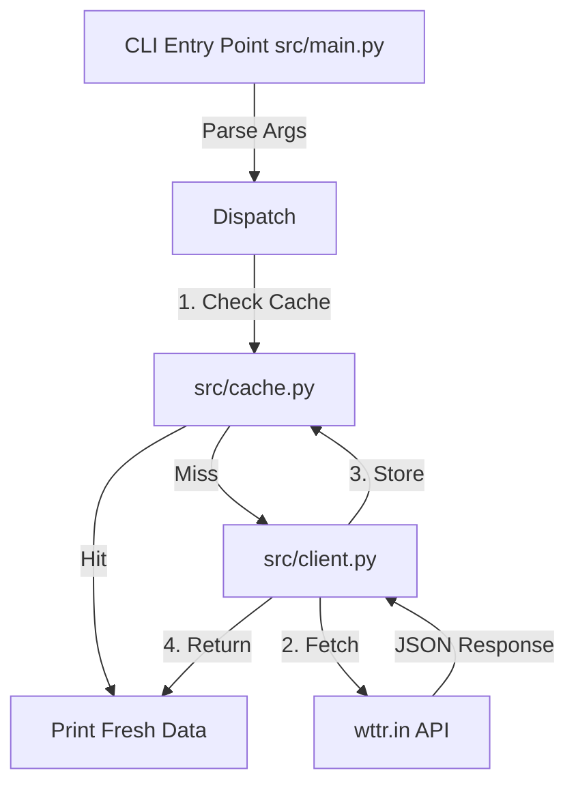

# Architecture

*Mapped: 2026-02-16*

## Project Structure Overview

| Directory | Description |
| --------- | ----------- |
| `src/` | **Core Logic**: Main application source files |
| `src/main.py` | **Entry Point**: CLI argument parsing and command dispatch |
| `src/client.py` | **Network**: API client using `urllib` (fetches `wttr.in`) |
| `src/cache.py` | **Storage**: JSON file-based cache logic |
| `src/config.py` | **Settings**: Constants and configuration |
| `tests/` | **Tests**: Unit tests (mocked `unittest`) |

## Tech Stack

| Technology | Role | Reason |
| ---------- | ---- | ------ |
| **Python 3.9+** | Runtime | Universal availability, strong stdlib |
| **argparse** | CLI Framework | Standard library, no external dependencies |
| **urllib** | HTTP Client | Standard library, sufficient for simple GET requests |
| **json** | Serialization | Standard library, readable file format |

## Data Flow

The application functions as a simple fetch-and-cache CLI.

## Key Modules

- `main.py`: Dispatches `weather` or `raw` commands. Formats output.
- `client.py`: Handles network I/O, user-agent headers, and JSON parsing.
- `cache.py`: Manages file system writes, TTL checks (default 5 mins), and safe filename generation via MD5 hashing.
